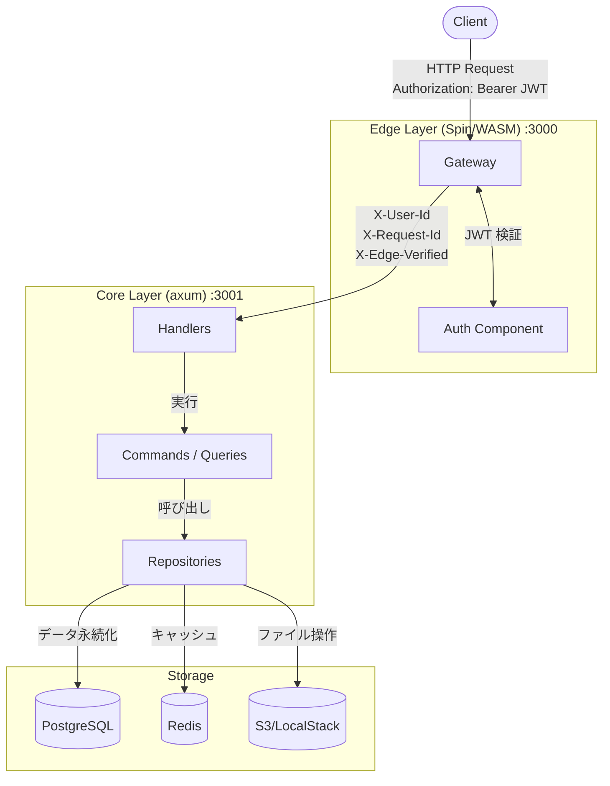

# spin-axum-todo

Spin + axum による WASM + コンテナのハイブリッドアーキテクチャ TODO API。

## アーキテクチャ

Edge 層（Spin/WASM）で JWT 認証を行い、認証済みリクエストを Core 層（axum）に転送するハイブリッド構成。
Edge 層は軽量な WASM コンポーネントとして高速に起動し、Core 層は Clean Architecture で構築されたビジネスロジックを担当する。



> 詳細なアーキテクチャは [architecture.md](core/docs/architecture.md) を参照

## 技術スタック

| レイヤー | 技術                                         | 説明                                      |
| -------- | -------------------------------------------- | ----------------------------------------- |
| Edge     | [Spin](https://spinframework.dev/) / WASM    | JWT 検証、リクエストルーティング          |
| Core     | [axum](https://github.com/tokio-rs/axum)     | REST API、認証、ビジネスロジック          |
| DB       | PostgreSQL 17                                | データ永続化（users, todos, files）       |
| Cache    | Redis 7                                      | エンティティキャッシュ                    |
| Storage  | S3 / [LocalStack](https://localstack.cloud/) | ファイルストレージ（開発時は LocalStack） |

## クイックスタート

### 前提条件

- [Rust](https://rustup.rs/) (1.75+)
- [Spin CLI](https://spinframework.dev/docs/install)
- [Docker](https://www.docker.com/)
- [sqlx-cli](https://github.com/launchbadge/sqlx/tree/main/sqlx-cli) (`cargo install sqlx-cli`)

### セットアップ

```bash
# 1. リポジトリをクローン
git clone <repository-url>
cd spin-axum-todo

# 2. セットアップ（.env作成、DB起動、マイグレーション）
./scripts/setup.sh

# 3. Core 層を起動（ターミナル 1）
make run-core

# 4. Edge 層を起動（ターミナル 2）
make run-edge

# 5. テスト実行
make test-all
```

> 詳細なセットアップ手順は [セットアップガイド](core/docs/setup.md) を参照

### Make コマンド一覧

```bash
make help        # ヘルプを表示

# セットアップ
make setup       # 初期セットアップ
make up          # インフラ起動（PostgreSQL + Redis + LocalStack）
make down        # インフラ停止
make migrate     # マイグレーション実行

# ビルド
make build       # 全てビルド（Core + Edge）
make build-core  # Core 層をビルド
make build-edge  # Edge 層をビルド

# 実行
make run-core    # Core 層を起動
make run-edge    # Edge 層を起動

# テスト・ユーティリティ
make test        # 統合テストを実行（Edge 層経由）
make test-edge   # Edge 層経由で全エンドポイントをテスト
make test-core   # Core 層単体で全エンドポイントをテスト
make test-all    # Core + Edge 両方のテストを実行
make status      # サービスの稼働状況を確認
make demo        # 認証フローのデモ

# S3/LocalStack
make s3-ls            # S3 バケット内のファイル一覧
make s3-create-bucket # S3 バケットを作成（LocalStack 用）
```

## API エンドポイント

> 詳細なリクエスト/レスポンス例は [API リファレンス](core/docs/api.md) を参照

### 認証 API（認証不要）

| メソッド | パス                 | 説明                 |
| -------- | -------------------- | -------------------- |
| POST     | `/api/auth/register` | ユーザー登録         |
| POST     | `/api/auth/login`    | ログイン（JWT 取得） |

### TODO API（認証必須）

| メソッド | パス                    | 説明                                                  |
| -------- | ----------------------- | ----------------------------------------------------- |
| GET      | `/api/todos`            | TODO 一覧取得（`?completed=true/false` でフィルタ可） |
| POST     | `/api/todos`            | TODO 作成                                             |
| GET      | `/api/todos/{id}`       | TODO 取得                                             |
| PATCH    | `/api/todos/{id}`       | TODO 更新                                             |
| DELETE   | `/api/todos/{id}`       | TODO 削除                                             |
| POST     | `/api/todos/batch`      | バッチ作成（複数 TODO を一括作成）                    |
| POST     | `/api/todos/with-files` | ファイル付き TODO 作成                                |

### ファイル API（認証必須）

| メソッド | パス                       | 説明                                        |
| -------- | -------------------------- | ------------------------------------------- |
| POST     | `/api/files/upload`        | ファイルアップロード（multipart/form-data） |
| GET      | `/api/files/{id}/download` | ファイルダウンロード                        |
| DELETE   | `/api/files/{id}`          | ファイル削除                                |

## 認証フロー

> 詳細な使用例は [API リファレンス](core/docs/api.md#使用例) を参照

```bash
# 1. ユーザー登録
curl -X POST http://localhost:3000/api/auth/register \
  -H "Content-Type: application/json" \
  -d '{"email": "user@example.com", "password": "password123"}'

# 2. ログイン（JWT 取得）
TOKEN=$(curl -s -X POST http://localhost:3000/api/auth/login \
  -H "Content-Type: application/json" \
  -d '{"email": "user@example.com", "password": "password123"}' | jq -r '.token')

# 3. API アクセス
curl -H "Authorization: Bearer $TOKEN" http://localhost:3000/api/todos
```

## プロジェクト構成

```
spin-axum-todo/
├── README.md                    # このファイル
├── Makefile                     # 開発コマンド
├── compose.yaml                 # Docker Compose（PostgreSQL + Redis + LocalStack）
├── .env.example                 # 環境変数テンプレート
│
├── scripts/                     # 開発スクリプト
│   ├── setup.sh                 # 初期セットアップ
│   ├── dev.sh                   # 開発環境起動
│   ├── test-edge.sh             # Edge 層統合テスト（35 テスト）
│   └── test-core.sh             # Core 層単体テスト（32 テスト）
│
├── edge/                        # Edge Layer (Spin/WASM)
│   ├── spin.toml                # Spin 設定
│   ├── wit/                     # WIT インターフェース
│   │   └── auth.wit
│   ├── gateway/                 # HTTP ゲートウェイ
│   │   └── src/lib.rs           # プロキシ、パブリックパス制御
│   └── auth/                    # JWT 認証（署名検証）
│       └── src/lib.rs
│
└── core/                        # Core Layer (axum)
    ├── Cargo.toml               # Workspace 定義
    ├── docs/                    # 詳細ドキュメント
    ├── api/                     # エントリーポイント
    │   ├── src/main.rs
    │   └── migrations/          # DB マイグレーション
    └── crates/
        ├── domain/              # ドメイン層（User, Todo, Repository トレイト）
        ├── application/         # アプリケーション層（AuthService, Use Cases）
        ├── infrastructure/      # インフラ層（PostgreSQL, Redis）
        └── presentation/        # プレゼンテーション層（HTTP ハンドラ）
```

## データベース

> スキーマの詳細は [セットアップガイド](core/docs/setup.md#データベーススキーマ) を参照

- **users**: ユーザー認証情報（email, password_hash）
- **todos**: TODO アイテム（user_id で分離、CASCADE 削除）
- **files**: ファイル添付メタデータ（todo_id に紐付け）

## セキュリティ

> 詳細は [セキュリティガイド](core/docs/security.md) を参照

### Defense in Depth（多層防御）

1. **Edge 層**: JWT 署名検証、トークン有効期限チェック
2. **Core 層**: `X-Edge-Verified` ヘッダー検証（直接アクセス防止）
3. **ハンドラ層**: user_id による所有権検証

### セキュリティヘッダー

| ヘッダー          | 用途                        |
| ----------------- | --------------------------- |
| `X-User-Id`       | 認証済みユーザー ID（UUID） |
| `X-Request-Id`    | リクエスト追跡              |
| `X-Edge-Verified` | Edge 通過の証明             |

## 環境変数

> 全ての環境変数は [セットアップガイド](core/docs/setup.md#環境変数) を参照

| 変数                  | 説明                                                     |
| --------------------- | -------------------------------------------------------- |
| `DATABASE_WRITER_URL` | PostgreSQL 書き込み用接続文字列                          |
| `DATABASE_READER_URL` | PostgreSQL 読み取り用接続文字列                          |
| `REDIS_URL`           | Redis 接続文字列                                         |
| `JWT_SECRET`          | JWT 署名用シークレット                                   |
| `EDGE_SECRET`         | Edge 検証用シークレット                                  |
| `S3_ENDPOINT_URL`     | S3 エンドポイント（LocalStack: `http://localhost:4566`） |
| `S3_BUCKET`           | S3 バケット名（デフォルト: `todo-files`）                |

## ドキュメント

| ドキュメント                                 | 内容                                      |
| -------------------------------------------- | ----------------------------------------- |
| [セットアップガイド](core/docs/setup.md)     | 環境構築、DB スキーマ、マイグレーション   |
| [API リファレンス](core/docs/api.md)         | 全エンドポイント、リクエスト/レスポンス例 |
| [アーキテクチャ](core/docs/architecture.md)  | Clean Architecture、CQRS パターン         |
| [セキュリティ](core/docs/security.md)        | 認証・認可、バリデーション                |
| [キャッシュ戦略](core/docs/cache.md)         | Redis キャッシュパターン                  |
| [トランザクション](core/docs/transaction.md) | バッチ操作、整合性保証                    |

## 参考資料

- [The State of WebAssembly 2025-2026](https://platform.uno/blog/the-state-of-webassembly-2025-2026/)
- [Spin Application Structure](https://spinframework.dev/docs/application-structure)
- [Rust axum Clean Architecture](https://medium.com/@qkpiot/building-a-robust-rust-backend-with-axum-diesel-postgresql-and-ddd-from-concept-to-deployment-b25cf5c65bc8)
- [Microservices Authentication Patterns 2025](https://rohitpatil.com/blog/microservices-authentication-patterns.html)

## ライセンス

MIT
