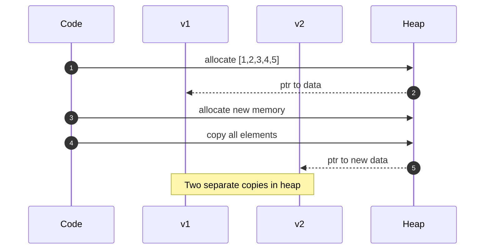
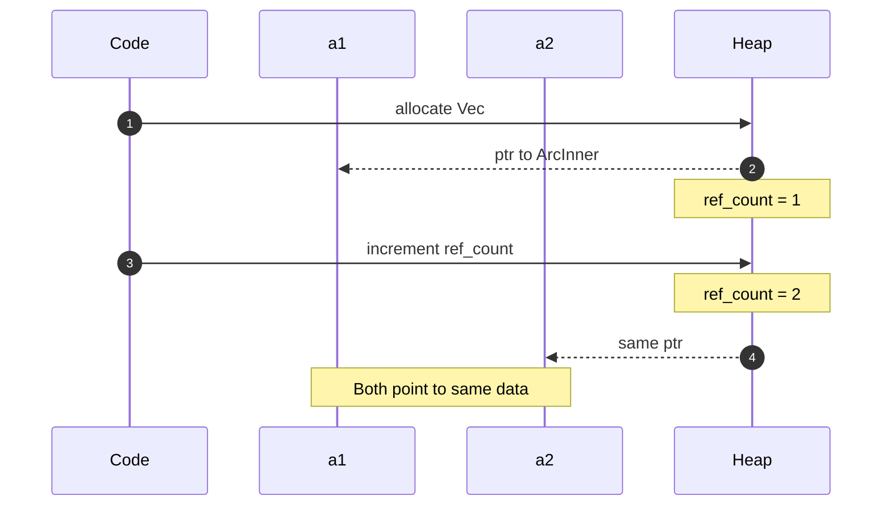
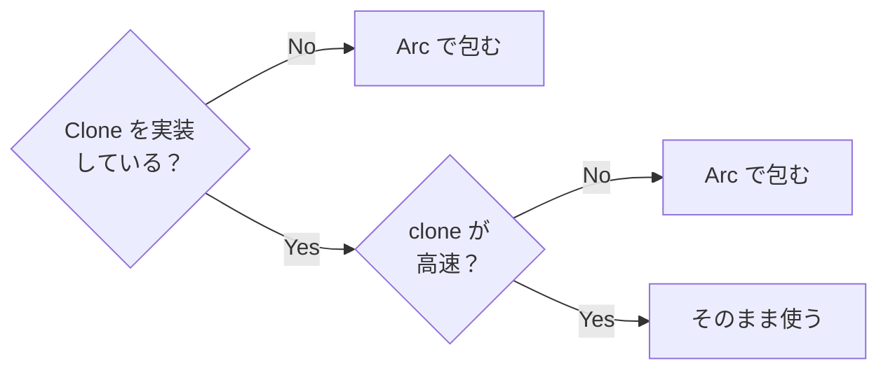
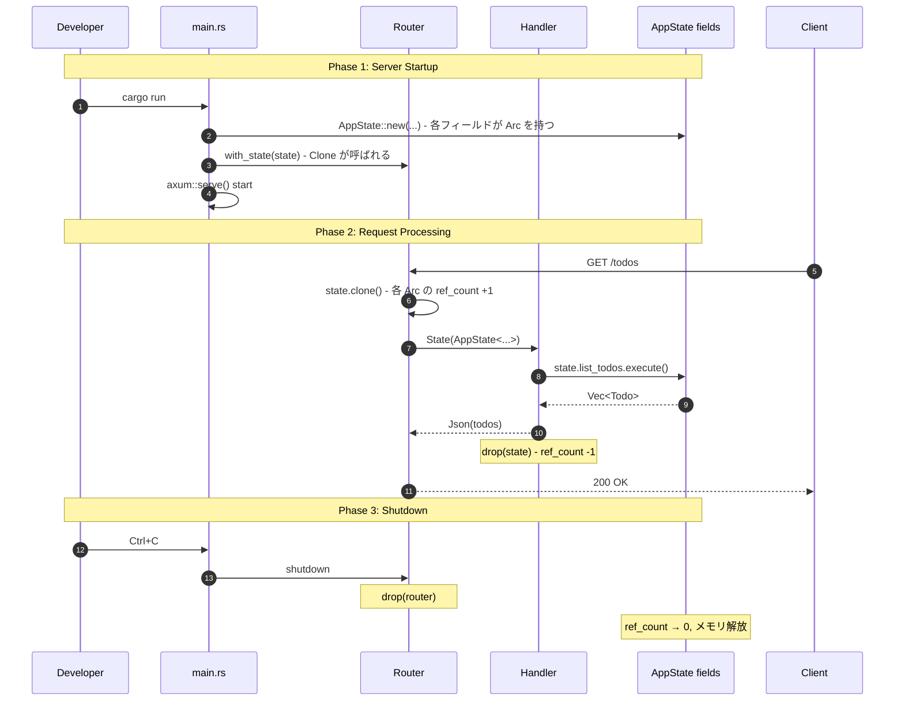
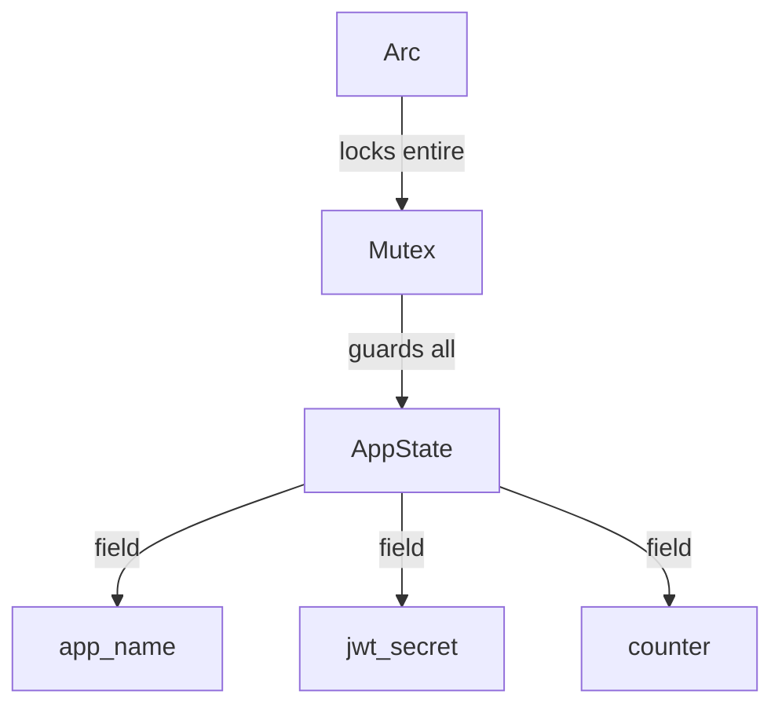
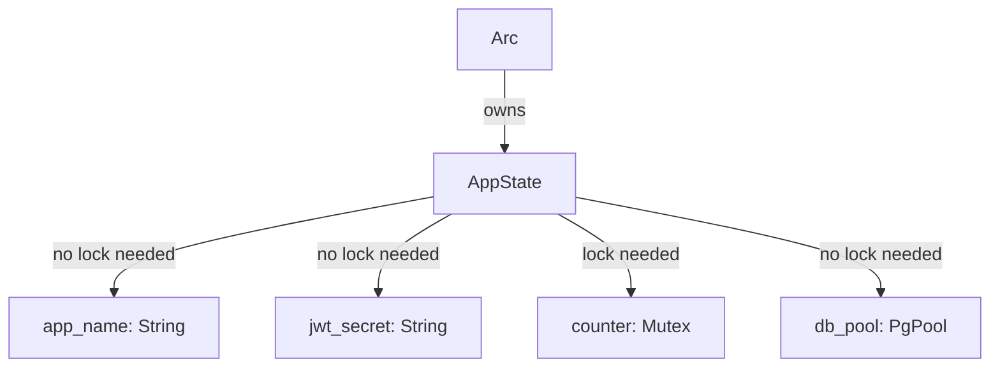
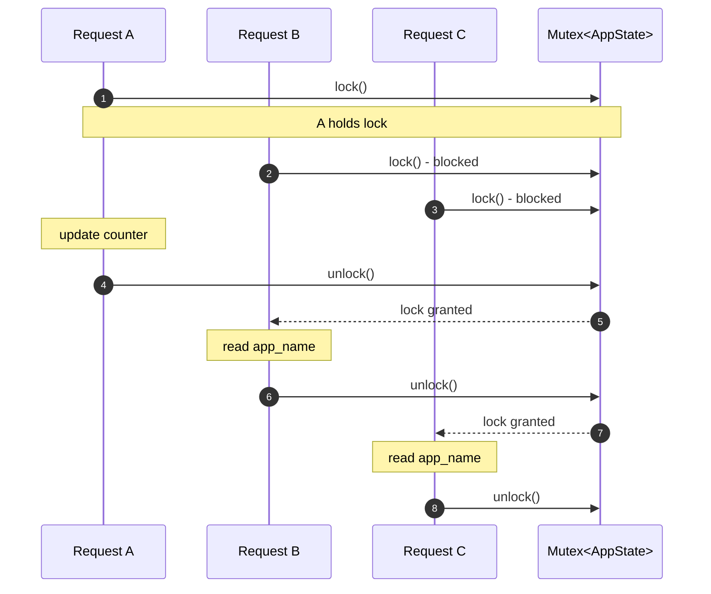
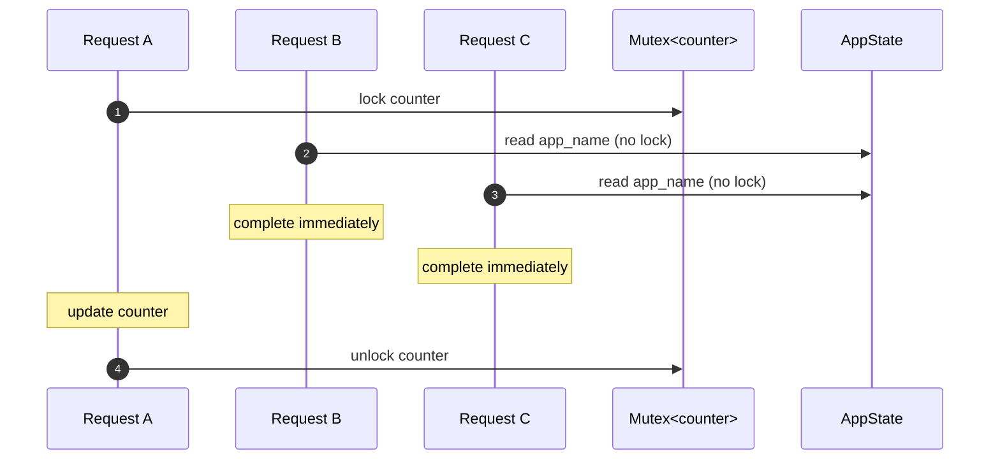
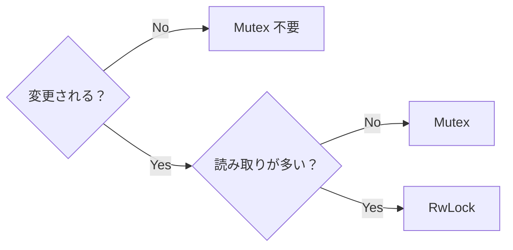

# axum State の仕組みを図解で整理してみた

## はじめに

### この記事を書いた背景

以前、**WASM + コンテナのハイブリッドアーキテクチャ**で TODO API を構築し、その内容を記事にまとめました：

https://zenn.dev/sbk0716/articles/e3830611060050

Edge 層（WASM/Spin）で JWT 認証、Core 層（axum/コンテナ）でビジネスロジックという構成で動くものは作れました。しかし、Core 層のコードを書いていて気づいたことがあります：

```rust
async fn list_todos<TW, TR, C, UR, UW, S>(
    State(state): State<AppState<TW, TR, C, UR, UW, S>>,
) -> Result<impl IntoResponse, ApiError>
where
    TW: TodoWriter,
    TR: TodoReader,
    // ...
{
    let todos = state.list_todos.execute(filter).await?;
    Ok(Json(todos))
}
```

**動くコードと理解のギャップ**

- なぜ `AppState` に `Clone` が必要？
- `State` の中で何が起きている？
- ジェネリクスとターボフィッシュ構文は何のため？
- 複数リクエストが同時に来たとき、メモリはどうなっている？

動くコードを書くだけなら、既存のコードを参考にすれば実装できます。しかし、**なぜそう書くのか** を理解していないと、エラーが発生したときに原因を特定できません。

この記事では、axum 公式推奨パターンを採用しながら、State のライフサイクルとメモリの動きを追っていきます。誤りや改善点があれば、コメントでご指摘ください。

### 対象読者

- Rust の基本構文（所有権、借用）を理解している
- axum や Web 開発は初めて、または経験が浅い
- 「なんとなく動くコード」を「理解して書けるコード」にしたい

### リポジトリ

この記事のコード例は以下のリポジトリで実際に動作確認できます：

https://github.com/sbk0716/spin-axum-todo

---

## State とは何か？

### 定義

> **State = 複数のハンドラ間でデータを共有する仕組み**

axum での具体的な意味：

| 用語       | axum での意味                                 | この記事での具体例                                               |
| ---------- | --------------------------------------------- | ---------------------------------------------------------------- |
| State      | 全エンドポイントで共有するオブジェクト        | `AppState` 構造体（`db_pool` などを持つ）                        |
| ハンドラ   | 1つの API エンドポイントを処理する `async fn` | `list_todos()`（`GET /todos`）、`create_todo()`（`POST /todos`） |
| リクエスト | クライアントからの HTTP 呼び出し              | `curl http://localhost:3000/todos`                               |

### なぜ State が必要か？

Web サーバーでは、DB 接続プール、Redis クライアント、JWT シークレットなど、**全てのリクエストハンドラで共通して使うリソース**があります。

```rust
// 概念的な例（実際のコードはジェネリクスを使用）
// 実際の AppState 定義: core/crates/presentation/src/state.rs
struct AppState {
    db_pool: PgPool,          // DB 接続（全エンドポイントで使う）
    redis_client: RedisClient, // キャッシュ（全エンドポイントで使う）
    jwt_secret: String,        // 認証シークレット（全エンドポイントで使う）
}
```

### 方法の比較

| 方法                 | 問題点                                               |
| -------------------- | ---------------------------------------------------- |
| グローバル変数       | テストが困難、依存関係が不明確、unsafe が必要        |
| 関数の引数で毎回渡す | 引数が増えすぎる、リファクタリングが大変             |
| **State パターン**   | 依存関係が明確、テスト時にモック差し替え可能、型安全 |

### 並行処理という課題

axum は **並行（concurrent）** に複数の HTTP リクエストを処理します。つまり、1つのリクエストの処理が完了する前に、別のリクエストの処理を開始できます：

```
時刻 0ms:  GET /todos    → list_todos() 関数の実行開始
時刻 1ms:  POST /todos   → create_todo() 関数の実行開始
時刻 2ms:  GET /users    → list_users() 関数の実行開始
時刻 5ms:  create_todo() 完了（レスポンス返却）
時刻 8ms:  list_todos() 完了（レスポンス返却）
時刻 10ms: list_users() 完了（レスポンス返却）
```

**問題**: `list_todos()`、`create_todo()`、`list_users()` の3つの関数が同時に動いている。3つの関数すべてが同じ `db_pool`（DB 接続プール）を使って SQL を実行したい。どうすればよいか？

### Arc がなければどうなるか？

もし開発者が Arc を使わずに `AppState` を `list_todos()` や `create_todo()` などのハンドラ関数に直接渡そうとすると、**コンパイラがエラー**を出します。

```rust
// ❌ コンパイルエラー
let state = AppState::new(...);  // main() 関数内のローカル変数 state が所有者

let router = Router::new()
    .route("/todos", get(list_todos(state)))  // state の所有権が main() → list_todos() へ移動
    .route("/todos", post(create_todo(state))); // エラー: state はもう list_todos() のものなので使えない
```

Rust の所有権ルールにより、`state` を `list_todos()` に渡した時点で、所有権が **`main()` 関数から `list_todos()` 関数へ移動**します。`state` はもう `main()` のものではないため、次の行で `create_todo(state)` と書いてもコンパイルエラーになります。

これは**実行時エラーではなく、コンパイル時に Rust が防いでくれます**。

### Arc を使うとなぜ解決するのか？

Arc を使うと、`list_todos()`、`create_todo()`、`list_users()` などの複数のハンドラ関数が、同じ `AppState`（`db_pool` を含む）にアクセスできるようになります。そのメカニズムを説明します。

**Step 1: `Arc::new()` で Heap にデータを配置**

`main()` 関数が `Arc::new(AppState {...})` を実行すると、`AppState` は Heap 上に配置され、Stack には 8 バイトのポインタだけが置かれます。

**この図の見方:**

| 要素              | 説明                                                                       |
| ----------------- | -------------------------------------------------------------------------- |
| **Stack（左側）** | `main()` 関数内の `state` 変数。8 バイトのポインタ。                       |
| **Heap（右側）**  | 実際の `AppState` データ。`ref_count: 1` は参照者が 1 人であることを示す。 |
| **矢印（→）**     | `state` ポインタが Heap 上のデータを指している。                           |

```
Stack                          Heap
+------------------+           +---------------------------+
| state (Arc ptr)  |---------->| ref_count: 1              |
| [8 bytes]        |           | AppState { db_pool, ... } |
+------------------+           +---------------------------+
```

**Step 2: `Arc::clone()` で新しいポインタを作成**

axum の Router が `Arc::clone()` を実行しても、**Heap 上の `AppState` データはコピーされません**。新しいポインタが作成され、そのポインタは `main()` 関数の `state` 変数と同じ Heap 領域を指します。参照カウントが +1 されるだけです（O(1) 操作）。

**この図の見方:**

| 要素              | 説明                                                  |
| ----------------- | ----------------------------------------------------- |
| **Stack（左側）** | 3つの Arc ポインタ（state1, state2, state3）          |
| **Heap（右側）**  | `AppState` データは **1つだけ**                       |
| **矢印（→）**     | 3本の矢印がすべて同じ Heap 領域に集まっている点に注目 |

```
Stack                          Heap
+------------------+           +---------------------------+
| state1 (Arc ptr) |---+       | ref_count: 3              |
+------------------+   |       |                           |
| state2 (Arc ptr) |---+------>| AppState { db_pool, ... } |
+------------------+   |       | (data exists only once)   |
| state3 (Arc ptr) |---+       +---------------------------+
+------------------+
```

**結果: 3つの関数が同じ db_pool を使える**

`list_todos()`、`create_todo()`、`list_users()` の3つの関数は、それぞれ自分の Arc ポインタを持っていますが、**全員が同じ Heap 上の `AppState` を指しています**。だから、3つの関数すべてが同じ `db_pool` を使って SQL を実行できるのです。

ここまでで「Arc を使えば共有できる」ことは分かりました。次のセクションでは、Arc の内部動作をより深く掘り下げ、**なぜ Arc::clone() が超高速なのか**を理解します。

---

## Arc の仕組み

前のセクションでは、axum の文脈で「Arc を使うと複数ハンドラで State を共有できる」ことを確認しました。

このセクションでは、Arc の**内部動作**に焦点を当てます：
- 参照カウントの仕組み
- メモリレイアウトの詳細
- `Arc::clone()` が O(1) で動作する理由

### Arc とは何か？

[Rust 公式ドキュメント](https://doc.rust-lang.org/std/sync/struct.Arc.html) によると：

> "A thread-safe reference-counting pointer. 'Arc' stands for 'Atomically Reference Counted'."

> "Unlike `Rc<T>`, `Arc<T>` uses atomic operations for its reference counting. This means that it is thread-safe."

つまり、**複数の所有者で同じデータを共有する**ためのスマートポインタです。

### 参照カウントのライフサイクル

Arc は「誰がこのデータを使っているか」を **数値（参照カウント）** で追跡します：

| 操作           | 参照カウント | 説明                             |
| -------------- | ------------ | -------------------------------- |
| `Arc::new()`   | 1            | 新規作成、最初の所有者           |
| `Arc::clone()` | +1           | 共有者が増える（アトミック加算） |
| `drop()`       | -1           | 共有者が減る（アトミック減算）   |
| カウント = 0   | -            | Heap メモリを自動解放            |

### メモリレイアウト

前セクションでは「複数ポインタが同じ Heap を指す」ことを示しました。ここでは Arc の**内部構造（ArcInner）** をより詳しく見ていきます。

`Arc::new(AppState {...})` 実行後、Heap 上には `ArcInner` という構造体が作られます。

**この図の見方:**

| 領域              | 説明                                                   | 格納されるもの                                   |
| ----------------- | ------------------------------------------------------ | ------------------------------------------------ |
| **Stack（左側）** | 関数のローカル変数が置かれる領域。高速だがサイズ固定。 | `state` 変数（Arc ポインタ、8 バイト）           |
| **Heap（右側）**  | 動的に確保される領域。サイズ柔軟。                     | `ArcInner`（参照カウント + AppState の実データ） |
| **矢印（→）**     | ポインタ。Stack から Heap への参照。                   | `state` が `ArcInner` を指している               |

```
Stack                          Heap
+------------------+           +---------------------------+
| state (Arc ptr)  |---------->| ArcInner                  |
| [8 bytes]        |           | +-- strong_count: 1       |
+------------------+           | +-- data: AppState        |
                               |     +-- db_pool: PgPool   |
                               |     +-- redis_client      |
                               |     +-- jwt_secret        |
                               +---------------------------+
```

**ポイント:**

- Stack にはポインタ（8 バイト）だけが置かれる
- `AppState` の実データ（`db_pool`、`jwt_secret` など）は Heap に格納される
- Heap 上のデータは複数スレッド（`list_todos()`、`create_todo()` など）から同時にアクセス可能

### Arc::clone() は超高速

`String`、`Vec`、`HashMap` など Heap にデータを持つ型は `clone()` で全データをコピーするため、`Arc::clone()` も同様にデータ全体をコピーするのかと最初は思っていました。

[公式ドキュメント](https://doc.rust-lang.org/std/sync/struct.Arc.html)には明確に書かれています：

> Invoking `clone` on `Arc` produces a new `Arc` instance, which points to the same allocation on the heap as the source `Arc`, while increasing a reference count.

つまり、`Arc::clone()` は **`AppState`（`db_pool` などを含む）のコピーではなく、参照カウントを +1 するだけ** です。

### O(n) vs O(1) の違いを実感しよう

> **なぜ Vec を例に使うのか？**
>
> `String`、`Vec`、`HashMap` など Heap にデータを持つ型は、どれも `clone()` で全データをコピーします。どの型を例に使っても本質は同じなので、この記事では `Vec` に統一して説明します。

**Vec::clone() は O(n)** — 要素数に比例して遅くなる：

| 要素数 | コピー回数 | 時間の目安 |
| ------ | ---------- | ---------- |
| 5      | 5回        | 約 5ns     |
| 100    | 100回      | 約 100ns   |
| 100万  | 100万回    | 約 1ms     |

**Arc::clone() は O(1)** — 要素数に関係なく一定：

| 要素数 | 操作回数 | 時間の目安 |
| ------ | -------- | ---------- |
| 5      | 1回      | 約 10ns    |
| 100    | 1回      | 約 10ns    |
| 100万  | 1回      | 約 10ns    |

Arc は中身をコピーせず、参照カウントを +1 するだけなので、データがどれだけ大きくても常に O(1)。

| 種類      | 動作                 | 計算量 | 100万要素の場合 |
| --------- | -------------------- | ------ | --------------- |
| Vec clone | 全要素をコピー       | O(n)   | 約 1ms          |
| Arc clone | 参照カウント +1 のみ | O(1)   | 約 10ns         |

### 通常の clone（全要素をコピー）

**何が起こるか**: メモリアロケータに新しい領域を要求し、全要素を1つずつコピーします。

```rust
// v1 が Vec の所有者（Heap 上のデータ [1,2,3,4,5] を所有）
let v1 = vec![1, 2, 3, 4, 5];
// v1.clone() で新しい Heap 領域が確保され、全要素がコピーされる
// v2 は新しい Heap 領域の所有者になる（v1 とは独立）
let v2 = v1.clone();
// この時点で v1 と v2 は別々の Heap 領域を所有している
```

**シーケンス図の見方:**

| 要素         | 説明                                                               |
| ------------ | ------------------------------------------------------------------ |
| **Code**     | 実行中のプログラム                                                 |
| **v1, v2**   | Vec 変数（Stack 上のポインタ）                                     |
| **Heap**     | 動的メモリ領域                                                     |
| **Step 1**   | v1 用に Heap メモリを確保し、データ [1,2,3,4,5] を格納             |
| **Step 2-3** | v2 用に**新しい** Heap メモリを確保し、全要素をコピー（O(n) 操作） |
| **結果**     | 2つの独立した Heap 領域が存在（データが重複している）              |



**結果**: v1 と v2 は **別々の Heap 領域** を指す（データがコピーされた）

```
Stack              Heap
+------+           +------------------------+
| v1   |---------->| [1,2,3,4,5] (copy 1)   |
+------+           +------------------------+
| v2   |---------->| [1,2,3,4,5] (copy 2)   |
+------+           +------------------------+
```

### Arc の clone（参照カウント増加のみ）

**何が起こるか**: CPU のアトミック命令で参照カウントを +1 するだけ。メモリアロケーションは発生しません。

```rust
// Arc::new() で Vec を Heap に配置し、a1 がその Arc ポインタを所有
// Heap 上のデータは ref_count: 1 で開始
let a1 = Arc::new(vec![1, 2, 3, 4, 5]);
// Arc::clone() は ref_count を +1 するだけ（新しい Heap 領域は作られない）
// a2 も同じ Heap 領域を指す Arc ポインタを所有
// a1 と a2 は「共同所有者」として同じデータを共有
let a2 = Arc::clone(&a1);
// この時点で ref_count: 2（a1 と a2 の2つが参照中）
```

**シーケンス図の見方:**

| 要素       | 説明                                                            |
| ---------- | --------------------------------------------------------------- |
| **Code**   | 実行中のプログラム                                              |
| **a1, a2** | Arc ポインタ（Stack 上、各 8 バイト）                           |
| **Heap**   | 動的メモリ領域（ArcInner 構造体を格納）                         |
| **Step 1** | ArcInner を Heap に確保し、a1 がそこを指す（ref_count = 1）     |
| **Step 2** | `Arc::clone()` は ref_count を +1 するだけ（O(1) 操作、約 5ns） |
| **結果**   | a1 と a2 は**同じ** Heap 領域を指す（データは 1 つだけ）        |



**結果**: a1 と a2 は **同じ Heap 領域** を指す（データはコピーされていない）

```
Stack              Heap
+------+           +------------------------+
| a1   |---------->| ref_count: 2           |
+------+      +--->| data: [1, 2, 3, 4, 5]  |
| a2   |------+    +------------------------+
+------+
```

**重要な違い**:
- **Vec**: 2つの独立した Heap 領域が存在（データがコピーされた）
- **Arc**: 1つの Heap 領域を2つのポインタが共有（データはコピーされていない）

Arc の仕組みを理解したところで、次は axum が推奨する State の実装パターンを見ていきます。

---

## axum 推奨パターン

### 2つのパターンの比較

axum で State を扱う方法には主に2つのパターンがあります：

| パターン           | 特徴                                                          | コード例               |
| ------------------ | ------------------------------------------------------------- | ---------------------- |
| `Arc<AppState>`    | AppState 全体を Arc で包む                                    | `State<Arc<AppState>>` |
| `AppState` + Clone | 各フィールドが内部で Arc を持ち、AppState 自体に Clone を実装 | `State<AppState>`      |

**この記事では axum 公式推奨の「AppState + Clone」パターンを解説します。**

### axum 公式ドキュメントの推奨

axum コラボレーター davidpdrsn（[GitHub Discussion #1911](https://github.com/tokio-rs/axum/discussions/1911)）：
> "Yes the state is cloned for each request. Otherwise you wouldn't be able to extract an owned state."

axum メンテナー mladedav（[GitHub Discussion #3223](https://github.com/tokio-rs/axum/discussions/3223)）：
> "The state must just be clonable. When you extract the state, axum will clone it and pass it to your handler."
>
> "Therefore, you almost always want to have something like `Arc<AppState>` or a cheaply clonable state with interior mutability."

※ [axum State ドキュメント](https://docs.rs/axum/latest/axum/extract/struct.State.html) の全コード例で `#[derive(Clone)]` が使用されています。ただし、これらはジェネリクスを使わないシンプルな例です。ジェネリクスと DB 接続を組み合わせる場合は「手動 Clone 実装」を参照してください。

### Clone が必要な理由（2箇所）

axum 推奨パターンでは、`AppState` に `Clone` 実装が必要です。これは以下の2箇所で使われます：

#### 1. Router::with_state()

`with_state()` は、Router にアプリケーション全体で共有する State を登録するメソッドです。登録された State は、State エクストラクタを通じて各ハンドラに渡されます。

```rust
// 使用例
let app = Router::new()
    .route("/todos", get(list_todos))
    .with_state(state);  // ← ここで AppState を登録
```

以下は axum の Router 実装のイメージです。

```rust
// axum の Router 実装（イメージ）
impl<S> Router<S> {
    pub fn with_state<S2>(self, state: S) -> Router<S2>
    where
        S: Clone,  // ← ここで Clone が要求される
    {
        // ...
    }
}
```

`AppState` が `Clone` を実装していないと、開発者が `with_state()` を呼んだ時点でコンパイラがエラーを出します。

#### 2. State エクストラクタ

axum の **エクストラクタ（Extractor）** とは、HTTP リクエストから特定のデータを抽出してハンドラ関数の引数として渡す仕組みです。

```rust
async fn list_todos(
    State(state): State<AppState>,     // ← State エクストラクタ（Router の state を抽出）
    Query(params): Query<QueryParams>, // ← Query エクストラクタ（URLクエリパラメータを抽出）
    Json(body): Json<CreateTodo>,      // ← Json エクストラクタ（リクエストボディを抽出）
) -> impl IntoResponse {
    // ...
}
```

`State<T>` エクストラクタは、`with_state()` で登録した State を自動的に `clone()` してハンドラに渡します。以下は axum 内部の動作イメージです。

```rust
// axum 内部の動作イメージ
loop {
    // 1. クライアントからの HTTP リクエストを受け付ける（非同期で待機）
    let request = accept_request().await;

    // 2. Router が保持している state を clone() する
    //    → 各フィールドの Arc::clone() が呼ばれる（ref_count +1 のみ、超高速）
    //    → state_clone は元の state とは別の変数だが、同じ Heap データを指す
    let state_clone = state.clone();

    // 3. 新しい非同期タスクを生成してリクエストを処理
    //    → tokio::spawn() により、このリクエストは別タスクで並行処理される
    //    → async move により、state_clone の所有権がタスク内に移動する
    tokio::spawn(async move {
        // 4. State エクストラクタで state_clone をラップしてハンドラに渡す
        //    → ハンドラ関数が State(state) として受け取る
        let response = handler(State(state_clone), request).await;

        // 5. ハンドラの戻り値をクライアントに送信
        send_response(response).await;
    });
    // 6. タスク終了時、state_clone が drop される
    //    → 各フィールドの Arc の ref_count が -1 される
    //    → Router が持つ元の state は影響を受けない
}
```

各リクエストを処理する際、axum は内部で `state.clone()` を呼び出してハンドラに渡します。

### フィールドごとの Arc

「毎リクエストで clone() を呼ぶなら遅いのでは？」と思うかもしれません。

**答え: AppState の各フィールドが内部で Arc を使用しているため、clone() は O(1) で超高速です。**

```rust
// 実際のコード: core/crates/presentation/src/state.rs
// 各フィールドは内部で Arc<dyn Trait> を保持している
pub struct AppState<TW, TR, C, UR, UW, S> {
    // AuthService<UR, UW> は内部で Arc<UR>, Arc<UW> を保持
    pub auth_service: AuthService<UR, UW>,
    // CreateTodoCommand<TW, C> は内部で Arc<TW>, Arc<C> を保持
    pub create_todo: CreateTodoCommand<TW, C>,
    // ListTodosQuery<TR> は内部で Arc<TR> を保持
    pub list_todos: ListTodosQuery<TR>,
    // GetTodoQuery<TR> は内部で Arc<TR> を保持（list_todos と同じ Arc を共有）
    pub get_todo: GetTodoQuery<TR>,
    // ...
}
```

clone() が呼ばれると、各フィールドの `Arc::clone()` が呼ばれるだけです：
- 参照カウント +1 のみ
- 約 5ns/フィールド
- 実データ（DB プールなど）はコピーされない

**この図の見方:**

| 要素                | 説明                                                                                   |
| ------------------- | -------------------------------------------------------------------------------------- |
| **state (clone 1)** | 元の AppState（Router が所有者）。全フィールドへの Arc ポインタを持つ                  |
| **state (clone 2)** | clone() で作成された AppState（ハンドラが所有者）。全フィールドへの Arc ポインタを持つ |
| **ref_count: 2**    | clone 1 と clone 2 の両方から参照されている（実データは1つだけ）                       |

**ポイント**: 各クローンは全フィールドへの Arc ポインタを持つ。実データは Heap 上に1つだけ存在し、参照が増えるだけ

**【clone 1 の構造】Router が所有**

```
Stack                              Heap
+--------------------+             +-----------------------------------+
| state (clone 1)    |------------>| AuthService (ref_count: 2)        |
| (owned by Router)  |             +-----------------------------------+
|                    |------------>| CreateTodoCommand (ref_count: 2)  |
+--------------------+             +-----------------------------------+
```

**【clone 2 の構造】ハンドラが所有**

```
Stack                              Heap (same memory as clone 1)
+--------------------+             +-----------------------------------+
| state (clone 2)    |------------>| AuthService (ref_count: 2)        |
| (owned by handler) |             +-----------------------------------+
|                    |------------>| CreateTodoCommand (ref_count: 2)  |
+--------------------+             +-----------------------------------+
```

> **重要**: 上の2つの図で Heap 側は**同じメモリ領域**を表しています。clone 1 と clone 2 は別々の Stack 変数ですが、両方が同じ Heap 上のデータを指しています。だから ref_count が 2 なのです。

#### どのフィールドを Arc で包むべきか？

すべてのフィールドを Arc で包む必要はありません。以下のフローチャートで判断できます。



**フローチャートの見方:**

| 判断ポイント               | 説明                                                                    |
| -------------------------- | ----------------------------------------------------------------------- |
| **Clone を実装している？** | その型が `.clone()` メソッドを持っているか                              |
| **clone が高速？**         | clone 時に O(1) で完了するか（内部で Arc 使用、または数バイトのコピー） |
| **Arc で包む**             | `Arc::clone()` で O(1) の clone を実現する                              |
| **そのまま使う**           | 追加の Arc ラップは不要                                                 |

**具体例:**

| フィールドの種類                   | Arc が必要か | 理由                                           |
| ---------------------------------- | ------------ | ---------------------------------------------- |
| `PgPool`、`redis::Client`          | 不要         | 内部で既に Arc を使用している                  |
| `String`（短い設定値）、`i32` など | 不要         | clone が十分に高速（数バイトのコピー）         |
| DB 接続を持つ構造体                | **必要**     | Clone を実装していない、または clone が重い    |
| 大きなキャッシュデータ             | **必要**     | clone すると全データをコピーしてしまう（O(n)） |

### 手動 Clone 実装

#### 前提知識: `Arc<T>::clone()` と `T: Clone` の違い

この節を理解するには、`Arc<T>::clone()` と `T: Clone` の違いを知る必要があります。

**`T: Clone` とは**: 型 `T` が `Clone` トレイトを実装しているという制約です。

```rust
// Vec<i32> は Clone を実装している
let v1: Vec<i32> = vec![1, 2, 3];
let v2 = v1.clone();  // Vec の全要素をコピー（重い処理）

// PostgresTodoWriter は Clone を実装していない（DB接続を持つので普通はしない）
struct PostgresTodoWriter { /* DB接続など */ }
// let w2 = writer.clone();  // ❌ コンパイルエラー！
```

**`Arc<T>::clone()` とは**: `Arc` 型自体が持つ `clone()` メソッドです。**中身の `T` をコピーするのではなく、参照カウントを +1 するだけ**です。

```rust
// PostgresTodoWriter は Clone を実装していない
struct PostgresTodoWriter { /* DB接続など */ }

let writer = PostgresTodoWriter::new();
let arc1 = Arc::new(writer);  // Arc で包む

// Arc::clone() は「Arc ポインタ」をコピーする（writer はコピーしない）
let arc2 = Arc::clone(&arc1);  // ✅ これは動く！

// 何が起きたか:
// - arc1 と arc2 は同じ writer を指している
// - 参照カウントが 1 → 2 になっただけ
// - writer のコピーは発生していない
```

**重要**: `Arc<T>::clone()` は中身をコピーしないので、`T: Clone` は不要です。

#### なぜ `#[derive(Clone)]` ではダメなのか？

> **注意**: 問題は「Clone トレイトが追加される」ことではありません。`Arc<T>` も Clone を実装しており、Clone 自体は悪くありません。
>
> **本当の問題は「型パラメータ `TW` に対して `TW: Clone` という制約が追加される」こと**です。この制約により、`TW` として使う具体型（`PostgresTodoWriter` など）が Clone を実装していないとコンパイルエラーになります。

`#[derive(Clone)]` を使うと、コンパイラが型パラメータに `Clone` 制約を自動追加してしまいます。

```rust
// AppState の定義
pub struct AppState<TW> {
    pub create_todo: CreateTodoCommand<TW>,  // 内部で Arc<TW> を持つ
}

// CreateTodoCommand の定義
pub struct CreateTodoCommand<TW> {
    writer: Arc<TW>,  // ← TW を直接持つのではなく Arc<TW> を持つ
}
```

```rust
// ❌ derive(Clone) を使った場合
#[derive(Clone)]
pub struct AppState<TW> { ... }

// ↓ コンパイラが自動生成するコード
impl<TW: Clone> Clone for AppState<TW> {
//       ^^^^^ ここに TW: Clone が追加される！
    fn clone(&self) -> Self { ... }
}
```

コンパイラは「型パラメータ `TW` が使われているなら、`TW: Clone` が必要だろう」と保守的に判断します。

**問題点**:

```rust
// PostgresTodoWriter は Clone を実装していない
struct PostgresTodoWriter { db_pool: PgPool }

// ❌ コンパイルエラー！
let state: AppState<PostgresTodoWriter> = ...;
let cloned = state.clone();
// → TW: Clone が要求される
// → PostgresTodoWriter は Clone を実装していない
// → エラー
```

**でも実際は Clone 不要**:

```rust
// 実際の clone() の流れを追ってみる
state.clone()
  → self.create_todo.clone()      // CreateTodoCommand::clone()
    → self.writer.clone()         // Arc<TW>::clone()
      → 参照カウント +1 だけ      // TW::clone() は呼ばれない！
```

`Arc<TW>::clone()` は `TW` をコピーしないので、`TW: Clone` は本当は不要です。

#### 手動実装なら正確な制約だけ

```rust
// 実際のコード: core/crates/presentation/src/state.rs:298-324
impl<TW, TR, C, UR, UW, S> Clone for AppState<TW, TR, C, UR, UW, S>
where
    TW: TodoWriter,  // Clone は要求しない！
    TR: TodoReader,
    // ...
{
    fn clone(&self) -> Self {
        Self {
            // CreateTodoCommand::clone() → Arc<TW>::clone() → ref_count +1
            create_todo: self.create_todo.clone(),
            auth_service: self.auth_service.clone(),
            // ...
        }
    }
}

// ✅ これで動く！
let state: AppState<PostgresTodoWriter, ...> = ...;
let cloned = state.clone();  // OK（PostgresTodoWriter が Clone でなくても）
```

**まとめ**:

| 方法               | 生成される制約           | 結果                            |
| ------------------ | ------------------------ | ------------------------------- |
| `#[derive(Clone)]` | `TW: Clone` が追加される | `PostgresTodoWriter` が使えない |
| 手動実装           | `TW: Clone` を追加しない | `PostgresTodoWriter` が使える   |

`#[derive(Clone)]` はフィールドの内部構造（`Arc` を使っているか）を考慮せず、型パラメータに `Clone` を要求してしまいます。手動実装なら、本当に必要な制約だけを指定できます。

#### ジェネリクスを使わない場合は derive でも OK

**もしジェネリクスを使わなければ**、`#[derive(Clone)]` でも問題ありません：

```rust
// ✅ 具体型のみなら derive でも OK
#[derive(Clone)]
pub struct AppState {
    pub create_todo: CreateTodoCommand,  // 具体的な型（ジェネリクスなし）
}

// CreateTodoCommand が Clone を実装していれば OK
// CreateTodoCommand は内部で Arc を使って Clone を実装できる
#[derive(Clone)]
pub struct CreateTodoCommand {
    writer: Arc<PostgresTodoWriter>,  // Arc なので Clone 可能
}
```

この場合、`PostgresTodoWriter` 自体は Clone を実装していなくても、`Arc<PostgresTodoWriter>` は Clone を実装しているので問題ありません。

#### なぜ axum アプリでは手動実装が多いのか？

**結論**: 実際の axum アプリでは、**テスト容易性のためにジェネリクス（依存性注入）を使うことが多い**ため、手動 Clone 実装が必要になるケースがほとんどです。

```rust
// ジェネリクスを使う理由：テスト時にモックを注入できる
pub struct AppState<TW: TodoWriter> {
    pub create_todo: CreateTodoCommand<TW>,
}

// 本番環境: AppState<PostgresTodoWriter>
// テスト環境: AppState<MockTodoWriter>
```

`#[derive(Clone)]` と手動 Clone 実装の使い分けをまとめると以下のようになります。

| 状況                             | derive(Clone) | 手動実装 |
| -------------------------------- | ------------- | -------- |
| 具体型のみ（テスト困難）         | ✅ 使える      | 不要     |
| ジェネリクス + Arc（テスト容易） | ❌ 使えない    | ✅ 必要   |

パターンを理解したところで、実際のリクエスト処理でどのように State が使われるかを追ってみましょう。

---

## State のライフサイクル

サーバー起動からリクエスト処理、シャットダウンまでの流れに沿って、State がどう扱われるかを追っていきます。

### シナリオ 1: サーバー起動時

```rust
// 実際のコード: core/api/src/main.rs
#[tokio::main]
async fn main() -> anyhow::Result<()> {
    // 1. DB 接続プールを作成
    //    db_pool は main() 関数のローカル変数（所有者）
    let db_pool = PgPool::connect(&database_url).await?;

    // 2. 各サービスを作成
    //    db_pool.clone() で PgPool 内部の Arc の ref_count が +1 される
    //    todo_writer が Arc<PostgresTodoWriter> の所有者になる
    let todo_writer = Arc::new(PostgresTodoWriter::new(db_pool.clone()));
    //    todo_reader も同様に Arc<PostgresTodoReader> の所有者
    let todo_reader = Arc::new(PostgresTodoReader::new(db_pool.clone()));
    // ...

    // 3. AppState を作成
    //    state は main() 関数のローカル変数（AppState の所有者）
    //    todo_writer, todo_reader の所有権が AppState に移動する
    let state = AppState::new(
        todo_writer,   // 所有権が state.create_todo 内部へ移動
        todo_reader,   // 所有権が state.list_todos 内部へ移動
        // ...
    );

    // 4. Router に State を登録
    //    with_state() が state.clone() を呼ぶ
    //    各フィールドの Arc の ref_count が +1 される
    let app = Router::new()
        .route("/todos", get(list_todos))
        .with_state(state);  // state の所有権が Router へ移動

    // 5. サーバー起動
    axum::serve(listener, app).await?;
    Ok(())
}
```

**この図の見方:**

| 要素                               | 説明                                                                             |
| ---------------------------------- | -------------------------------------------------------------------------------- |
| **state (AppState)**               | main() 関数のローカル変数 state が AppState の所有者（Stack 上）                 |
| **auth_service, create_todo, ...** | AppState の各フィールド（各フィールドが Heap 上のデータへの Arc ポインタを所有） |
| **ref_count: 1**                   | まだ1つの AppState からしか参照されていない（clone 前）                          |
| **Router**                         | with_state() で state の所有権を受け取る（所有権が main() → Router へ移動）      |

```
main.rs
+------------------+
| state            |  <- local variable in main() (owner of AppState)
| (AppState)       |
+------------------+
        |
        +-- auth_service -----> [Heap: AuthService (ref_count: 1)]
        +-- create_todo ------> [Heap: CreateTodoCommand (ref_count: 1)]
        +-- list_todos -------> [Heap: ListTodosQuery (ref_count: 1)]

+------------------+
| Router           |  <- receives ownership via with_state()
+------------------+
```

**ポイント**: AppState の各フィールドは Heap 上のデータを指すポインタ。フィールドが増えても、各フィールドは約 8 バイトのポインタだけ。

### シナリオ 2: リクエスト到着

```
$ curl http://localhost:3000/todos
```

何が起こるか（ステップバイステップ）：

```
時刻 0ms: クライアントが GET /todos をリクエスト
         ↓
時刻 1ms: axum がリクエストを受信
         ↓
時刻 2ms: Router が「/todos は list_todos() で処理する」と判断
         ↓
時刻 3ms: axum が state.clone() を実行 ← ★ここが重要！
         - 各フィールドの Arc::clone() が呼ばれる
         - 参照カウント +1（実データはコピーされない）
         ↓
時刻 4ms: ハンドラ list_todos() が呼び出される
         ↓
時刻 50ms: DB からデータ取得完了、JSON レスポンス返却
```

```rust
// 実際のコード: core/crates/presentation/src/handlers/todo.rs
pub async fn list_todos<TW, TR, C, UR, UW, S>(
    // axum が Router から state.clone() を実行し、その結果がここに渡される
    // この state はクローン後のコピーで、list_todos() 関数がこのコピーの所有者
    State(state): State<AppState<TW, TR, C, UR, UW, S>>,
) -> Result<impl IntoResponse, ApiError>
where
    TW: TodoWriter,
    TR: TodoReader,
    // ...
{
    // state.list_todos は ListTodosQuery<TR> 型
    // execute() は &self を受け取るので、state.list_todos の所有権は移動しない
    let todos = state.list_todos.execute(filter).await?;
    Ok(Json(todos))
}
// ← 関数終了時、state（クローンされたコピー）が drop される
//   state.auth_service, state.list_todos 等の各フィールドの Arc の ref_count が -1
//   Router が保持している元の state は影響を受けない
```

### シナリオ 3: 複数リクエストが同時に来る

3つの curl コマンドがほぼ同時に実行された場合：

```
時刻 0ms: curl GET /todos    → list_todos() 関数が開始
時刻 1ms: curl POST /todos   → create_todo() 関数が開始
時刻 2ms: curl GET /users    → list_users() 関数が開始
```

この瞬間、3つの関数すべてが同じ DB プールを使って SQL クエリを実行しようとしています。

**この図の見方:**

| 要素                                          | 説明                                                                               |
| --------------------------------------------- | ---------------------------------------------------------------------------------- |
| **Router**                                    | AppState の所有者。各リクエストで state.clone() を実行し、クローンをハンドラに渡す |
| **list_todos(), create_todo(), list_users()** | 各ハンドラが clone された AppState の所有者（関数終了時に drop される）            |
| **AuthService (ref_count: 4)**                | Router(1) + 3つのハンドラ(3) = 4 つの AppState から参照されている                  |
| **DB Pool**                                   | 内部でスレッドセーフ。全ハンドラで共有（Mutex 不要）                               |

**ポイント**: データは Heap 上に1つだけ存在し、Arc ポインタ（参照）が増えるだけ

```
Stack                         Heap
+------------------+          +---------------------------+
| Router           |-----+--->| AuthService               |
| (owner of        |     |    | ref_count: 4              |
|  original state) |     |    | (Router + 3 handlers)     |
+------------------+     |    +---------------------------+
                         |
+------------------+     |    +---------------------------+
| list_todos()     |-----+--->| DB Pool                   |
| [Request A]      |     |    | (thread-safe internally)  |
| (clone owner)    |     |    +---------------------------+
+------------------+     |
                         |
+------------------+     |
| create_todo()    |-----+
| [Request B]      |     |
| (clone owner)    |     |
+------------------+     |
                         |
+------------------+     |
| list_users()     |-----+
| [Request C]      |
| (clone owner)    |
+------------------+
```

**ポイント**:
- 参照カウントは増えるが、**実データ（DB プール等）は Heap 上に1つだけ**
- `list_todos()`、`create_todo()`、`list_users()` の3つの関数すべてが、同じ DB プールを使える
- clone() は参照カウント +1 だけなので超高速（約 5ns/フィールド）

### 全体のシーケンス図

State のライフサイクル全体を1つの図にまとめました。

**シーケンス図の見方:**

| 要素                | 説明                                                      |
| ------------------- | --------------------------------------------------------- |
| **Developer**       | 開発者（cargo run でサーバーを起動する）                  |
| **main.rs**         | アプリケーションのエントリーポイント                      |
| **Router**          | axum の Router（ルーティングと State 管理を担当）         |
| **Handler**         | 各エンドポイントのハンドラ関数（list_todos など）         |
| **AppState fields** | AppState 内の各フィールド（内部で Arc を持つ）            |
| **Client**          | HTTP リクエストを送信するクライアント                     |
| **Phase 1**         | サーバー起動時に AppState を作成し、Router に登録         |
| **Phase 2**         | リクエスト受信時に state.clone() で各 Arc の ref_count +1 |
| **Phase 3**         | シャットダウン時に ref_count が 0 になりメモリ解放        |



State のライフサイクルを理解したところで、次はハンドラ内で頻繁に使われる「借用」について説明します。

---

## 借用（&）を使う理由

ハンドラ関数で DB にアクセスする際、`&pool` のように参照を渡す場面があります。この `&` は何を意味しているのでしょうか？

```rust
// 学習用に簡略化した例
// 実際のハンドラ: core/crates/presentation/src/handlers/todo.rs
pub async fn list_todos(
    // state は axum が clone() した AppState のコピー
    // list_todos() 関数がこの state の所有者
    State(state): State<AppState>,
) -> Result<impl IntoResponse, ApiError> {
    let todos = sqlx::query_as!(Todo, "SELECT * FROM todos")
        // &state.db_pool: state が所有する db_pool フィールドへの参照（借用）
        // fetch_all() は &PgPool を受け取り、所有権を奪わない
        // そのため、この後も state.db_pool は有効なまま使える
        .fetch_all(&state.db_pool)
        .await?;
    Ok(Json(todos))
}
// 関数終了時、state が drop される
// db_pool の参照（借用）は関数内でのみ有効だったので、ここで無効になる
```

> **Note**: 実際のハンドラは CQRS パターンを採用しており、`state.list_todos.execute(filter)` のようにユースケース経由で DB にアクセスします。上記は借用の説明のために簡略化した例です。

### 借用と所有権

Rust では、値を関数に渡す方法は2つあります：

| 方法                     | 書き方         | 動作                                                                              | 結果                     |
| ------------------------ | -------------- | --------------------------------------------------------------------------------- | ------------------------ |
| **所有権の移動（move）** | `func(value)`  | 値の所有権が**呼び出し元（`list_todos()`）から呼び出し先（`fetch_all()`）へ移る** | 元の変数は使えなくなる   |
| **借用（borrow）**       | `func(&value)` | 参照だけを渡す（所有権は `list_todos()` が保持したまま）                          | 元の変数は引き続き使える |

### なぜ db_pool を借用するのか？

`fetch_all()` は `&PgPool`（参照）を受け取るように設計されています。参照で十分な理由は以下の通りです：

1. **PgPool は内部で Arc を使用している**
   - PgPool 自体が Arc でラップされた接続プールを持っている
   - 参照を渡すだけで、内部の接続プールにアクセスできる

2. **所有権を移動する必要がない**
   - DB クエリに必要なのは「接続プールへのアクセス」だけ
   - ハンドラが `PgPool` の所有権を `fetch_all()` へ渡す必要はない

3. **state を継続して使用できる**
   - 借用なので、`&state.db_pool` の後も `state` は有効
   - 同じハンドラ内で複数回 DB アクセスが可能

### 参照渡しのパターン

このパターンは Rust では一般的です：

| 型       | 関数の引数 | 理由                             |
| -------- | ---------- | -------------------------------- |
| `PgPool` | `&PgPool`  | 内部で Arc を使用、参照で十分    |
| `String` | `&str`     | 読み取りだけなら参照で十分       |
| `Vec<T>` | `&[T]`     | 要素の読み取りだけなら参照で十分 |

**ポイント**: データを読むだけなら、所有権を奪う必要はない。借用で十分。

ここまでは「読み取り専用」の State を扱ってきました。次のセクションでは、State 内のデータを「書き換える」必要がある場合の設計パターンを解説します。

---

## 設計パターン: Mutex が必要なケース

### Arc だけでは「書き込み」はできない

Arc は「複数のハンドラ関数で `AppState` を共有する」という問題を解決します。しかし、Arc だけでは「フィールドの値を安全に更新する」という問題は解決できません。

| 機能                 | Arc | Mutex | Arc + Mutex |
| -------------------- | --- | ----- | ----------- |
| 複数所有者での共有   | ✅   | ❌     | ✅           |
| データの変更         | ❌   | ✅     | ✅           |
| スレッドセーフな変更 | ❌   | ✅     | ✅           |

### Mutex が必要なフィールド・不要なフィールド

| フィールドの種類         | Mutex    | 理由                     | 例                    |
| ------------------------ | -------- | ------------------------ | --------------------- |
| 読み取り専用（不変）     | 不要     | 変更しないので競合しない | config, jwt_secret    |
| 読み書きする（可変）     | **必要** | 同時書き込みで競合する   | counter, cache        |
| 内部でスレッドセーフな型 | 不要     | 型自体が排他制御を持つ   | PgPool, redis::Client |

### ❌ 構造体全体を Mutex で包む（非推奨）

```rust
// ❌ 非推奨
Arc<Mutex<AppState>>
```

**問題点**: counter を更新するだけなのに、app_name も jwt_secret もロックされます。

**フローチャートの見方:**

| 要素      | 説明                                                                                                    |
| --------- | ------------------------------------------------------------------------------------------------------- |
| **Arc**   | 参照カウント付きスマートポインタ                                                                        |
| **Mutex** | 排他制御（ロック）機構                                                                                  |
| **問題**  | Mutex が AppState 全体をガードしているため、1つのフィールドを更新するだけでも全フィールドがロックされる |



### ✅ フィールドごとに Mutex（推奨）

```rust
// ✅ 推奨
struct AppState {
    app_name: String,           // 読み取り専用 → Mutex 不要
    jwt_secret: String,         // 読み取り専用 → Mutex 不要
    counter: Mutex<u64>,        // 変更する → Mutex 必要
    db_pool: PgPool,            // 内部でスレッドセーフ → Mutex 不要
}
```

**フローチャートの見方:**

| 要素               | 説明                                                         |
| ------------------ | ------------------------------------------------------------ |
| **Arc**            | AppState 全体を所有（Mutex ではなく Arc で包む）             |
| **no lock needed** | 読み取り専用または内部でスレッドセーフな型はロック不要       |
| **lock needed**    | 変更が必要なフィールドのみ Mutex で包む                      |
| **利点**           | counter をロックしても、他のフィールドへのアクセスは妨げない |



この設計なら、`counter` をロックしても、他のフィールドには影響しません。

### パフォーマンス比較: なぜフィールド単位のロックが重要か？

具体例で比較しましょう。以下の3つのリクエストが同時に到着したとします：

- リクエスト A: `POST /count` → `increment_count()` 関数が `counter` を更新（**書き込み**）
- リクエスト B: `GET /info` → `get_info()` 関数が `app_name` を読むだけ（**読み取り**）
- リクエスト C: `GET /info` → `get_info()` 関数が `app_name` を読むだけ（**読み取り**）

#### ❌ Arc<Mutex<AppState>> の場合

`get_info()` 関数（B, C）は `app_name` を読むだけなのに、`increment_count()` 関数（A）の `counter` 更新（5ms）が完了するまで待つ必要があります。

- A の処理時間: 5ms
- B の待ち時間: 5ms（A のロック解放待ち）
- C の待ち時間: 10ms（A + B のロック解放待ち）
- **合計レイテンシ: 20ms**

**シーケンス図の見方:**

| 要素                | 説明                                         |
| ------------------- | -------------------------------------------- |
| **Request A/B/C**   | 同時に到着した3つの HTTP リクエスト          |
| **Mutex<AppState>** | AppState 全体を保護する Mutex                |
| **lock()**          | ロック取得を試みる                           |
| **blocked**         | 他のリクエストがロックを保持しているため待機 |
| **unlock()**        | ロックを解放する                             |



#### ✅ Arc<AppState> の場合（フィールド単位で Mutex）

`get_info()` 関数（B, C）は `counter` フィールドにアクセスしないので、`increment_count()` 関数（A）が `counter` をロックしていても待つ必要がありません。

- A の処理時間: 5ms
- B の処理時間: 1ms（**待ち時間なし**）
- C の処理時間: 1ms（**待ち時間なし**）
- **合計レイテンシ: 7ms**

**シーケンス図の見方:**

| 要素               | 説明                                   |
| ------------------ | -------------------------------------- |
| **Mutex<counter>** | counter フィールドだけを保護する Mutex |
| **AppState**       | 他のフィールドへの直接アクセスが可能   |
| **no lock**        | Mutex のロックなしで直接読み取り       |



#### タイムライン比較

2つのアプローチで、同じ3リクエストを処理したときの時間経過を比較します。

**図の見方:**

| 記号           | 意味                           |
| -------------- | ------------------------------ |
| `[===LOCK===]` | ロックを保持して処理中         |
| `[==WAIT==]`   | ロック取得待ち（ブロッキング） |
| `[==DONE==]`   | 処理完了                       |

**登場するリクエスト:**
- **A**: counter を更新（書き込み処理、5ms かかる）
- **B**: app_name を読むだけ（読み取り処理、1ms で完了）
- **C**: app_name を読むだけ（読み取り処理、1ms で完了）

```
Arc<Mutex<AppState>> - 構造体全体をロック:

Time:  0----1----2----3----4----5----6----7----8----9
A:     [=======LOCK=======]
B:                         [==WAIT==][==LOCK==]
C:                                             [WAIT][==]

→ 合計レイテンシ: 20ms


Arc<AppState> - フィールド単位のロック:

Time:  0----1----2----3----4----5----6----7----8----9
A:     [===counter LOCK===]
B:     [==DONE==]                    <- 待ち時間なし！
C:     [==DONE==]                    <- 待ち時間なし！

→ 合計レイテンシ: 7ms
```

**約3倍の性能差が生じます。** これが「フィールド単位で Mutex を適用する」ことを推奨する理由です。

### 設計判断フローチャート

AppState に新しいフィールドを追加するとき、どう保護するかを決めるためのフローチャートです。

**フローチャートの見方:**

| 判断ポイント         | 説明                                                         |
| -------------------- | ------------------------------------------------------------ |
| **変更される？**     | そのフィールドが実行時に書き換えられるかどうか               |
| **読み取りが多い？** | 書き込みより読み取りの頻度が高いかどうか                     |
| **Mutex 不要**       | 変更されないフィールドはロック不要                           |
| **Mutex**            | 書き込みが多い、または読み書き頻度が同程度の場合             |
| **RwLock**           | 読み取りが圧倒的に多い場合（複数スレッドが同時に読み取れる） |



Mutex による書き込み制御を理解したところで、最後にコード例に頻出する「ジェネリクス」と「ターボフィッシュ構文」について解説します。

---

## ジェネリクスとターボフィッシュ

### なぜジェネリクスを使うのか？

このプロジェクトでは、`AppState` にジェネリクスを使用しています：

```rust
pub struct AppState<
    TW: TodoWriter,
    TR: TodoReader,
    C: TodoCacheOps,
    UR: UserReader,
    UW: UserWriter,
    S: StorageOps,
> {
    pub auth_service: AuthService<UR, UW>,
    pub create_todo: CreateTodoCommand<TW, C>,
    // ...
}
```

**理由：axum がジェネリクスベースの設計を採用しているため。**

axum の [Handler トレイト](https://docs.rs/axum/latest/axum/handler/trait.Handler.html) や [State エクストラクタ](https://docs.rs/axum/latest/axum/extract/struct.State.html) はジェネリクスで設計されており、コンパイル時の型安全性を重視しています。

### ジェネリクス vs トレイトオブジェクト

| 観点           | ジェネリクス             | トレイトオブジェクト       |
| -------------- | ------------------------ | -------------------------- |
| 型情報         | コンパイル時に決定       | 実行時に決定               |
| ディスパッチ   | 静的（インライン化可能） | 動的（vtable 経由）        |
| コード生成     | 型ごとに別のコードを生成 | 1つのコードを共有          |
| バイナリサイズ | 大きくなる可能性         | 小さく抑えられる           |
| 実行速度       | 高速                     | わずかに遅い（1-2ns/call） |

**結論**: Web アプリケーションでは、パフォーマンス差は無視できるレベル。axum の設計に合わせてジェネリクスを採用。

### where 句について

コード例に登場する `where` 句は、ジェネリック型パラメータに対する**トレイト境界（制約）** を指定する構文です。

```rust
// 方法 1: インライン境界（型パラメータの直後に書く）
async fn list_todos<TW: TodoWriter, TR: TodoReader>(...)

// 方法 2: where 句（関数シグネチャの後に書く）
async fn list_todos<TW, TR>(...)
where
    TW: TodoWriter,
    TR: TodoReader,
```

両者は**完全に同じ意味**です。制約が多い場合、`where` 句を使うと読みやすくなります。

```rust
where
    TW: TodoWriter,  // 「TW は TodoWriter トレイトを実装していなければならない」
    TR: TodoReader,  // 「TR は TodoReader トレイトを実装していなければならない」
```

### ターボフィッシュ構文

`::<Type>` という構文を「**ターボフィッシュ（turbofish）**」と呼びます。魚のように見えることからこの名前が付きました。

```rust
// ターボフィッシュ構文の例
.route("/", get(list_todos::<TW, TR, C, UR, UW, S>))
//                        ^^^^^^^^^^^^^^^^^^^^^^^^^^ これがターボフィッシュ
```

### なぜターボフィッシュが必要か？

ジェネリック関数をルートに登録する際、Rust コンパイラは具体的な型を推論できない場合があります。その場合、明示的に型を指定する必要があります。

```rust
// 実際のコード: core/crates/presentation/src/routes.rs:90-193
pub fn create_router<TW, TR, C, UR, UW, S>(
    // main() から所有権が移動してきた AppState
    // create_router() がこの state の所有者になる
    state: AppState<TW, TR, C, UR, UW, S>,
    edge_secret: Option<String>,
) -> Router
where
    // 'static: 型 TW が一時的な借用を含まないことを要求
    // → tokio::spawn() で非同期タスクに渡すため必要
    //   （タスクがいつ終わるか不明なので、データは永続的に保持できる必要がある）
    TW: TodoWriter + 'static,
    TR: TodoReader + 'static,
    // ...
{
    let todo_routes = Router::new()
        // ターボフィッシュ ::<TW, TR, C, UR, UW, S> で型を明示
        // これにより Rust コンパイラが list_todos 関数の具体的な型を決定できる
        .route(
            "/",
            get(list_todos::<TW, TR, C, UR, UW, S>)
                .post(create_todo::<TW, TR, C, UR, UW, S>),
        )
        .route(
            "/{id}",
            get(get_todo::<TW, TR, C, UR, UW, S>)
                .patch(update_todo::<TW, TR, C, UR, UW, S>)
                .delete(delete_todo::<TW, TR, C, UR, UW, S>),
        )
        .with_state(state);  // state の所有権が Router へ移動
    // ...
}
```

### ターボフィッシュの利点と欠点

| 観点     | 説明                                           |
| -------- | ---------------------------------------------- |
| **利点** | コンパイル時に型が確定し、型安全性が保証される |
| **欠点** | コードが冗長に見える（可読性の低下）           |

---

## まとめ

### 覚えておくべきポイント

| ポイント                           | 説明                                               |
| ---------------------------------- | -------------------------------------------------- |
| **AppState のデータは常に1つだけ** | 各フィールドが Arc を持ち、実データは Heap 上に1つ |
| **clone() は超高速**               | 参照カウント +1 のみ、約 5ns/フィールド            |
| **Clone 実装が必須**               | with_state() と State エクストラクタで使われる     |
| **手動 Clone 実装が推奨**          | #[derive(Clone)] は不要な制約を追加してしまう      |
| **構造体全体を Mutex で包まない**  | 必要なフィールドだけを Mutex で保護する            |

### よくあるミス

| やりがちなこと            | 問題点                           | 正しい方法                           |
| ------------------------- | -------------------------------- | ------------------------------------ |
| `Arc<Mutex<AppState>>`    | 全フィールドがロックされる       | フィールド単位で Mutex               |
| `#[derive(Clone)]` を使う | 不要な Clone 制約が追加される    | 手動で Clone を実装                  |
| PgPool を Mutex で包む    | 二重ロック、不要なオーバーヘッド | そのまま使う（内部でスレッドセーフ） |

### 5W1H まとめ

記事で解説した State（AppState）について、5W1H の観点から整理します。

| 5W1H      | 回答                                                          |
| --------- | ------------------------------------------------------------- |
| **What**  | 全 API エンドポイントで共有するリソースの入れ物               |
| **Why**   | DB 接続を効率的に共有し、テストを容易にするため               |
| **When**  | 複数エンドポイントで使う & リクエストごとに変わらないリソース |
| **Where** | 定義は presentation 層、組み立ては main.rs、使用はハンドラ    |
| **Who**   | ハンドラだけが直接アクセス、下位レイヤーはトレイト経由        |
| **How**   | AppState + Clone で State を管理、with_state() で登録         |

---

## おわりに

冒頭で挙げた疑問への回答を改めて整理します：

| 疑問                                       | 回答                                                                                                                  |
| ------------------------------------------ | --------------------------------------------------------------------------------------------------------------------- |
| なぜ `AppState` に `Clone` が必要？        | axum が with_state() と State エクストラクタで state.clone() を呼ぶため。各フィールドは Arc を持つので clone は超高速 |
| `State` の中で何が起きている？             | 各リクエストで state.clone() が呼ばれ、クローンされた state がハンドラに渡される                                      |
| ジェネリクスとターボフィッシュは何のため？ | axum 公式推奨。コンパイル時型安全性とゼロコスト抽象化のため                                                           |
| 複数リクエストが同時に来たら？             | 各フィールドの Arc により全ハンドラが同じデータを参照。データは1つだけ、参照カウントが増えるだけ                      |

Rust の所有権システムは最初は難しく感じますが、**メモリの動きを図で追っていく**と理解しやすくなります。この記事が、同じように「なんとなく」を脱したい方の参考になれば幸いです。

間違いや改善点があれば、ぜひコメントで教えてください。

---

## 用語集

この記事で使われる Rust / axum 用語を「axum での意味」を中心に整理しました。一般的な Rust 用語はインターネットで検索すると正確な情報が得られるため、ここでは **axum 固有の文脈** を重点的に説明します。

### この記事で重要な用語

| 用語          | Rust での意味                                    | この記事での意味（axum）                                                                                                                       |
| ------------- | ------------------------------------------------ | ---------------------------------------------------------------------------------------------------------------------------------------------- |
| **State**     | アプリケーション全体で共有する状態               | **Router が**保持する AppState。**axum が**各リクエストで `state.clone()` を呼び、**クローンされた state を**ハンドラに渡す                    |
| **Clone**     | `.clone()` で値を複製するトレイト                | **axum が** State エクストラクタで `state.clone()` を呼ぶ。**AppState の各フィールドは** Arc を持つため、clone は O(1)（約 5ns）               |
| **Arc**       | スレッドセーフな参照カウント付きスマートポインタ | **AppState の各フィールドが** Arc を内部で使用。**axum が** `clone()` を呼んでも、Arc により実データはコピーされず参照カウントが +1 されるだけ |
| **借用（&）** | `&T` で所有権を移動せず参照だけを渡すこと        | **ハンドラが** `&state.db_pool` のように**フィールドを借用して** DB クエリを実行。所有権は state が保持したまま                                |
| **'static**   | プログラム終了まで有効なライフタイム             | **型パラメータ（TW など）が** 一時的な借用を含まないことを要求。**tokio::spawn が**非同期タスクを生成するため必要                              |
| **drop**      | スコープ終了時に自動的に呼ばれる解放処理         | **ハンドラ終了時に** clone された state が drop され、**各フィールドの Arc の** ref_count が -1 される                                         |

### axum 関連用語

| 用語                            | 説明                                                                                                                                      |
| ------------------------------- | ----------------------------------------------------------------------------------------------------------------------------------------- |
| **エクストラクタ（Extractor）** | HTTP リクエストからデータを抽出してハンドラに渡す仕組み。`State<T>`（Router の state）、`Query<T>`（URL クエリ）、`Json<T>`（ボディ）など |
| **with_state()**                | **開発者が** Router に State を登録するメソッド。**axum が** 内部で `state.clone()` を呼ぶため、`AppState` は `Clone` 実装が必要          |
| **Router**                      | **axum の**ルーティング構造体。`.route()` でパスとハンドラを紐付け、`.with_state()` で State を登録する                                   |
| **ハンドラ（Handler）**         | 1つの API エンドポイントを処理する `async fn`。**axum が** State エクストラクタで渡した state を受け取る                                  |
| **ターボフィッシュ**            | `::<Type>` 構文。**ジェネリックなハンドラ関数の**型パラメータを明示的に指定する                                                           |
| **接続プール（PgPool）**        | DB 接続を複数保持し再利用する仕組み。**内部でスレッドセーフに実装**されているため Mutex は不要                                            |

### メモリの基本

| 用語                   | 説明                                                                                                    |
| ---------------------- | ------------------------------------------------------------------------------------------------------- |
| **メモリ（Memory）**   | CPU が読み書きするデータの置き場（RAM）。「どこに」「どれくらい」「いつまで」置くかで領域の扱いが変わる |
| **Stack（スタック）**  | 関数呼び出しのたびに積まれ、関数終了で自動解放される領域。ローカル変数を格納。高速だが容量は限られる    |
| **Heap（ヒープ）**     | 実行中に動的に確保・解放する領域。`Arc`、`String`、`Vec<T>` の中身を格納。Stack より遅いがサイズ柔軟    |
| **静的領域（Static）** | プログラムの実行中ずっと存在するデータの領域。文字列リテラル（`"Hello"`）、`static` 変数などを格納      |

### ポインタと参照

| 用語                  | 説明                                                                          |
| --------------------- | ----------------------------------------------------------------------------- |
| **ポインタ**          | メモリ上の位置（アドレス）を指す値。8 バイト（64bit 環境）                    |
| **参照（Reference）** | `&T` / `&mut T` で表される安全なポインタ。Rust は不正利用をコンパイル時に防ぐ |
| **スマートポインタ**  | メモリを自動管理するポインタ。Rust では `Arc`、`Box`、`Rc` などがある         |

### Rust の所有権システム

| 用語                         | 説明                                                                                       |
| ---------------------------- | ------------------------------------------------------------------------------------------ |
| **所有権（Ownership）**      | 「そのデータを解放する責任を誰が持つか」。変数はスコープを抜けると解放される               |
| **スコープ（Scope）**        | 変数が有効な範囲。`{}` で囲まれたブロック。変数はスコープを抜けると自動的に `drop` される  |
| **ライフタイム（Lifetime）** | 「参照が有効でいられる期間」の型レベル表現。`'a` のようにシングルクォート `'` + 名前で表す |
| **コピー（Copy）**           | ビット単位の暗黙的な複製。`i32`、`f64`、`bool` などのプリミティブ型が持つ                  |

### 並行処理

| 用語               | 説明                                                                                                            |
| ------------------ | --------------------------------------------------------------------------------------------------------------- |
| **参照カウント**   | データを何箇所から参照しているかを数える仕組み。カウントが 0 になるとメモリを自動解放。Arc で使用               |
| **アトミック操作** | 他のスレッドに割り込まれない、分割不可能な単一の操作。Arc の参照カウント更新に使用される                        |
| **Send**           | 「この型の値を別スレッドに送っても安全」を示すマーカートレイト。Arc や PgPool は Send を実装している            |
| **Sync**           | 「この型への参照を複数スレッドで共有しても安全」を示すマーカートレイト。Arc や PgPool は Sync を実装している    |
| **Mutex / RwLock** | 排他制御の仕組み。**書き換えが必要なフィールドのみ**に `Arc<Mutex<T>>` として適用する（構造体全体に適用しない） |

### 計算量（Big O 記法）

| 用語     | 説明                                                                                     |
| -------- | ---------------------------------------------------------------------------------------- |
| **O(1)** | 「定数時間」。データサイズに関係なく、常に同じ時間で完了する操作。`Arc::clone()` は O(1) |
| **O(n)** | 「線形時間」。データサイズ n に比例して時間がかかる操作。`String::clone()` は O(n)       |

---

## 参考資料

### axum / tokio

- [axum Documentation](https://docs.rs/axum/latest/axum/)
- [axum State Documentation](https://docs.rs/axum/latest/axum/extract/struct.State.html)
- [tokio Documentation](https://docs.rs/tokio/latest/tokio/)

### Rust の所有権・借用

- [The Rust Book - Understanding Ownership](https://doc.rust-lang.org/book/ch04-00-understanding-ownership.html)
- [The Rust Book - References and Borrowing](https://doc.rust-lang.org/book/ch04-02-references-and-borrowing.html)

### Arc / Mutex

- [std::sync::Arc](https://doc.rust-lang.org/std/sync/struct.Arc.html)
- [std::sync::Mutex](https://doc.rust-lang.org/std/sync/struct.Mutex.html)
