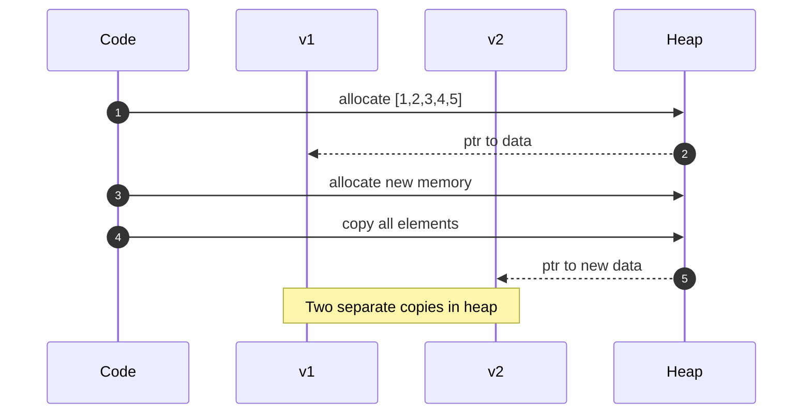
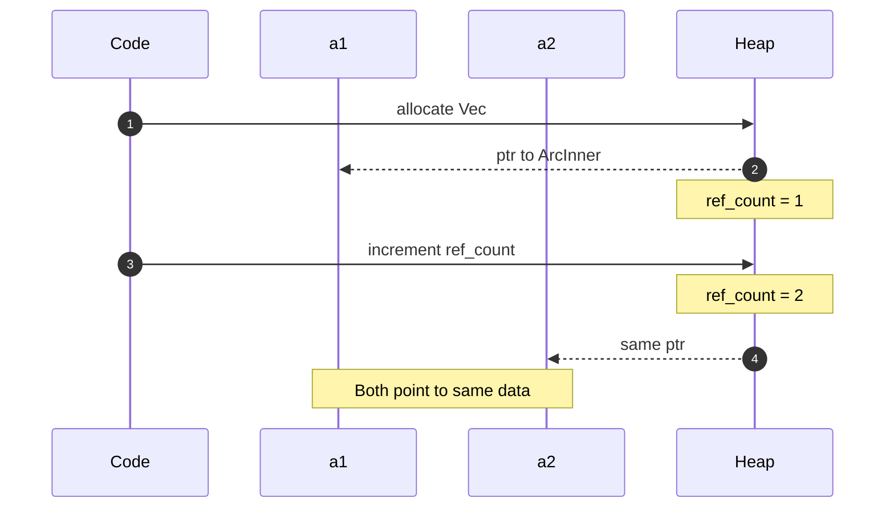
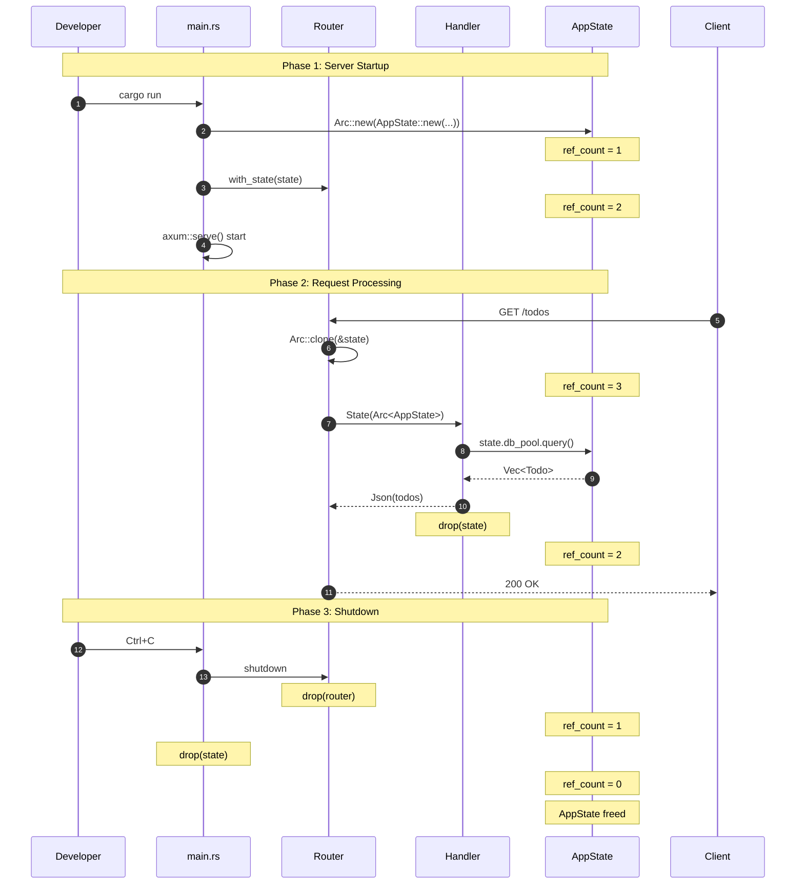
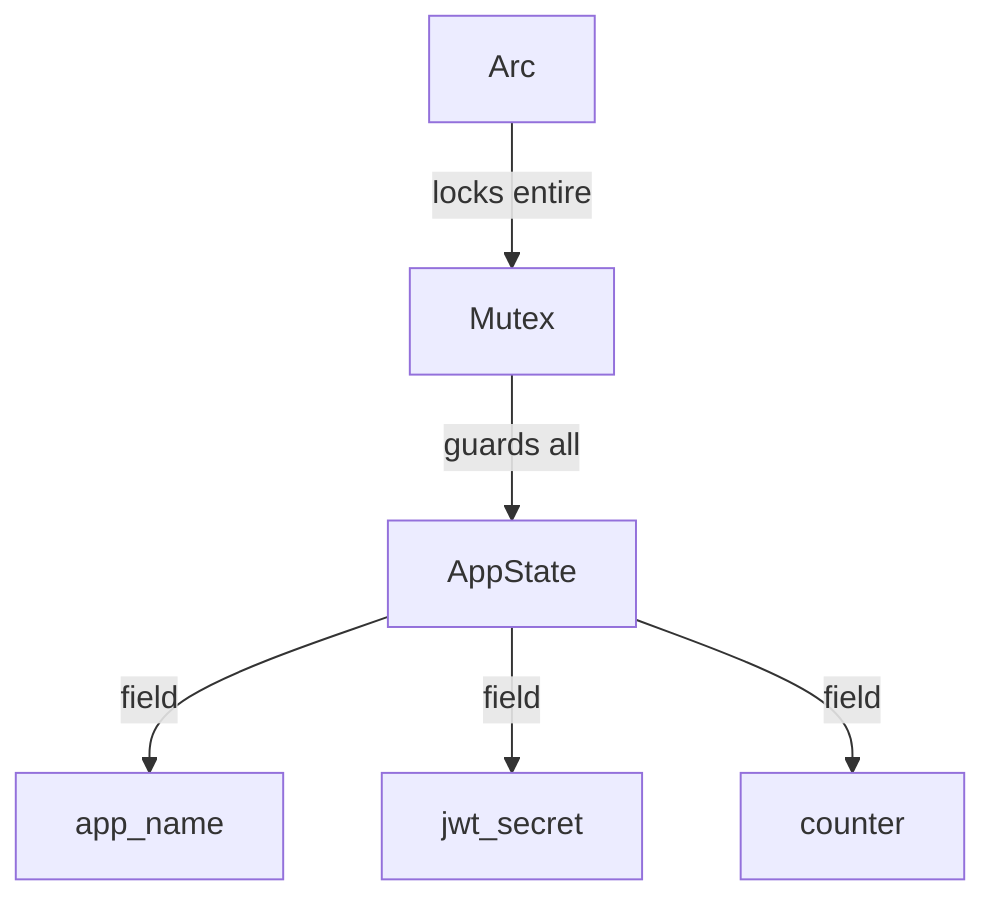
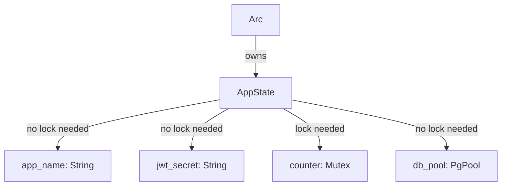
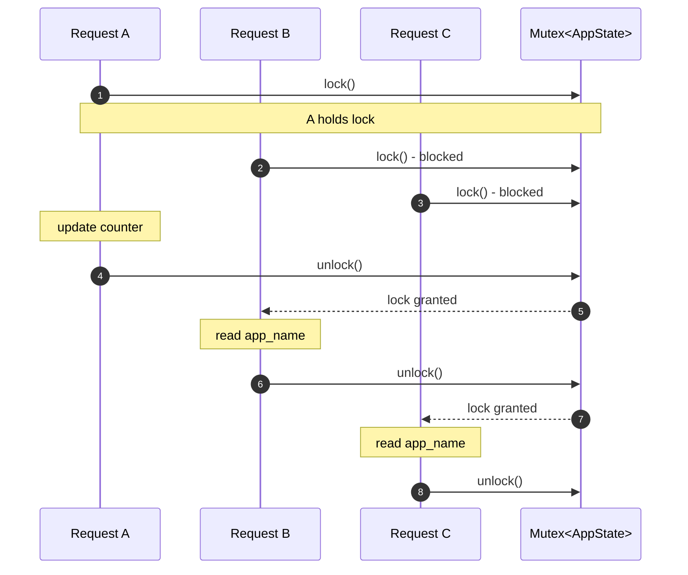
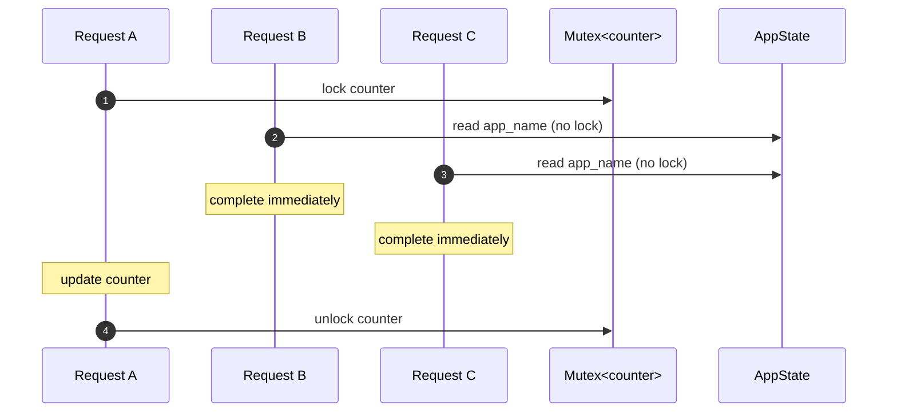
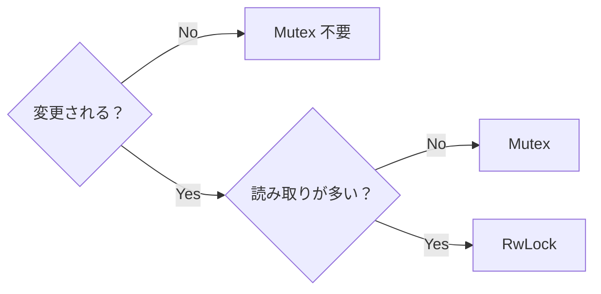

# axum State の仕組みを図解で整理してみた

## はじめに

### この記事を書いた背景

以前、**WASM + コンテナのハイブリッドアーキテクチャ**で TODO API を構築し、その内容を記事にまとめました：

https://zenn.dev/sbk0716/articles/e3830611060050

Edge 層（WASM/Spin）で JWT 認証、Core 層（axum/コンテナ）でビジネスロジックという構成で動くものは作れました。しかし、Core 層のコードを書いていて気づいたことがあります：

```rust
async fn list_todos(
    State(state): State<Arc<AppState>>,
) -> Json<Vec<Todo>> {
    let todos = sqlx::query_as!(Todo, "SELECT * FROM todos")
        .fetch_all(&state.db_pool)
        .await?;
    Json(todos)
}
```

**動くコードと理解のギャップ**

- `Arc` で包む理由は？
- `&state.db_pool` の `&` は何をしている？
- `State` の中で何が起きている？
- 複数リクエストが同時に来たとき、メモリはどうなっている？

動くコードを書くだけなら、既存のコードを参考にすれば実装できます。しかし、**なぜそう書くのか** を理解していないと、エラーが発生したときに原因を特定できません。

この記事では、シナリオベースで State のライフサイクルとメモリの動きを追っていきます。誤りや改善点があれば、コメントでご指摘ください。

### 対象読者

- Rust の基本構文（所有権、借用）を理解している
- axum や Web 開発は初めて、または経験が浅い
- 「なんとなく動くコード」を「理解して書けるコード」にしたい

### リポジトリ

この記事のコード例は以下のリポジトリで実際に動作確認できます：

https://github.com/sbk0716/spin-axum-todo

---

## State とは何か？

### 定義

> **State = 複数のハンドラー間でデータを共有する仕組み**

axum での具体的な意味：

| 用語       | axum での意味                                 | この記事での具体例                                               |
| ---------- | --------------------------------------------- | ---------------------------------------------------------------- |
| State      | 全エンドポイントで共有するオブジェクト        | `AppState` 構造体（`db_pool` などを持つ）                        |
| ハンドラー | 1つの API エンドポイントを処理する `async fn` | `list_todos()`（`GET /todos`）、`create_todo()`（`POST /todos`） |
| リクエスト | クライアントからの HTTP 呼び出し              | `curl http://localhost:3000/todos`                               |

### なぜ State が必要か？

Web サーバーでは、DB 接続プール、Redis クライアント、JWT シークレットなど、**全てのリクエストハンドラーで共通して使うリソース**があります。

```rust
struct AppState {
    db_pool: PgPool,          // DB 接続（全エンドポイントで使う）
    redis_client: RedisClient, // キャッシュ（全エンドポイントで使う）
    jwt_secret: String,        // 認証シークレット（全エンドポイントで使う）
}
```

### 方法の比較

| 方法                 | 問題点                                               |
| -------------------- | ---------------------------------------------------- |
| グローバル変数       | テストが困難、依存関係が不明確、unsafe が必要        |
| 関数の引数で毎回渡す | 引数が増えすぎる、リファクタリングが大変             |
| **State パターン**   | 依存関係が明確、テスト時にモック差し替え可能、型安全 |

### 並行処理という課題

axum は **並行（concurrent）** に複数の HTTP リクエストを処理します。つまり、1つのリクエストの処理が完了する前に、別のリクエストの処理を開始できます：

```
時刻 0ms:  GET /todos    → list_todos() 関数の実行開始
時刻 1ms:  POST /todos   → create_todo() 関数の実行開始
時刻 2ms:  GET /users    → list_users() 関数の実行開始
時刻 5ms:  create_todo() 完了（レスポンス返却）
時刻 8ms:  list_todos() 完了（レスポンス返却）
時刻 10ms: list_users() 完了（レスポンス返却）
```

**問題**: `list_todos()`、`create_todo()`、`list_users()` の3つの関数が同時に動いている。3つの関数すべてが同じ `db_pool`（DB 接続プール）を使って SQL を実行したい。どうすればよいか？

### Arc がなければどうなるか？

もし Arc を使わずに `AppState` を `list_todos()` や `create_todo()` などのハンドラー関数に直接渡そうとすると、**コンパイルエラー**になります。

```rust
// ❌ コンパイルエラー
let state = AppState::new(...);  // main() 関数内のローカル変数 state が所有者

let router = Router::new()
    .route("/todos", get(list_todos(state)))  // state の所有権が main() → list_todos() へ移動
    .route("/todos", post(create_todo(state))); // エラー: state はもう list_todos() のものなので使えない
```

Rust の所有権ルールにより、`state` を `list_todos()` に渡した時点で、所有権が **`main()` 関数から `list_todos()` 関数へ移動**します。`state` はもう `main()` のものではないため、次の行で `create_todo(state)` と書いてもコンパイルエラーになります。

これは**実行時エラーではなく、コンパイル時に Rust が防いでくれます**。

### Arc を使うとなぜ解決するのか？

Arc を使うと、`list_todos()`、`create_todo()`、`list_users()` などの複数のハンドラー関数が、同じ `AppState`（`db_pool` を含む）にアクセスできるようになります。そのメカニズムを説明します。

**Step 1: `Arc::new()` で Heap にデータを配置**

`main()` 関数が `Arc::new(AppState {...})` を実行すると、`AppState` は Heap 上に配置され、Stack には 8 バイトのポインタだけが置かれます。

**この図の見方:**

| 要素              | 説明                                                                       |
| ----------------- | -------------------------------------------------------------------------- |
| **STACK（左側）** | `main()` 関数内の `state` 変数。8 バイトのポインタ。                       |
| **HEAP（右側）**  | 実際の `AppState` データ。`ref_count: 1` は参照者が 1 人であることを示す。 |
| **矢印（→）**     | `state` ポインタが Heap 上のデータを指している。                           |

```
STACK                          HEAP
+------------------+           +---------------------------+
| state (Arc ptr)  |---------->| ref_count: 1              |
| [8 bytes]        |           | AppState { db_pool, ... } |
+------------------+           +---------------------------+
```

**Step 2: `Arc::clone()` で新しいポインタを作成**

axum の Router が `Arc::clone()` を実行しても、**Heap 上の `AppState` データはコピーされません**。新しいポインタが作成され、そのポインタは `main()` 関数の `state` 変数と同じ Heap 領域を指します。参照カウントが +1 されるだけです（O(1) 操作）。

**この図の見方:**

| 要素              | 説明                                                  |
| ----------------- | ----------------------------------------------------- |
| **STACK（左側）** | 3つの Arc ポインタ（state1, state2, state3）          |
| **HEAP（右側）**  | `AppState` データは **1つだけ**                       |
| **矢印（→）**     | 3本の矢印がすべて同じ Heap 領域に集まっている点に注目 |

```
STACK                          HEAP
+------------------+           +---------------------------+
| state1 (Arc ptr) |---+       | ref_count: 3              |
+------------------+   |       |                           |
| state2 (Arc ptr) |---+------>| AppState { db_pool, ... } |
+------------------+   |       | (data exists only once)   |
| state3 (Arc ptr) |---+       +---------------------------+
+------------------+
```

**結果: 3つの関数が同じ db_pool を使える**

`list_todos()`、`create_todo()`、`list_users()` の3つの関数は、それぞれ自分の Arc ポインタを持っていますが、**全員が同じ Heap 上の `AppState` を指しています**。だから、3つの関数すべてが同じ `db_pool` を使って SQL を実行できるのです。

---

## Arc の仕組み

### Arc とは何か？

[Rust 公式ドキュメント](https://doc.rust-lang.org/std/sync/struct.Arc.html) によると：

> **Arc = Atomic Reference Counted（アトミック参照カウント）**
> 「複数の所有者で同じデータを共有する」ためのスマートポインタ

公式ドキュメントの説明：
> Unlike `Rc<T>`, `Arc<T>` uses atomic operations for its reference counting. This means that it is thread-safe.

### Arc が解決する問題（復習）

前のセクションで説明した通り、Rust の所有権ルールにより、`AppState` を複数のハンドラー関数で共有するにはそのままでは不可能です。Arc はこの問題を解決します。

### 参照カウントのライフサイクル

Arc は「誰がこのデータを使っているか」を **数値（参照カウント）** で追跡します：

| 操作           | 参照カウント | 説明                             |
| -------------- | ------------ | -------------------------------- |
| `Arc::new()`   | 1            | 新規作成、最初の所有者           |
| `Arc::clone()` | +1           | 共有者が増える（アトミック加算） |
| `drop()`       | -1           | 共有者が減る（アトミック減算）   |
| カウント = 0   | -            | Heap メモリを自動解放            |

### メモリレイアウト

`Arc::new(AppState {...})` 実行後のメモリ状態を図で示します。

**この図の見方:**

| 領域              | 説明                                                   | 格納されるもの                                   |
| ----------------- | ------------------------------------------------------ | ------------------------------------------------ |
| **STACK（左側）** | 関数のローカル変数が置かれる領域。高速だがサイズ固定。 | `state` 変数（Arc ポインタ、8バイト）            |
| **HEAP（右側）**  | 動的に確保される領域。サイズ柔軟。                     | `ArcInner`（参照カウント + AppState の実データ） |
| **矢印（→）**     | ポインタ。Stack から Heap への参照。                   | `state` が `ArcInner` を指している               |

```
STACK                          HEAP
+------------------+           +---------------------------+
| state (Arc ptr)  |---------->| ArcInner                  |
| [8 bytes]        |           | +-- strong_count: 1       |
+------------------+           | +-- data: AppState        |
                               |     +-- db_pool: PgPool   |
                               |     +-- redis_client      |
                               |     +-- jwt_secret        |
                               +---------------------------+
```

**ポイント:**

- Stack にはポインタ（8バイト）だけが置かれる
- `AppState` の実データ（`db_pool`、`jwt_secret` など）は Heap に格納される
- Heap 上のデータは複数スレッド（`list_todos()`、`create_todo()` など）から同時にアクセス可能

### Arc::clone() は超高速

最初は「clone」という名前から、データ全体をコピーするのかと思っていました。

[公式ドキュメント](https://doc.rust-lang.org/std/sync/struct.Arc.html)には明確に書かれています：

> Invoking `clone` on `Arc` produces a new `Arc` instance, which points to the same allocation on the heap as the source `Arc`, while increasing a reference count.

つまり、`Arc::clone()` は **`AppState`（`db_pool` などを含む）のコピーではなく、参照カウントを +1 するだけ** です。

### O(n) vs O(1) の違いを実感しよう

> **なぜ Vec を例に使うのか？**
>
> `String`、`Vec`、`HashMap` など Heap にデータを持つ型は、どれも `clone()` すると全データをコピーするため O(n) になります。どの型を例に使っても本質は同じなので、この記事では `Vec` に統一して説明します。

100万要素の Vec をクローンする場合：
- `Vec::clone()`: 新しいメモリ確保 + 全要素コピー → **数ミリ秒**
- `Arc::clone()`: 8バイトの整数をインクリメント → **数ナノ秒**

| 種類      | 動作                 | 計算量 | 100万要素の場合 |
| --------- | -------------------- | ------ | --------------- |
| Vec clone | 全要素をコピー       | O(n)   | ~1ms            |
| Arc clone | 参照カウント +1 のみ | O(1)   | ~10ns           |

### 通常の clone（全要素をコピー）

**何が起こるか**: メモリアロケータに新しい領域を要求し、全要素を1つずつコピーします。

```rust
let v1 = vec![1, 2, 3, 4, 5];
let v2 = v1.clone();  // 全要素のコピーが作られる
```



**結果**: v1 と v2 は **別々の Heap 領域** を指す（データがコピーされた）

**この図の見方:**

| 要素          | 説明                                                                     |
| ------------- | ------------------------------------------------------------------------ |
| **v1**        | 最初の Vec。Heap 上の [1,2,3,4,5] (copy 1) を指す。                      |
| **v2**        | clone で作成された Vec。**別の** Heap 領域 [1,2,3,4,5] (copy 2) を指す。 |
| **矢印（→）** | 2つの矢印が**別々の場所**を指している点に注目。                          |

```
STACK              HEAP
+------+           +------------------------+
| v1   |---------->| [1,2,3,4,5] (copy 1)   |
+------+           +------------------------+
| v2   |---------->| [1,2,3,4,5] (copy 2)   |
+------+           +------------------------+
```

### Arc の clone（参照カウント増加のみ）

**何が起こるか**: CPU のアトミック命令で参照カウントを +1 するだけ。メモリアロケーションは発生しません。

```rust
let a1 = Arc::new(vec![1, 2, 3, 4, 5]);
let a2 = Arc::clone(&a1);  // 参照カウント +1 のみ（超高速）
```



**結果**: a1 と a2 は **同じ Heap 領域** を指す（データはコピーされていない）

**この図の見方:**

| 要素          | 説明                                                                   |
| ------------- | ---------------------------------------------------------------------- |
| **a1**        | 最初の Arc ポインタ。                                                  |
| **a2**        | Arc::clone() で作成されたポインタ。**同じ** Heap 領域を指す。          |
| **矢印（→）** | 2つの矢印が**同じ場所**を指している点に注目（Vec::clone() との違い）。 |

```
STACK              HEAP
+------+           +----------------------+
| a1   |---------->| ref_count: 2         |
+------+      +--->| data: [1, 2, 3, 4, 5]|
| a2   |------+    +----------------------+
+------+
```

**重要な違い**:
- **Vec**: 2つの独立した Heap 領域が存在（データがコピーされた）
- **Arc**: 1つの Heap 領域を2つのポインタが共有（データはコピーされていない）

---

## State のライフサイクル

サーバー起動からリクエスト処理、シャットダウンまでの流れに沿って、`Arc<AppState>` の参照カウントがどう変化するかを追っていきます。

### シナリオ 1: サーバー起動時

```rust
#[tokio::main]
async fn main() -> anyhow::Result<()> {
    // 1. DB 接続プールを作成（高コスト、時間がかかる）
    let db_pool = PgPool::connect(&database_url).await?;

    // 2. AppState を作成
    //    この時点で state 変数が AppState の「所有者」
    let state = Arc::new(AppState::new(db_pool, jwt_secret));
    //    ↑ 参照カウント = 1

    // 3. Router に State を登録
    let app = Router::new()
        .route("/todos", get(list_todos))
        .with_state(state);
    //    ↑ Router も state を持つので、参照カウント = 2

    // 4. サーバー起動
    axum::serve(listener, app).await?;
    Ok(())
}
```

この時点でのメモリ状態を図で示します。

**この図の見方:**

| 要素                      | 説明                                                                    |
| ------------------------- | ----------------------------------------------------------------------- |
| **state（Arc pointer）**  | `main()` 関数内のローカル変数。Heap 上の `ArcInner` を指すポインタ。    |
| **Router（Arc pointer）** | `with_state()` により Arc::clone() された参照。同じ `ArcInner` を指す。 |
| **ref_count: 2**          | `state` と `Router` の2つが参照しているので、カウントは 2。             |
| **矢印（→）**             | 両方のポインタが **同じ** Heap 領域を指している点に注目。               |

```
+---------------------------------------------------------------------+
|                            main.rs                                  |
|                                                                     |
|  +------------------+                                               |
|  | state            |---+                                           |
|  | (Arc pointer)    |   |                                           |
|  +------------------+   |     +----------------------------------+  |
|                         +---->| ArcInner (on Heap)               |  |
|                         |     | +------------------------------+ |  |
|  +------------------+   |     | | ref_count: 2                 | |  |
|  | Router           |---+     | +------------------------------+ |  |
|  | (Arc pointer)    |         | | AppState                     | |  |
|  +------------------+         | |  - db_pool: PgPool           | |  |
|                               | |  - jwt_secret: String        | |  |
|                               | +------------------------------+ |  |
|                               +----------------------------------+  |
+---------------------------------------------------------------------+
```

**ポイント**: AppState の実データは **1つだけ**。state 変数と Router は同じデータへのポインタを持っている。

### シナリオ 2: リクエスト到着

```
$ curl http://localhost:3000/todos
```

何が起こるか（ステップバイステップ）：

```
時刻 0ms: クライアントが GET /todos をリクエスト
         ↓
時刻 1ms: axum がリクエストを受信
         ↓
時刻 2ms: Router が「/todos は list_todos() で処理する」と判断
         ↓
時刻 3ms: Router が Arc::clone(&state) を実行 ← ★ここが重要！
         - 参照カウント: 2 → 3
         - AppState のデータはコピーされない（ポインタだけコピー）
         ↓
時刻 4ms: ハンドラー list_todos() が呼び出される
         ↓
時刻 50ms: DB からデータ取得完了、JSON レスポンス返却
```

```rust
pub async fn list_todos(
    State(state): State<Arc<AppState>>,  // ← Router が Arc::clone() した参照
) -> Result<Json<Vec<Todo>>, AppError> {

    let todos = sqlx::query_as!(Todo, "SELECT * FROM todos")
        .fetch_all(&state.db_pool)  // ← なぜ & がついている？
        .await?;

    Ok(Json(todos))
}
// ← 関数終了時、state (Arc) が drop される
//   参照カウント: 3 → 2
```

### シナリオ 3: 複数リクエストが同時に来る

3つの curl コマンドがほぼ同時に実行された場合：

```
時刻 0ms: curl GET /todos    → list_todos() 関数が開始
時刻 1ms: curl POST /todos   → create_todo() 関数が開始
時刻 2ms: curl GET /users    → list_users() 関数が開始
```

この瞬間、3つの関数すべてが `state.db_pool` を使って SQL クエリを実行しようとしています。

**この図の見方:**

| 要素                          | 説明                                                                               |
| ----------------------------- | ---------------------------------------------------------------------------------- |
| **state**                     | `main()` 関数のローカル変数。`Arc<AppState>` 型。サーバー稼働中は常に存在する      |
| **Router**                    | axum のルーター。`with_state()` で `Arc::clone()` された参照を持つ                 |
| **list_todos() [Request A]**  | `GET /todos` を処理中。`State(state): State<Arc<AppState>>` で受け取った参照を持つ |
| **create_todo() [Request B]** | `POST /todos` を処理中。同上                                                       |
| **list_users() [Request C]**  | `GET /users` を処理中。同上                                                        |
| **ref_count: 5**              | `state` + `Router` + 3つの関数 = 5つの参照者                                       |

**重要**: 5本の矢印がすべて **同じ ArcInner** を指している点に注目してください。`AppState` のデータ（`db_pool` など）は **1つだけ** です。

```
+----------------------------------------------------------------------+
|                    3 Concurrent Requests Processing                  |
|                                                                      |
|  +------------------+                                                |
|  | state            |---+                                            |
|  +------------------+   |                                            |
|                         |                                            |
|  +------------------+   |                                            |
|  | Router           |---+                                            |
|  +------------------+   |                                            |
|                         |     +-----------------------------------+  |
|  +------------------+   |     | ArcInner (on Heap)                |  |
|  | list_todos()     |---+---->| +-------------------------------+ |  |
|  | [Request A]      |   |     | | ref_count: 5                  | |  |
|  +------------------+   |     | +-------------------------------+ |  |
|                         |     | | AppState                      | |  |
|  +------------------+   |     | |  - db_pool  <--- ALL handlers | |  |
|  | create_todo()    |---+     | |  - jwt_secret    share this!  | |  |
|  | [Request B]      |   |     | +-------------------------------+ |  |
|  +------------------+   |     +-----------------------------------+  |
|                         |                                            |
|  +------------------+   |                Only ONE AppState exists    |
|  | list_users()     |---+                in memory (not copied!)     |
|  | [Request C]      |                                                |
|  +------------------+                                                |
+----------------------------------------------------------------------+
```

**ポイント**:
- 参照カウントは 5 に増えたが、**`AppState` のデータ（`db_pool`、`jwt_secret` など）は Heap 上に1つだけ**
- `list_todos()`、`create_todo()`、`list_users()` の3つの関数すべてが、同じ `db_pool` を使って SQL を実行できる
- Arc::clone() はポインタのコピーだけなので、非常に高速（約5ナノ秒）

### 全体のシーケンス図

State のライフサイクル全体を1つの図にまとめました。サーバー起動からシャットダウンまでの流れを追えます。

**この図の見方:**

| 登場人物      | 説明                                                                |
| ------------- | ------------------------------------------------------------------- |
| **Developer** | 開発者（あなた）。`cargo run` でサーバーを起動し、Ctrl+C で停止する |
| **main.rs**   | エントリーポイント。AppState を作成し、Router に渡す                |
| **Router**    | axum のルーター。リクエストを適切なハンドラーに振り分ける           |
| **Handler**   | 各 API エンドポイントの処理関数（list_todos など）                  |
| **AppState**  | 共有データ。Heap 上に存在し、参照カウントで管理される               |
| **Client**    | API を呼び出すクライアント（curl など）                             |

**3つのフェーズ:**

| フェーズ                        | 内容                                            | ref_count の変化  |
| ------------------------------- | ----------------------------------------------- | ----------------- |
| **Phase 1: Server Startup**     | AppState 作成 → Router に登録                   | 1 → 2             |
| **Phase 2: Request Processing** | リクエスト処理中に Arc::clone() → 終了時に drop | 2 → 3 → 2         |
| **Phase 3: Shutdown**           | Router と state が順番に drop                   | 2 → 1 → 0（解放） |



---

## 借用（&）を使う理由

`list_todos()` ハンドラー関数のコード中にある `&state.db_pool` について説明します。

### 借用と所有権

Rust では、値を関数に渡す方法は2つあります：

| 方法                     | 書き方         | 動作                                                                              | 結果                     |
| ------------------------ | -------------- | --------------------------------------------------------------------------------- | ------------------------ |
| **所有権の移動（move）** | `func(value)`  | 値の所有権が**呼び出し元（`list_todos()`）から呼び出し先（`fetch_all()`）へ移る** | 元の変数は使えなくなる   |
| **借用（borrow）**       | `func(&value)` | 参照だけを渡す（所有権は `list_todos()` が保持したまま）                          | 元の変数は引き続き使える |

### なぜ db_pool を借用するのか？

`fetch_all()` は `&PgPool`（参照）を受け取るように設計されています。これには理由があります：

1. **PgPool は内部で Arc を使用している**
   - PgPool 自体が Arc でラップされた接続プールを持っている
   - 参照を渡すだけで、内部の接続プールにアクセスできる

2. **所有権を移動する必要がない**
   - DB クエリに必要なのは「接続プールへのアクセス」だけ
   - `list_todos()` が `PgPool` の所有権を `fetch_all()` へ渡す必要はない

3. **state を継続して使用できる**
   - 借用なので、`&state.db_pool` の後も `state` は有効
   - 同じハンドラー内で複数回 DB アクセスが可能

### もし `&` を付けなかったら？

```rust
// ❌ コンパイルエラー
let todos = sqlx::query_as!(...)
    .fetch_all(state.db_pool)  // move が発生
    .await?;

// state.db_pool はもう使えない！
let count = state.db_pool.query(...);  // エラー
```

### 参照渡しのパターン

このパターンは Rust では一般的です：

| 型       | 関数の引数 | 理由                             |
| -------- | ---------- | -------------------------------- |
| `PgPool` | `&PgPool`  | 内部で Arc を使用、参照で十分    |
| `String` | `&str`     | 読み取りだけなら参照で十分       |
| `Vec<T>` | `&[T]`     | 要素の読み取りだけなら参照で十分 |

**ポイント**: データを読むだけなら、`fetch_all()` が `list_todos()` から所有権を奪う必要はない。借用で十分。

---

## 設計パターン: Mutex が必要なケース

### Arc だけでは「書き込み」はできない

Arc は「`list_todos()` や `create_todo()` など複数のハンドラー関数で `AppState` を共有する」という問題を解決します。しかし、Arc だけでは「`counter` フィールドの値を安全に更新する」という問題は解決できません。

[公式ドキュメント](https://doc.rust-lang.org/std/sync/struct.Mutex.html)によると、Mutex は以下のように定義されています：

> A mutual exclusion primitive useful for protecting shared data. This mutex will block threads waiting for the lock to become available.

| 機能                 | Arc | Mutex | Arc + Mutex |
| -------------------- | --- | ----- | ----------- |
| 複数所有者での共有   | ✅   | ❌     | ✅           |
| データの変更         | ❌   | ✅     | ✅           |
| スレッドセーフな変更 | ❌   | ✅     | ✅           |

### Mutex が必要なフィールド・不要なフィールド

| フィールドの種類         | Mutex    | 理由                     | 例                    |
| ------------------------ | -------- | ------------------------ | --------------------- |
| 読み取り専用（不変）     | 不要     | 変更しないので競合しない | config, jwt_secret    |
| 読み書きする（可変）     | **必要** | 同時書き込みで競合する   | counter, cache        |
| 内部でスレッドセーフな型 | 不要     | 型自体が排他制御を持つ   | PgPool, redis::Client |

### ❌ 構造体全体を Mutex で包む（非推奨）

```rust
// ❌ 非推奨
Arc<Mutex<AppState>>
```

**問題点**: counter を更新するだけなのに、app_name も jwt_secret もロックされます。

以下の図は、構造体全体を Mutex で包んだ場合のデータ構造を示しています。

**図の矢印の意味:**
- `locks entire`（全体をロック）: Arc は Mutex 全体をロックしなければならない
- `guards all`（すべてを保護）: Mutex は AppState の **すべてのフィールド** を保護する

つまり、`counter` を1つ更新するだけで、`app_name` や `jwt_secret` も一緒にロックされてしまいます。



### ✅ フィールドごとに Mutex（推奨）

```rust
// ✅ 推奨
struct AppState {
    app_name: String,           // 読み取り専用 → Mutex 不要
    jwt_secret: String,         // 読み取り専用 → Mutex 不要
    counter: Mutex<u64>,        // 変更する → Mutex 必要
    db_pool: PgPool,            // 内部でスレッドセーフ → Mutex 不要
}
```

以下の図は、フィールドごとに Mutex を配置した場合のデータ構造を示しています。

**図の矢印の意味:**
- `no lock needed`（ロック不要）: 読み取り専用、または内部でスレッドセーフな型
- `lock needed`（ロック必要）: 変更されるフィールドのみ Mutex で保護

この設計なら、`counter` をロックしても、他のフィールドには影響しません。



### パフォーマンスへの影響

3つのリクエストが同時に来た場合の比較を見てみましょう。

> **Note**: ここでは TODO API ではなく、カウンター機能を持つ API を例に説明します。TODO API の `db_pool` は内部でスレッドセーフなので Mutex は不要ですが、`counter` のような単純な値を更新する場合は Mutex が必要です。

**シナリオ:**
- リクエスト A: `GET /count` → `increment_count()` 関数が `state.counter` フィールドを +1 する（**書き込み**）
- リクエスト B: `GET /info` → `get_info()` 関数が `state.app_name` フィールドを読むだけ（**読み取り**）
- リクエスト C: `GET /info` → `get_info()` 関数が `state.app_name` フィールドを読むだけ（**読み取り**）

### ❌ Arc<Mutex<AppState>> の場合

`get_info()` 関数（B, C）は `app_name` を読むだけなのに、`increment_count()` 関数（A）の `counter` 更新（例: 5ms）が完了するまで待つ必要があります。

- A の処理時間: 5ms
- B の待ち時間: 5ms（A のロック解放待ち）
- C の待ち時間: 10ms（A + B のロック解放待ち）
- **合計レイテンシ: 20ms**



### ✅ Arc<AppState> の場合（フィールド単位で Mutex）

`get_info()` 関数（B, C）は `counter` フィールドにアクセスしないので、`increment_count()` 関数（A）が `counter` をロックしていても待つ必要がありません。

- A の処理時間: 5ms
- B の処理時間: 1ms（**待ち時間なし**）
- C の処理時間: 1ms（**待ち時間なし**）
- **合計レイテンシ: 7ms**



### タイムライン比較

2つのアプローチで、同じ3リクエストを処理したときの時間経過を比較します。

**図の見方:**

| 記号           | 意味                           |
| -------------- | ------------------------------ |
| `[===LOCK===]` | ロックを保持して処理中         |
| `[==WAIT==]`   | ロック取得待ち（ブロッキング） |
| `[==DONE==]`   | 処理完了                       |

**登場するリクエスト:**
- **A**: counter を更新（書き込み処理、5ms かかる）
- **B**: app_name を読むだけ（読み取り処理、1ms で完了）
- **C**: app_name を読むだけ（読み取り処理、1ms で完了）

```
Arc<Mutex<AppState>> - 構造体全体をロック:

Time:  0----1----2----3----4----5----6----7----8----9
A:     [=======LOCK=======]
B:                         [==WAIT==][==LOCK==]
C:                                             [WAIT][==]

→ 合計レイテンシ: 20ms


Arc<AppState> - フィールド単位のロック:

Time:  0----1----2----3----4----5----6----7----8----9
A:     [===counter LOCK===]
B:     [==DONE==]                    <- 待ち時間なし！
C:     [==DONE==]                    <- 待ち時間なし！

→ 合計レイテンシ: 7ms
```

**約3倍の性能差が生じます。**

### 設計判断フローチャート

AppState に新しいフィールドを追加するとき、どう保護するかを決めるためのフローチャートです。

**使い方:**
1. 「変更される？」→ そのフィールドは初期化後に値が変わるか？
2. 「読み取りが多い？」→ 書き込みより読み取りの頻度が圧倒的に高いか？

**結果の意味:**
- **Mutex 不要**: `String`、`PgPool` など、そのままの型で OK
- **Mutex**: 書き込み頻度が高い場合の標準的な選択
- **RwLock**: 読み取りが多い場合（複数スレッドが同時に読める）



---

## まとめ

### 覚えておくべきポイント

| ポイント                              | 説明                                                |
| ------------------------------------- | --------------------------------------------------- |
| **AppState のデータは常に1つだけ**    | Arc を使っても、データは Heap 上に1つしか存在しない |
| **Arc::clone() はポインタのコピー**   | データはコピーしない、約5ナノ秒で完了               |
| **参照カウントが 0 になると自動解放** | 開発者は明示的なメモリ管理をしなくていい            |
| **構造体全体を Mutex で包まない**     | 必要なフィールドだけを Mutex で保護する             |

### よくあるミス

| やりがちなこと               | 問題点                           | 正しい方法                           |
| ---------------------------- | -------------------------------- | ------------------------------------ |
| `Arc<Mutex<AppState>>`       | 全フィールドがロックされる       | フィールド単位で Mutex               |
| ハンドラーで `state.clone()` | 不要なクローン                   | 参照を渡す（`&dyn Trait`）           |
| PgPool を Mutex で包む       | 二重ロック、不要なオーバーヘッド | そのまま使う（内部でスレッドセーフ） |

※ PgPool については、[sqlx 公式ドキュメント](https://docs.rs/sqlx/latest/sqlx/pool/struct.Pool.html)に以下の記載があります：
> Cloning `Pool` is cheap as it is simply a reference-counted handle to the inner pool state.

### 5W1H まとめ

| 5W1H      | 回答                                                             |
| --------- | ---------------------------------------------------------------- |
| **What**  | 全 API エンドポイントで共有するリソースの入れ物                  |
| **Why**   | DB 接続を効率的に共有し、テストを容易にするため                  |
| **When**  | 複数エンドポイントで使う & リクエストごとに変わらないリソース    |
| **Where** | 定義は presentation 層、組み立ては main.rs、使用はハンドラー     |
| **Who**   | ハンドラーだけが直接アクセス、下位レイヤーはトレイト経由         |
| **How**   | Arc<AppState> で包み、with_state() で登録、State<...> で受け取る |

---

## おわりに

冒頭で挙げた疑問への回答を改めて整理します：

| 疑問                           | 回答                                                                                                                         |
| ------------------------------ | ---------------------------------------------------------------------------------------------------------------------------- |
| なぜ `Arc` で包むの？          | 複数のハンドラーで同じデータを共有するため。Arc::clone() は参照カウントを +1 するだけで超高速（約5ナノ秒）                   |
| `&state.db_pool` の `&` は何？ | 借用。`list_todos()` から `fetch_all()` へ所有権を移動せずに参照だけを渡す。PgPool は内部で Arc を使っているので、参照で十分 |
| 複数リクエストが同時に来たら？ | Arc により全ハンドラーが同じ AppState を参照。データは1つだけ、ポインタが増えるだけ                                          |
| Mutex はいつ使う？             | State のフィールドを変更する場合のみ。読み取り専用や内部でスレッドセーフな型（PgPool）には不要                               |

Rust の所有権システムは最初は難しく感じますが、**メモリの動きを図で追っていく**と理解しやすくなります。この記事が、同じように「なんとなく」を脱したい方の参考になれば幸いです。

間違いや改善点があれば、ぜひコメントで教えてください。

---

## 用語集

Rust やシステムプログラミングでよく使われる用語を整理しました。Web API 開発の経験はあるが、メモリ管理やポインタに馴染みのない方向けです。

### メモリの基本

> **補足**: Stack・Heap・静的領域は「概念上の区分」であり、物理的に別の装置に分かれているわけではありません。実行中はすべて RAM（主記憶）上に配置されます。OS が作る「仮想アドレス空間」の中で用途ごとに区分けされているだけです。

| 用語                   | 説明                                                                                                                 |
| ---------------------- | -------------------------------------------------------------------------------------------------------------------- |
| **メモリ（Memory）**   | CPU が読み書きするデータの置き場（RAM）。「どこに」「どれくらい」「いつまで」置くかで領域の扱いが変わる。            |
| **静的領域（Static）** | プログラムの実行中ずっと存在するデータの領域。文字列リテラル（`"Hello"`）、`static` 変数、グローバル定数などを格納。 |
| **Stack（スタック）**  | 関数呼び出しのたびに積まれ、関数終了で自動解放される領域。ローカル変数を格納。高速だが容量は限られる。               |
| **Heap（ヒープ）**     | 実行中に動的に確保・解放する領域。`String`、`Vec<T>`、`Box<T>` の中身を格納。Stack より遅いがサイズ柔軟。            |
| **メモリアロケータ**   | Heap メモリの確保（malloc）・解放（free）を管理するシステム。Rust ではデフォルトでシステムアロケータを使用。         |

### ポインタと参照

| 用語                  | 説明                                                                                                     |
| --------------------- | -------------------------------------------------------------------------------------------------------- |
| **ポインタ**          | メモリ上の位置（アドレス）を指す値。8バイト（64bit 環境）。                                              |
| **参照（Reference）** | `&T` / `&mut T` で表される安全なポインタ。Rust は不正利用をコンパイル時に防ぐ。                          |
| **スマートポインタ**  | メモリを自動管理するポインタ。Rust では `Arc`、`Box`、`Rc` などがある。C++ の `std::shared_ptr` に相当。 |

### Rust の所有権システム

| 用語                         | 説明                                                                                                                                                                                          |
| ---------------------------- | --------------------------------------------------------------------------------------------------------------------------------------------------------------------------------------------- |
| **所有権（Ownership）**      | 「そのデータを解放する責任を誰が持つか」。`String` は自分の Heap 領域を所有し、スコープを抜けると解放される。                                                                                 |
| **借用（Borrowing）**        | `&T` / `&mut T` で「一時的に参照して使う」こと。借りている間に元が消えないよう Rust がチェックする。                                                                                          |
| **ライフタイム（Lifetime）** | 「参照が有効でいられる期間」の型レベル表現。`'static` は「プログラム終了まで有効」を意味する。                                                                                                |
| **スコープ（Scope）**        | 変数が有効な範囲。`{}` で囲まれたブロック。変数はスコープを抜けると自動的に `drop` される。                                                                                                   |
| **drop**                     | 値がスコープを抜けるときに自動的に呼ばれる解放処理。Arc の場合は参照カウントを -1 し、0 になったら Heap メモリを解放する。                                                                    |
| **クローン（Clone）**        | `.clone()` メソッドで値を複製すること。`String::clone()` は Heap メモリの確保 + データ複製が必要（O(n)）、`Arc::clone()` は参照カウントの加算のみ（O(1)）。                                   |
| **コピー（Copy）**           | ビット単位の暗黙的な複製。`i32`、`f64`、`bool` などのプリミティブ型が持つ。代入や関数呼び出しで自動的に複製され、元の値も引き続き使える。Clone とは異なり明示的な `.clone()` 呼び出しが不要。 |

### 並行処理

| 用語                        | 説明                                                                                                                                      |
| --------------------------- | ----------------------------------------------------------------------------------------------------------------------------------------- |
| **参照カウント**            | データを何箇所から参照しているかを数える仕組み。カウントが 0 になるとメモリを自動解放。Arc で使用。                                       |
| **アトミック操作**          | 他のスレッドに割り込まれない、分割不可能な単一の操作。Arc の参照カウント更新に使用される。                                                |
| **Send**                    | 「この型の値を別スレッドに送っても安全」を示すマーカートレイト。Arc や PgPool は Send を実装している。                                    |
| **Sync**                    | 「この型への参照を複数スレッドで共有しても安全」を示すマーカートレイト。`T: Sync` なら `&T: Send`。Arc や PgPool は Sync を実装している。 |
| **ミューテックス（Mutex）** | Mutual Exclusion（相互排他）の略。一度に1つのスレッドだけがデータにアクセスできることを保証する仕組み。                                   |
| **RwLock**                  | Reader-Writer Lock。複数の読み取りは同時に許可し、書き込み時のみ排他ロック。読み取りが多い場合は Mutex より効率的。                       |

### 計算量（Big O 記法）

| 用語     | 説明                                                                                                                                                               |
| -------- | ------------------------------------------------------------------------------------------------------------------------------------------------------------------ |
| **O(1)** | 「定数時間」。データサイズに関係なく、常に同じ時間で完了する操作。`Arc::clone()` は参照カウントを +1 するだけなので O(1)。                                         |
| **O(n)** | 「線形時間」。データサイズ n に比例して時間がかかる操作。`String::clone()` は文字数分のメモリを新規確保して複製するため、1000文字なら1文字の1000倍の時間がかかる。 |

### その他

| 用語                              | 説明                                                                                                                                                              |
| --------------------------------- | ----------------------------------------------------------------------------------------------------------------------------------------------------------------- |
| **トレイト（Trait）**             | 型が持つべき振る舞い（メソッド）を定義するインターフェース。他言語の interface に相当。                                                                           |
| **async/await**                   | 非同期処理を記述するための構文。`async fn` は Future を返し、`.await` で完了を待つ。tokio や axum のハンドラーで使用。                                            |
| **接続プール（Connection Pool）** | DB 接続を事前に複数確保しておき、リクエストごとに再利用する仕組み。接続確立のコストを削減。PgPool が該当。内部でスレッドセーフに実装されているため Mutex は不要。 |

---

## 参考資料

### axum / tokio

- [axum Documentation](https://docs.rs/axum/latest/axum/)
- [tokio Documentation](https://docs.rs/tokio/latest/tokio/)

### Rust の所有権・借用

- [The Rust Book - Understanding Ownership](https://doc.rust-lang.org/book/ch04-00-understanding-ownership.html)
- [The Rust Book - References and Borrowing](https://doc.rust-lang.org/book/ch04-02-references-and-borrowing.html)

### Arc / Mutex

- [std::sync::Arc](https://doc.rust-lang.org/std/sync/struct.Arc.html)
- [std::sync::Mutex](https://doc.rust-lang.org/std/sync/struct.Mutex.html)
