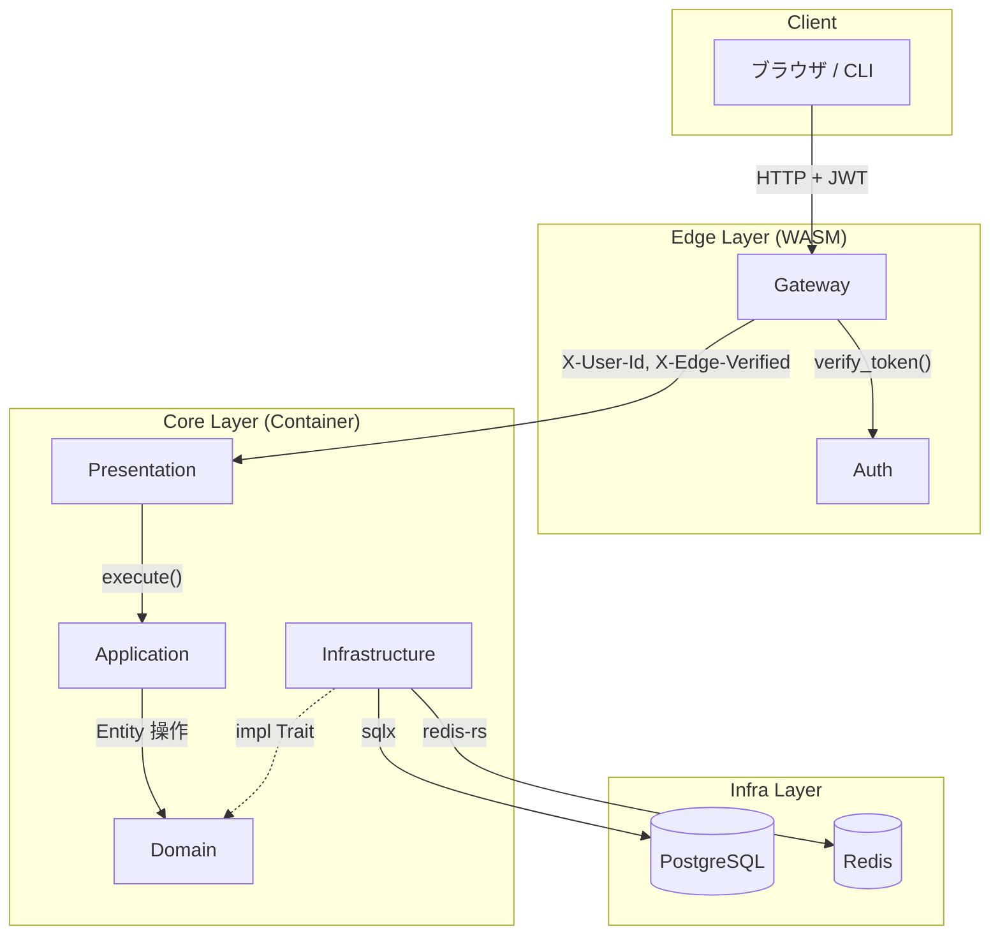
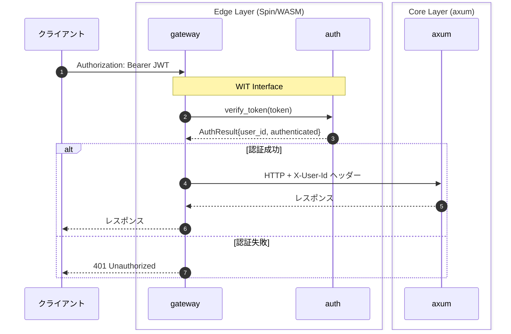
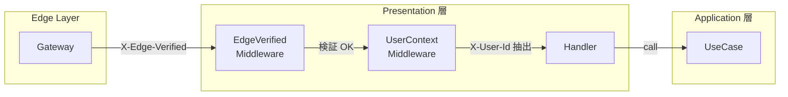
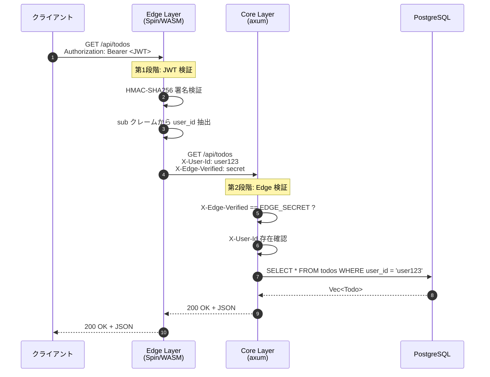
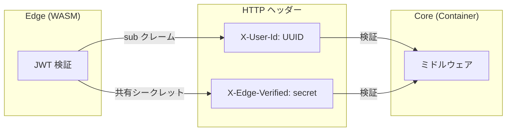
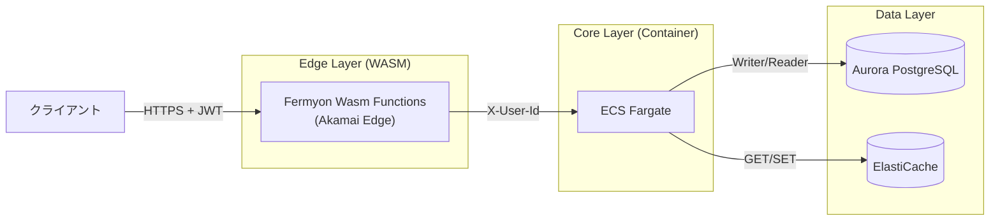
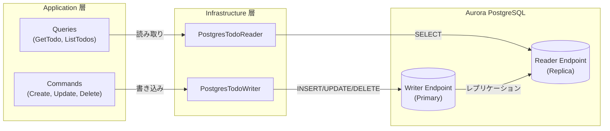
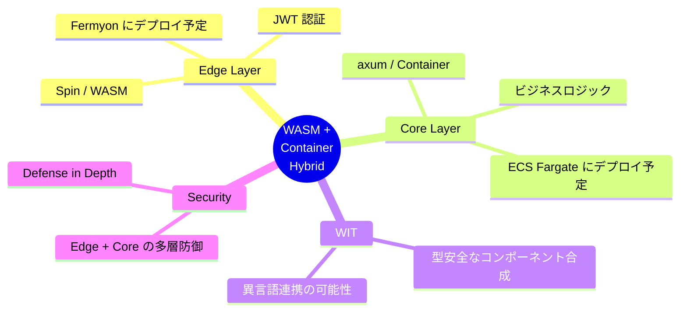

# Spin + axum で WASM + コンテナのハイブリッドアーキテクチャを作ってみた

## はじめに

以前、以下の本を書きました：

**WASM コンポーネント実践入門 - Rust × WIT × Spin ではじめるエッジコンピューティング**
https://zenn.dev/sbk0716/books/dc3be9e82a0b51

**実践 Azure Artifacts - 社内Pythonパッケージ配布ガイド**
https://zenn.dev/sbk0716/books/52b1cd16ad20a5

書いてみて思ったのは、「やっぱり手を動かさないと身につかない」ということ。Rust、WIT、Spin、WASM の実践的な知識を深めるため、**WASM + コンテナのハイブリッドアーキテクチャ**で TODO API を作ってみました。

**リポジトリ**:
https://github.com/sbk0716/spin-axum-todo

## なぜ WASM + コンテナなのか

### WASM の強み

[Fermyon のブログ](https://www.fermyon.com/blog/webassembly-vs-containers) によると：

> WebAssembly offers "blazing fast startup and shutdown times" allowing modules to "run on demand, which is cheap and easy compared to maintaining long-running servers."

| 項目             | WASM vs コンテナ                     | 出典                                                                                                                          |
| ---------------- | ------------------------------------ | ----------------------------------------------------------------------------------------------------------------------------- |
| コールドスタート | 100-1000倍高速（10ms vs 800ms-1.5s） | [DEV Community](https://dev.to/nabindebnath/i-replaced-a-docker-based-microservice-with-webassembly-and-its-100x-faster-4f6d) |
| イメージサイズ   | 最大30倍小さい（2MB vs 80MB）        | [Wasm Performance Benchmarks](https://wasmruntime.com/en/benchmarks)                                                          |
| メモリ使用量     | 40-64%削減                           | [ACM Research](https://dl.acm.org/doi/10.1145/3712197)                                                                        |

### 一方で WASM の制約

[Fermyon](https://www.fermyon.com/blog/webassembly-vs-containers) は WASM の現時点での制約も指摘しています：

- **エコシステムの成熟度**: Rust の全クレートが WASM 対応しているわけではない
- **永続化**: データベースへの直接接続は発展途上
- **デバッグ**: 従来のデバッガーが使えない場面がある

### ハイブリッドという選択

[byteiota](https://byteiota.com/webassembly-vs-docker-when-to-use-each-in-2026/) は以下のように述べています：

> "Is my workload stateless and edge-deployed? WASM. Is it stateful with heavy I/O? Docker."
> "Hybrid architectures—WASM for public-facing edge logic, Docker for internal services—give you the best of both technologies."

そこで今回は「**何を WASM でやるか、何をコンテナでやるか**」を明確に分けました。

| 処理             | 実行環境        | 理由                                  |
| ---------------- | --------------- | ------------------------------------- |
| JWT 検証         | WASM (Edge)     | ステートレス、軽量、高頻度            |
| ビジネスロジック | コンテナ (Core) | DB 接続、複雑な処理、エコシステム活用 |

Edge 層は「認証済みかどうか」だけを判断し、ビジネスロジックには関与しません。これにより Edge 層のバイナリサイズを最小化し、コールドスタート < 1ms を実現しています。

## 全体アーキテクチャ

今回構築したシステムは、クライアントからのリクエストを Edge 層（WASM）で受け、JWT 認証後に Core 層（コンテナ）へプロキシする構成です。Core 層はクリーンアーキテクチャの 4 層構造で、PostgreSQL と Redis に接続します。



| レイヤー | 技術             | 役割                           |
| -------- | ---------------- | ------------------------------ |
| **Edge** | Spin / WASM      | JWT 認証、リクエストプロキシ   |
| **Core** | axum / Container | ビジネスロジック、データ永続化 |

### デプロイ構成（予定）

現時点ではローカル環境での動作確認のみですが、将来的には以下の構成でデプロイ予定です：

| 層       | ローカル       | 本番（予定）                    |
| -------- | -------------- | ------------------------------- |
| **Edge** | Spin (:3000)   | Fermyon Wasm Functions (Akamai) |
| **Core** | axum (:3001)   | AWS ECS Fargate                 |
| **Data** | Docker Compose | Aurora PostgreSQL + ElastiCache |

## Edge 層の設計

### WIT によるコンポーネント合成

Edge 層は **2 つの WASM コンポーネント**で構成されています。`gateway` が HTTP リクエストを受け取り、`auth` コンポーネントの `verify_token()` 関数を呼び出して JWT を検証します。この 2 つのコンポーネント間の通信は WIT（WebAssembly Interface Types）で型安全に定義されています。



| コンポーネント | 役割                              | WIT                    |
| -------------- | --------------------------------- | ---------------------- |
| **gateway**    | HTTP 受信、認証呼び出し、プロキシ | `import authenticator` |
| **auth**       | JWT 検証、ユーザーID 抽出         | `export authenticator` |

### WIT インターフェース定義

```wit
package demo:auth;

interface authenticator {
    record auth-result {
        authenticated: bool,
        user-id: option<string>,
        error: option<string>,
    }

    verify-token: func(token: string) -> auth-result;
}

// auth コンポーネント: authenticator を「公開」
world auth-world {
    export authenticator;
}

// gateway コンポーネント: authenticator を「利用」
world gateway-world {
    import authenticator;
}
```

**WIT (WebAssembly Interface Types)** を使うと：

- **型安全**: インターフェースが明示的に定義される
- **関心の分離**: 認証ロジックを独立コンポーネントに分離
- **再利用性**: auth コンポーネントは他のゲートウェイでも使用可能
- **将来の拡張**: 異言語コンポーネント（Go, JavaScript 等）との連携が可能

WIT 定義から `wit_bindgen::generate!` マクロで Rust コードが自動生成されます。WIT 定義を変更すると Rust 側でコンパイルエラーになるので、インターフェースの不整合を早期に検出できます。

> **Tips**: `cargo expand` コマンドでマクロ展開後のコードを確認できます。生成されたトレイトや構造体の実装を見ることで、WIT と Rust の対応関係が理解しやすくなります。

## Core 層の設計

Core 層はクリーンアーキテクチャに基づき 4 つの層で構成しています。

| 層                 | 役割                             | 主要コンポーネント                   |
| ------------------ | -------------------------------- | ------------------------------------ |
| **Presentation**   | HTTP ハンドラ、ミドルウェア      | Handler, EdgeVerified, UserContext   |
| **Application**    | ユースケース（CQRS）             | Commands, Queries                    |
| **Domain**         | エンティティ、リポジトリトレイト | Todo, User, TodoReader/Writer        |
| **Infrastructure** | DB・キャッシュ実装               | PostgresTodoReader/Writer, TodoCache |

Edge 層との連携で重要なのは Presentation 層のミドルウェアです。Edge 層から送られてくる `X-Edge-Verified` と `X-User-Id` ヘッダーを検証・抽出し、認証情報をハンドラに渡します。Edge 層を経由していないリクエスト（直接アクセス）はここでブロックされます。



| ミドルウェア     | 役割                                                 |
| ---------------- | ---------------------------------------------------- |
| **EdgeVerified** | `X-Edge-Verified` ヘッダーを検証（直接アクセス防止） |
| **UserContext**  | `X-User-Id` ヘッダーからユーザー ID を抽出           |

## Edge と Core をつなぐ

### Defense in Depth（多層防御）

[OWASP](https://cheatsheetseries.owasp.org/cheatsheets/Microservices_Security_Cheat_Sheet.html) は、API Gateway のみの認証は「defense in depth」原則に違反すると指摘しています。

今回は Edge 層と Core 層の 2 段階で検証を行います。Edge 層では JWT の署名検証と有効期限チェックを行い、Core 層では Edge 経由であることの確認と user_id の存在チェックを行います。この多層防御により、仮に Edge 層が突破されても Core 層で食い止められます。



### ヘッダーによる情報伝達

Edge 層で検証した情報を Core 層に伝える方法として、HTTP ヘッダーを採用しました。JWT トークン自体を転送するのではなく、検証済みの情報（user_id）と Edge 経由の証明（シークレット）をヘッダーに設定します。これにより Core 層は JWT のパースを行う必要がなく、シンプルな検証で済みます。



| ヘッダー          | 用途                | 設定元                         |
| ----------------- | ------------------- | ------------------------------ |
| `X-User-Id`       | 認証済みユーザー ID | Edge（JWT の sub クレーム）    |
| `X-Edge-Verified` | Edge 経由の証明     | Edge（環境変数のシークレット） |

Core 層は `X-Edge-Verified` が正しいシークレット値でない場合、リクエストを拒否します。これにより Edge 層をバイパスした直接アクセスを防止できます。

## 本番デプロイ戦略

### WASM + コンテナの本番構成

本番環境では、Edge 層を Akamai のエッジネットワーク上で動作する Fermyon Wasm Functions にデプロイし、Core 層を AWS ECS Fargate にデプロイする構成を予定しています。WASM の高速なコールドスタートと、コンテナの豊富なエコシステムを両立できます。



### Edge 層: Fermyon Wasm Functions (Akamai)

2025年12月、[Akamai が Fermyon を買収](https://www.akamai.com/newsroom/press-release/akamai-announces-acquisition-of-function-as-a-service-company-fermyon)しました。

[Fermyon の発表](https://www.globenewswire.com/news-release/2025/11/12/3186327/0/en/Fermyon-Wasm-Functions-on-Akamai-Now-Generally-Available-Scales-to-75-Million-RPS.html)によると：

> "Fermyon Wasm Functions now scales up to 75 million requests per second across edge and cloud in production environments."
> "Cold start times for applications were reduced to a fraction of a millisecond."

| プラットフォーム                    | WASI サポート       | コールドスタート | Spin 親和性 |
| ----------------------------------- | ------------------- | ---------------- | ----------- |
| **Fermyon Wasm Functions (Akamai)** | フル対応            | < 1ms            | ネイティブ  |
| Cloudflare Workers                  | 部分的（WASI なし） | < 5ms            | 要変換      |
| Fastly Compute                      | フル対応            | 数ms             | 対応        |

**Spin アプリなら Fermyon が最も親和性が高い**です。

### Core 層: AWS ECS Fargate

[Quabyt のコンテナ比較](https://quabyt.com/blog/serverless-containers-platforms) によると：

> "Fargate offers the most cost-effective solution... If you're already invested in AWS, Fargate provides excellent integration with other AWS services."

| プラットフォーム     | 特徴                   | コスト |
| -------------------- | ---------------------- | ------ |
| **AWS ECS Fargate**  | AWS 統合、コスト効率   | 最安   |
| GCP Cloud Run        | シンプル、スケールゼロ | 中程度 |
| Azure Container Apps | KEDA/Dapr 統合         | 約2倍  |

AWS エコシステムとの統合とコスト効率を重視して **ECS Fargate** を選択予定です。

### Aurora PostgreSQL と CQRS

今回のプロジェクトでは CQRS（Command Query Responsibility Segregation）パターンを採用し、読み取り（Query）と書き込み（Command）を分離しています。Application 層で Query と Command を分け、Infrastructure 層で Reader と Writer を分離することで、Aurora PostgreSQL の Writer/Reader エンドポイント分離とシームレスに連携できます。



Aurora PostgreSQL は Writer（プライマリ）と Reader（レプリカ）のエンドポイントが分離されているため、CQRS パターンと相性が良いです。

| エンドポイント | 用途                 | 環境変数              |
| -------------- | -------------------- | --------------------- |
| **Writer**     | INSERT/UPDATE/DELETE | `DATABASE_WRITER_URL` |
| **Reader**     | SELECT               | `DATABASE_READER_URL` |

読み取り負荷をレプリカに分散することで、書き込みパフォーマンスへの影響を最小化できます。

### 予定構成まとめ

| レイヤー | プラットフォーム                | 理由                            |
| -------- | ------------------------------- | ------------------------------- |
| **Edge** | Fermyon Wasm Functions          | Spin ネイティブ、< 1ms 起動     |
| **Core** | AWS ECS Fargate                 | AWS 統合、コスト効率            |
| **Data** | Aurora PostgreSQL + ElastiCache | CQRS 対応（Reader/Writer 分離） |

## まとめ

今回構築したハイブリッドアーキテクチャの全体像をまとめます。WASM（Edge）とコンテナ（Core）の責務を明確に分離し、WIT による型安全なコンポーネント合成と Defense in Depth による多層防御を実現しました。



### やってみて良かったこと

- **WASM + コンテナの使い分け**: 軽量・高速な処理は WASM、エコシステムが必要な処理はコンテナという棲み分けがうまくハマった
- **WIT でコンポーネント合成**: 型安全なインターフェースで関心を分離できる
- **Defense in Depth**: Edge + Core の多層防御でセキュリティを担保
- **デプロイ構成の明確化**: Edge は Fermyon、Core は ECS Fargate という本番構成が見えた

次は実際に Fermyon Wasm Functions と ECS Fargate へのデプロイに挑戦します。

---

## 参考資料

### WASM / Edge

- [Containers vs. WebAssembly: What's the Difference? - Fermyon](https://www.fermyon.com/blog/webassembly-vs-containers)
- [WebAssembly vs Docker—When to Use Each in 2026 - byteiota](https://byteiota.com/webassembly-vs-docker-when-to-use-each-in-2026/)
- [I Replaced a Docker-based Microservice with WebAssembly - DEV Community](https://dev.to/nabindebnath/i-replaced-a-docker-based-microservice-with-webassembly-and-its-100x-faster-4f6d)

### デプロイプラットフォーム

- [Fermyon Wasm Functions GA - GlobeNewswire](https://www.globenewswire.com/news-release/2025/11/12/3186327/0/en/Fermyon-Wasm-Functions-on-Akamai-Now-Generally-Available-Scales-to-75-Million-RPS.html)
- [Akamai Acquires Fermyon - Akamai公式](https://www.akamai.com/newsroom/press-release/akamai-announces-acquisition-of-function-as-a-service-company-fermyon)
- [Serverless Containers Comparison - Quabyt](https://quabyt.com/blog/serverless-containers-platforms)

### Spin / WIT

- [Spin Documentation - Fermyon](https://developer.fermyon.com/spin/v2/)
- [WIT Specification - WebAssembly](https://github.com/WebAssembly/component-model/blob/main/design/mvp/WIT.md)

### セキュリティ

- [Microservices Security Cheat Sheet - OWASP](https://cheatsheetseries.owasp.org/cheatsheets/Microservices_Security_Cheat_Sheet.html)
