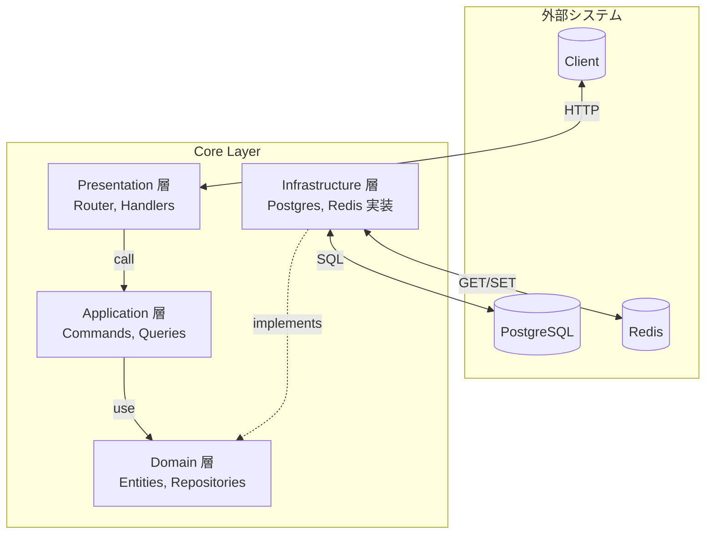

# Core Layer (axum)

spin-axum-todo プロジェクトのコア層を担当する axum アプリケーション。
PostgreSQL + Redis によるデータ永続化とキャッシュ、ローカル認証（JWT 発行）、クリーンアーキテクチャによる関心の分離を実現。

> **Note**: このコンポーネントは [Edge Layer](../edge/README.md) と連携して動作します。
> 単体での使用も可能ですが、本番環境では Edge 層経由でのアクセスを推奨します。

## 技術スタック

| 領域               | 技術                                                      |
| ------------------ | --------------------------------------------------------- |
| Web フレームワーク | axum 0.8                                                  |
| 非同期ランタイム   | tokio 1.x                                                 |
| データベース       | PostgreSQL 17 + sqlx 0.8                                  |
| キャッシュ         | Redis 7 + redis-rs 1.0                                    |
| 認証               | bcrypt 0.18（パスワードハッシュ）+ jsonwebtoken 10（JWT） |
| シリアライズ       | serde + serde_json                                        |
| ログ               | tracing + tracing-subscriber                              |

## ドキュメント

| ドキュメント | 内容 |
| ------------ | ---- |
| [アーキテクチャ](docs/architecture.md) | クリーンアーキテクチャ、CQRS パターン、リクエストフロー、エラーハンドリング |
| [トランザクション管理](docs/transaction.md) | 設計方針、レイヤー別責務、RAII パターン、外部キー制約 |
| [キャッシュ戦略](docs/cache.md) | Cache-Aside パターン、Write-Through、操作別キャッシュ動作 |
| [セキュリティ](docs/security.md) | 多層防御、ミドルウェア、パスワードハッシュ、入力バリデーション |
| [API リファレンス](docs/api.md) | エンドポイント一覧、リクエスト/レスポンス例、使用例 |
| [セットアップ](docs/setup.md) | 環境変数、データベーススキーマ、Docker、プロジェクト構成 |

## クイックスタート

```bash
# 1. PostgreSQL と Redis を起動
docker compose up -d

# 2. 環境変数を設定
cp ../example.env .env

# 3. マイグレーション実行
cargo install sqlx-cli --no-default-features --features postgres
cd api && sqlx migrate run && cd ..

# 4. サーバー起動
cargo run -p api
```

サーバーが `http://127.0.0.1:3001` で起動します。

## アーキテクチャ概要



詳細は [アーキテクチャ](docs/architecture.md) を参照してください。

## API エンドポイント

| メソッド | パス                    | 説明             |
| -------- | ----------------------- | ---------------- |
| POST     | `/api/auth/register`    | ユーザー登録     |
| POST     | `/api/auth/login`       | ログイン         |
| GET      | `/api/todos`            | TODO 一覧取得    |
| POST     | `/api/todos`            | TODO 作成        |
| GET      | `/api/todos/{id}`       | TODO 取得        |
| PATCH    | `/api/todos/{id}`       | TODO 更新        |
| DELETE   | `/api/todos/{id}`       | TODO 削除        |
| POST     | `/api/todos/batch`      | バッチ TODO 作成 |
| POST     | `/api/todos/with-files` | TODO + ファイル  |

詳細は [API リファレンス](docs/api.md) を参照してください。

## 主な特徴

- **クリーンアーキテクチャ**: 4層構造による関心の分離
- **CQRS パターン**: Reader/Writer 分離による責務の明確化
- **Cache-Aside + Write-Through**: 効率的なキャッシュ戦略
- **トランザクション管理**: RAII パターンによる安全なトランザクション
- **多層防御**: Edge 検証 + 所有権検証によるセキュリティ
