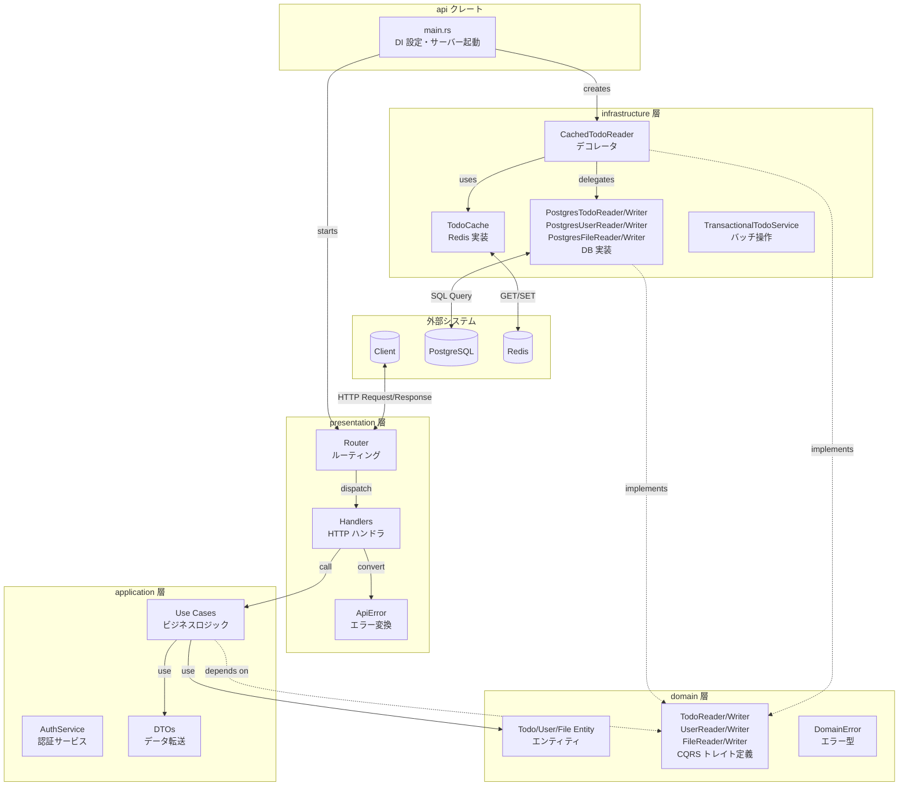
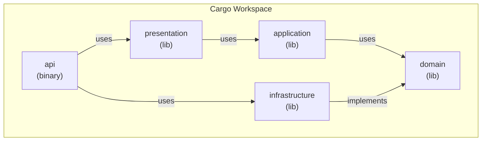
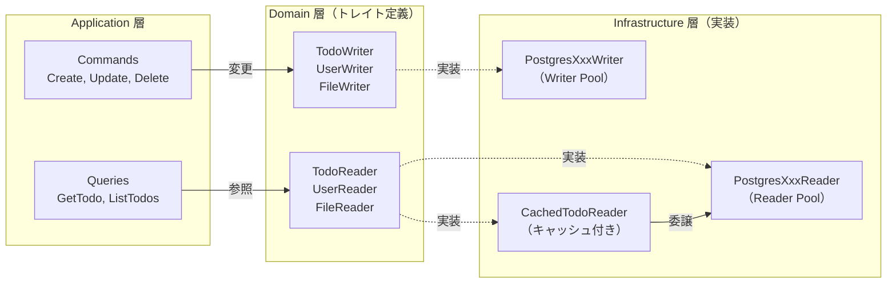
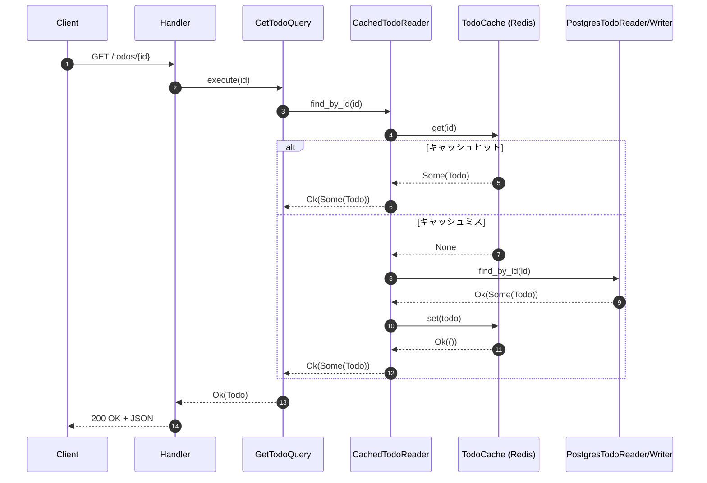
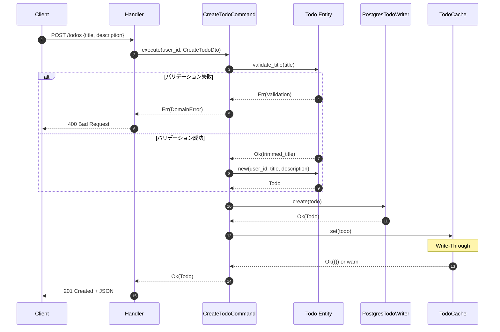
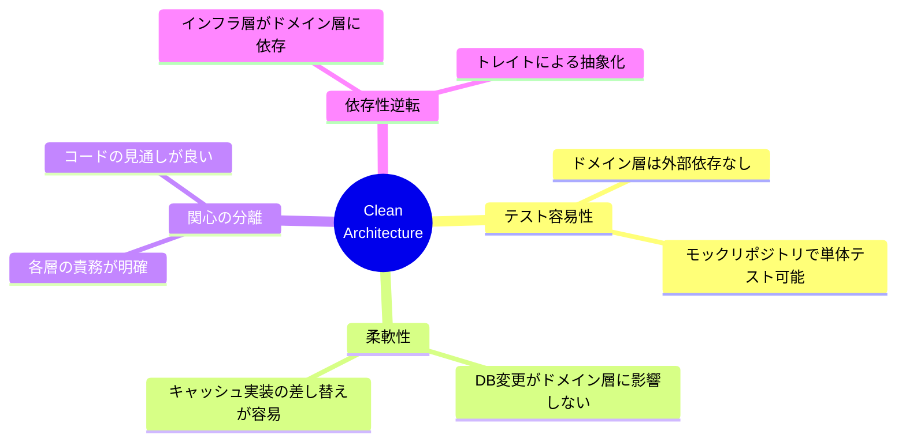
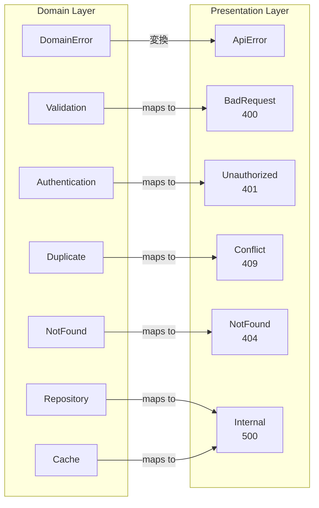

# アーキテクチャ

本プロジェクトはクリーンアーキテクチャに基づき、4つの層に分離されています。
外部システム（Client、PostgreSQL、Redis）との通信は最外層で行い、ビジネスロジックは内側の層で保護されています。

## 全体構成

点線の矢印は「トレイトへの依存/実装」を、実線の矢印は「直接的な呼び出し」を表しています。

## クレート依存関係

Cargo ワークスペースは5つのクレートで構成されています。
`api` がエントリーポイント（バイナリ）で、残りの4つはライブラリクレートです。

**依存関係の方向**: `api → presentation → application → domain ← infrastructure`

> **依存性逆転の原則**: infrastructure は domain のトレイトを実装するため、矢印が domain に向かう

## CQRS パターン（Reader/Writer 分離）

本プロジェクトでは軽量 CQRS（Command Query Responsibility Segregation）パターンを採用しています。
各エンティティのリポジトリを **Reader**（読み取り）と **Writer**（書き込み）に分離することで、
責務の明確化とスケーラビリティを実現しています。

| 役割 | トレイト | 操作 | DB プール |
| ---- | -------- | ---- | --------- |
| **Reader** | `TodoReader`, `UserReader`, `FileReader` | `find_by_id`, `find_all`, `find_by_email` | Reader Pool（レプリカ） |
| **Writer** | `TodoWriter`, `UserWriter`, `FileWriter` | `create`, `update`, `delete` | Writer Pool（プライマリ） |

> **メリット**: Aurora などで Reader/Writer エンドポイントが分離されている場合、
> 読み取り負荷をレプリカに分散できます。

## リクエストフロー

### TODO 取得（キャッシュあり）

`GET /todos/{id}` のリクエストフローを示します。
CachedTodoReader はまず Redis キャッシュを確認し、ヒットすればそのまま返却します。
キャッシュミスの場合は PostgreSQL から取得し、次回アクセスのためにキャッシュに保存します。

### TODO 作成

`POST /todos` のリクエストフローを示します。
CreateTodoCommand はまずドメイン層でタイトルのバリデーションを行い、失敗した場合は早期リターンします。
バリデーション成功後、エンティティを生成して TodoWriter で永続化し、TodoCache に Write-Through で保存します。

## クリーンアーキテクチャの利点

1. **テスト容易性**: ドメイン層は外部依存がなく、単体テストが容易
2. **柔軟性**: DB や キャッシュの実装を変更しても、ドメイン層に影響なし
3. **関心の分離**: 各層の責務が明確で、コードの見通しが良い
4. **依存性逆転**: インフラ層がドメイン層に依存（トレイト経由）

## エラーハンドリング

ドメイン層で発生したエラー（DomainError）は、プレゼンテーション層で HTTP ステータスコードに変換されます。

| DomainError      | ApiError       | HTTP Status |
| ---------------- | -------------- | ----------- |
| `Validation`     | `BadRequest`   | 400         |
| `Authentication` | `Unauthorized` | 401         |
| `Duplicate`      | `Conflict`     | 409         |
| `NotFound`       | `NotFound`     | 404         |
| `Repository`     | `Internal`     | 500         |
| `Cache`          | `Internal`     | 500         |
