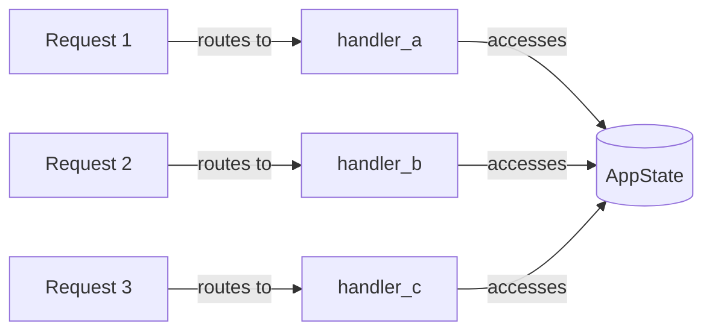

# State とは何か？

このドキュメントでは、axum の State の概念と、なぜ State が必要なのかを説明します。

---

## 目次

1. [State の一言定義](#state-の一言定義)
2. [なぜ State が必要か？](#なぜ-state-が必要か)
3. [ハンドラーとは？](#ハンドラーとは)
4. [ハンドラー以下のレイヤーでのデータ共有](#ハンドラー以下のレイヤーでのデータ共有)
5. [完全なコード例](#完全なコード例)

---

## このドキュメントのコード例について

このドキュメントでは、説明の目的に応じて2種類のコード例を使い分けています：

| パターン | 名称 | 用途 |
|---------|------|------|
| **最小サンプル** | Counter App | 概念説明（Arc、State の基本など） |
| **TODO アプリ** | Todo App | 実践パターン（レイヤー設計、DI など） |

各セクションの冒頭で、どちらのパターンを使用しているかを明記しています。

---

## State の一言定義

> **このセクションのコード例**: TODO アプリ（実践パターン）

**State = 複数のハンドラー間でデータを共有する仕組み**

axum での具体的な意味:

| 用語 | axum での意味 | 具体例 |
|------|--------------|--------|
| State | 全エンドポイントで共有するオブジェクト | AppState 構造体 |
| ハンドラー | 1つの API エンドポイントを処理する関数 | `GET /todos` の処理関数 |
| リクエスト | クライアントからの HTTP 呼び出し | `curl http://localhost:3000/todos` |

```rust
// State = 全エンドポイントで共有するもの
struct AppState {
    db_pool: PgPool,          // DB 接続（全エンドポイントで使う）
    redis_client: RedisClient, // キャッシュ（全エンドポイントで使う）
    jwt_secret: String,        // 認証シークレット（全エンドポイントで使う）
}

// ハンドラー = 1つの API エンドポイント
// GET /todos
async fn list_todos(State(state): State<Arc<AppState>>) -> Json<Vec<Todo>> {
    let todos = fetch_from_db(&state.db_pool).await;
    Json(todos)
}
```

下図は、3つのリクエストが同時に来た場合の State へのアクセスパターンを示しています。全てのハンドラーが **同じ AppState インスタンス** にアクセスしている点に注目してください。



---

## なぜ State が必要か？

Web サーバーでは、DB 接続プール、Redis クライアント、JWT シークレットなど、**全てのリクエストハンドラーで共通して使うリソース**があります。

### ダメな方法と良い方法の比較

| 方法 | 問題点 |
|------|--------|
| グローバル変数 | テストが困難、依存関係が不明確、unsafe が必要 |
| 関数の引数で毎回渡す | 引数が増えすぎる、リファクタリングが大変 |
| **State パターン** | 依存関係が明確、テスト時にモック差し替え可能、型安全 |

### axum API サーバーの特性

axum は **並行（concurrent）** に複数のリクエストを処理します。

```
時刻 0ms:  GET /todos    → ハンドラー A 開始
時刻 1ms:  POST /todos   → ハンドラー B 開始
時刻 2ms:  GET /users    → ハンドラー C 開始
時刻 5ms:  ハンドラー B 完了
時刻 8ms:  ハンドラー A 完了
時刻 10ms: ハンドラー C 完了
```

**問題**: 3つのハンドラーが同時に動いている。全員が DB 接続を使いたい。どうする？

### 解決策の比較

| 方法 | 問題点 | axum で使えるか |
|------|--------|----------------|
| グローバル変数 | unsafe 必須、テスト困難 | 非推奨 |
| 毎回新規作成 | DB 接続のコスト高、接続数爆発 | 非現実的 |
| **State で共有** | 安全、効率的、テスト可能 | 推奨 |

### State パターンのメリット

| メリット | 説明 |
|----------|------|
| **テスタビリティ** | テスト時に本物の DB の代わりにモックを注入できる |
| **依存性注入（DI）** | 具象型に依存せず、トレイト経由でアクセス |
| **明示的な依存関係** | どのハンドラーが何を使うかが型で分かる |
| **Rust の所有権と相性が良い** | Arc で安全に共有できる |

---

## ハンドラーとは？

**ハンドラー = API エンドポイントを処理する関数**

axum は Web API サーバー用のフレームワークです。「ハンドラー」とは、特定の HTTP エンドポイント（ルート）にリクエストが来たときに呼び出される関数のことです。

```rust
// これがハンドラー（= GET /todos エンドポイント）
async fn list_todos(State(state): State<Arc<AppState>>) -> Json<Vec<Todo>> {
    // リクエストを処理してレスポンスを返す
}

// ルーティングでパスとハンドラーを紐付け
Router::new()
    .route("/todos", get(list_todos))       // GET /todos → list_todos
    .route("/todos/:id", get(get_todo))     // GET /todos/123 → get_todo
    .route("/todos", post(create_todo))     // POST /todos → create_todo
```

---

## ハンドラー以下のレイヤーでのデータ共有

> **このセクションのコード例**: TODO アプリ（実践パターン）

**Q: ハンドラーは State を使うのは分かった。では、ハンドラーから呼び出される下位レイヤー（Use Case、Repository など）はどうやってデータにアクセスする？**

**A: ハンドラーが State から必要な依存を取り出し、引数として渡す。**

下位レイヤーは axum の State を直接知りません。これがクリーンアーキテクチャの重要なポイントです。

#### 図の登場人物

| 名前 | 説明 | 図中の場所 |
|------|------|-----------|
| **Handler** | axum の State を受け取り、依存を取り出す。Presentation Layer。 | 上段 |
| **Use Case** | ビジネスロジックを実行。axum を知らない。Application Layer。 | 中段 |
| **Repository** | 実際の DB/Redis/S3 操作を行う。Infrastructure Layer。 | 下段 |

#### 重要なポイント

1. **Handler だけが axum を知っている**
   - State から依存を取り出し、Use Case に引数として渡す
   - 下位レイヤーは axum の存在を知らない

2. **トレイト経由で疎結合**
   - Use Case は `&dyn TodoWriter` のようなトレイト参照を受け取る
   - 具象型（PostgresTodoWriter など）を知らない

3. **依存の方向は上から下へ**
   - Handler → Use Case → Repository
   - 逆方向の依存はない

### DIP（依存性逆転の原則）とトレイト参照

#### なぜ具象型ではなくトレイト参照を使うのか？

Use Case が具象型（`PostgresTodoWriter`）に直接依存すると、以下の問題が発生します：

| 問題 | 説明 |
|------|------|
| **テストが困難** | 本物の DB が必要になる |
| **変更に弱い** | DB を MySQL に変えると Use Case も修正が必要 |
| **再利用性が低い** | 別プロジェクトで使いにくい |

#### DIP の適用

**DIP（Dependency Inversion Principle / 依存性逆転の原則）**:
> 上位モジュールは下位モジュールに依存してはならない。両者は抽象（トレイト）に依存すべきである。

```
❌ DIP に違反（Use Case が具象型に依存）

+----------------+          +----------------------+
|   Use Case     | -------> | PostgresTodoWriter   |
+----------------+          +----------------------+
                                    ↓
                            [PostgreSQL]


✅ DIP に準拠（Use Case がトレイトに依存）

+----------------+          +----------------+
|   Use Case     | -------> | dyn TodoWriter |  ← トレイト（抽象）
+----------------+          +----------------+
                                    ↑
                                    | implements
                            +----------------------+
                            | PostgresTodoWriter   |  ← 具象型
                            +----------------------+
                                    ↓
                            [PostgreSQL]
```

#### トレイト参照の仕組み

```rust
// 1. トレイトを定義（domain 層）
pub trait TodoWriter: Send + Sync {
    async fn create(&self, input: CreateTodoInput) -> Result<Todo, DomainError>;
}

// 2. 具象型がトレイトを実装（infrastructure 層）
pub struct PostgresTodoWriter {
    pool: PgPool,
}

impl TodoWriter for PostgresTodoWriter {
    async fn create(&self, input: CreateTodoInput) -> Result<Todo, DomainError> {
        // 実際の DB 操作
    }
}

// 3. Use Case はトレイト参照を受け取る（application 層）
async fn create_todo_use_case(
    writer: &dyn TodoWriter,  // ← 具象型を知らない
    input: CreateTodoInput,
) -> Result<Todo, DomainError> {
    writer.create(input).await
}
```

#### 依存の方向と知識の範囲

| レイヤー | 依存先 | 知っているもの |
|----------|--------|---------------|
| Handler | Use Case, トレイト | axum, AppState, トレイト |
| Use Case | トレイトのみ | トレイト（`&dyn TodoWriter`） |
| Repository | DB ライブラリ | 具象型（`PostgresTodoWriter`）、DB |
| main.rs | 全て | 全ての具象型（組み立て担当） |

**main.rs（Composition Root）** だけが具象型を知っており、依存関係を組み立てます。

```
+-------------------------------------------------------------+
|  Handler (Presentation Layer)                               |
|  - Extracts dependencies from axum State                    |
|  - Passes trait references to Use Case                      |
+-------------------------------------------------------------+
                          |
                          | passes trait references
                          v
+-------------------------------------------------------------+
|  Use Case (Application Layer)                               |
|  - Does NOT know about axum (framework independent)         |
|  - Depends on Repository traits (not concrete types)        |
+-------------------------------------------------------------+
                          |
                          | calls via trait
                          v
+-------------------------------------------------------------+
|  Repository (Infrastructure Layer)                          |
|  - Actual DB/Redis/S3 operations                            |
+-------------------------------------------------------------+
```

### コード例

```rust
// ========================================
// Handler（Presentation 層）
// ========================================
// axum の State を受け取り、Use Case に渡す
async fn create_todo(
    State(state): State<Arc<AppState>>,  // ← axum が State を注入
    Json(input): Json<CreateTodoInput>,
) -> Result<Json<Todo>, AppError> {
    // State から必要な依存を取り出して Use Case に渡す
    let todo = create_todo_use_case(
        state.todo_writer(),  // ← トレイト参照を渡す
        state.cache(),        // ← トレイト参照を渡す
        input,
    ).await?;

    Ok(Json(todo))
}

// ========================================
// Use Case（Application 層）
// ========================================
// axum を知らない！トレイトだけに依存
async fn create_todo_use_case(
    writer: &dyn TodoWriter,  // ← 具象型ではなくトレイト
    cache: &dyn TodoCache,    // ← 具象型ではなくトレイト
    input: CreateTodoInput,
) -> Result<Todo, DomainError> {
    // ビジネスロジックを実行
    let todo = writer.create(input).await?;
    cache.invalidate().await?;
    Ok(todo)
}
```

### なぜこの設計が良いのか？

| メリット | 説明 |
|----------|------|
| **テスタビリティ** | Use Case のテスト時に、モック Repository を渡せる |
| **フレームワーク非依存** | Use Case は axum を知らないので、他のフレームワークに移行しやすい |
| **依存の方向が明確** | 上位レイヤー → 下位レイヤーの一方向依存 |
| **関心の分離** | Handler は HTTP 処理、Use Case はビジネスロジックに集中 |

---

## 完全なコード例

> **このセクションのコード例**: 最小サンプル（Counter App）
>
> ここでは State の基本的な使い方を理解するため、シンプルな Counter App を使います。
> 実際のプロジェクトでは、この構造に `PgPool`、`TodoReader` などを追加します。

```rust
// ============================================================================
// axum の State を使ったAPIサーバー（複数フィールド版）
// ============================================================================
// State は複数のハンドラー間でデータを共有するための仕組みです
//
// この例では以下のエンドポイントを提供します：
// GET /       → アプリ情報と現在のカウントを表示
// GET /count  → カウントを1増やして表示
// GET /info   → アプリ情報のみ表示（カウンターをロックしない）
// ============================================================================

use axum::{Router, extract::State, routing::get};
use std::sync::{Arc, Mutex};

// ============================================================================
// AppState - アプリケーション全体で共有する状態（複数フィールド）
// ============================================================================
struct AppState {
    // 読み取り専用フィールド（Mutex 不要）
    app_name: String,
    version: String,

    // 読み書きフィールド（Mutex 必要）
    counter: Mutex<u64>,
}

#[tokio::main]
async fn main() -> Result<(), Box<dyn std::error::Error>> {
    let state = Arc::new(AppState {
        app_name: String::from("Hello API"),
        version: String::from("1.0.0"),
        counter: Mutex::new(0),
    });

    let app = Router::new()
        .route("/", get(get_status))
        .route("/count", get(increment_count))
        .route("/info", get(get_info))
        .with_state(state);

    let listener = tokio::net::TcpListener::bind("0.0.0.0:3000").await?;
    println!("Server running at http://localhost:3000");
    axum::serve(listener, app).await?;

    Ok(())
}

// アプリ情報とカウントを表示
async fn get_status(State(state): State<Arc<AppState>>) -> String {
    let app_name = &state.app_name;
    let version = &state.version;
    let count = *state.counter.lock().unwrap();
    format!("{} v{}\nCurrent count: {}", app_name, version, count)
}

// カウントを増やす
async fn increment_count(State(state): State<Arc<AppState>>) -> String {
    let mut count = state.counter.lock().unwrap();
    *count += 1;
    format!("Count incremented to: {}", *count)
}

// アプリ情報のみ表示（ロックなし）
async fn get_info(State(state): State<Arc<AppState>>) -> String {
    format!("App: {}\nVersion: {}", state.app_name, state.version)
}
```

---

## 次のステップ

- [02-lifecycle.md](./02-lifecycle.md) - シナリオベースで State のライフサイクルを理解する
- [03-arc.md](./03-arc.md) - Arc（参照カウント）の仕組みを深く理解する
