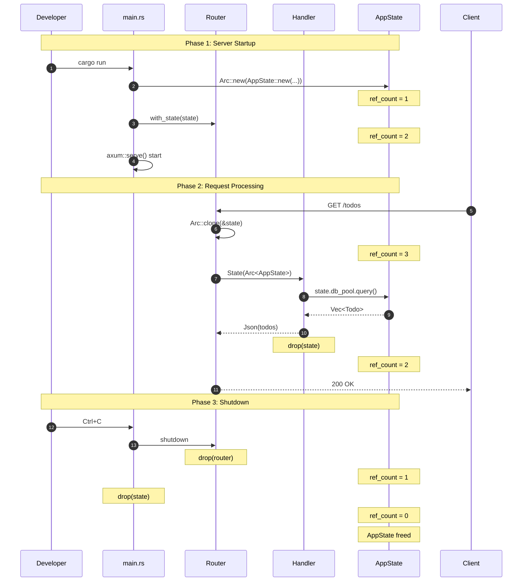

# AppState のライフサイクル

このドキュメントでは、**API リクエスト処理の流れ**に沿って State の仕組みを説明します。
抽象的な Rust の概念ではなく、「いつ、誰が、何を、どうするのか」を具体的に追っていきます。

---

## 目次

1. [登場人物](#登場人物)
2. [シナリオ 1: サーバー起動時](#シナリオ-1-サーバー起動時)
3. [シナリオ 2: 最初のリクエスト到着](#シナリオ-2-最初のリクエスト到着)
4. [シナリオ 3: 複数リクエストが同時に来る](#シナリオ-3-複数リクエストが同時に来る)
5. [シナリオ 4: リクエスト処理が完了する](#シナリオ-4-リクエスト処理が完了する)
6. [シナリオ 5: サーバーがシャットダウンする](#シナリオ-5-サーバーがシャットダウンする)
7. [全体の流れ（シーケンス図）](#全体の流れシーケンス図)

---

## このドキュメントのコード例について

> **使用するコード例**: シナリオベースの説明（擬似コード中心）
>
> このドキュメントでは、State のライフサイクルを理解するため、具体的なシナリオに沿って説明します。
> コード例は概念を伝えるための擬似コードが中心です。

---

## 登場人物

まず、この物語の登場人物を紹介します。

| 登場人物         | 役割                                                  | このプロジェクトでの実体                  |
| ---------------- | ----------------------------------------------------- | ----------------------------------------- |
| **main() 関数**  | AppState を作成する（Composition Root）               | `api/src/main.rs` の `main()` 関数        |
| **state 変数**   | AppState の唯一の所有者                               | `main()` 内の `let state = Arc::new(...)` |
| **AppState**     | 共有したいデータの入れ物                              | DB 接続、Redis、JWT シークレット等        |
| **Router**       | State の Arc クローンを保持し、リクエストを振り分ける | `create_router(state, ...)` で受け取る    |
| **ハンドラー**   | API エンドポイントを処理する関数                      | `list_todos()`, `create_todo()` 等        |
| **クライアント** | API を呼び出す人                                      | curl, ブラウザ, フロントエンド            |

---

## シナリオ 1: サーバー起動時

### 状況

```
$ cargo run -p api
Server starting...
```

開発者がサーバーを起動した瞬間、何が起こるか？

### 5W1H

| 質問                  | 回答                                                                        |
| --------------------- | --------------------------------------------------------------------------- |
| **What（何を）**      | AppState（DB 接続プール、Redis クライアント、JWT シークレット）             |
| **Who（誰が）**       | `api/src/main.rs` の `main()` 関数が、ローカル変数 `state` として作成       |
| **When（いつ）**      | サーバー起動時（**1回だけ**）                                               |
| **Where（どこで）**   | `main()` 関数のスコープ内（`let state = Arc::new(AppState::new(...))）`     |
| **Why（なぜ）**       | 全ての API エンドポイントで DB 接続を使いたいから                           |
| **How（どうやって）** | `Arc::new(AppState::new(...))` で作成し、`create_router(state, ...)` に渡す |

### コード（main.rs）

```rust
#[tokio::main]
async fn main() -> anyhow::Result<()> {
    // 1. DB 接続プールを作成（高コスト、時間がかかる）
    let db_pool = PgPool::connect(&database_url).await?;

    // 2. Redis クライアントを作成
    let redis_client = redis::Client::open(&redis_url)?;

    // 3. AppState を作成
    //    この時点で state 変数が AppState の「所有者」
    let state = Arc::new(AppState::new(
        db_pool,
        redis_client,
        jwt_secret,
    ));
    //    ↑ 参照カウント = 1（state 変数だけが持っている）

    // 4. Router に State を登録
    let app = Router::new()
        .route("/todos", get(list_todos))
        .with_state(state);
    //    ↑ Router も state を持つので、参照カウント = 2

    // 5. サーバー起動（リクエストを待ち受け開始）
    axum::serve(listener, app).await?;

    Ok(())
}
```

### この時点でのメモリ状態

サーバー起動直後のメモリ状態を図示します。

#### 図の登場人物

| 名前                     | 説明                                                                                      | 図中の場所    |
| ------------------------ | ----------------------------------------------------------------------------------------- | ------------- |
| **state (Arc pointer)**  | `main()` 関数内のローカル変数。`Arc<AppState>` 型。AppState の**最初の所有者**。          | 左上          |
| **Router (Arc pointer)** | `Arc::clone()` で作成されたポインタ。state と**同じ Heap 領域**を指す（コピーではない）。 | 左下          |
| **ArcInner**             | Heap上に確保された実データ。ref_count と AppState を含む。                                | 右側          |
| **ref_count**            | 「何人がこのデータを使っているか」を表す数値。現在は 2（state + Router）。                | ArcInner 内部 |
| **AppState**             | 実際のデータ（db_pool, redis_client, jwt_secret）。**1つだけ存在**。                      | ArcInner 内部 |

#### 重要なポイント

1. **AppState の実データはHeap上に1つだけ存在する**
   - db_pool、redis_client、jwt_secret などの実際のデータは、メモリ上に1箇所にしか存在しない
   - これが「共有」の意味：データをコピーするのではなく、同じデータを複数の場所から参照する

2. **state 変数と Router はそれぞれ Arc ポインタを持っている**
   - Arc ポインタは 8 バイトの小さなデータ（64bit システムの場合）
   - このポインタが「どこにデータがあるか」を指し示している

3. **ref_count が 2 になっている**
   - state が持っている Arc で +1
   - Router が持っている Arc で +1
   - この数字が「何人がこのデータを使っているか」を表す

```
+---------------------------------------------------------------------+
|                            main.rs                                  |
|                                                                     |
|  +------------------+                                               |
|  | state            |                                               |
|  | (Arc pointer)    |---+                                           |
|  | [8 bytes]        |   |                                           |
|  +------------------+   |                                           |
|                         |     +----------------------------------+  |
|                         +---->| ArcInner (on Heap)               |  |
|                         |     | +------------------------------+ |  |
|                         |     | | ref_count: 2                 | |  |
|  +------------------+   |     | +------------------------------+ |  |
|  | Router           |   |     | | AppState                     | |  |
|  | (Arc pointer)    |---+     | |  - db_pool: PgPool           | |  |
|  | [8 bytes]        |         | |  - redis_client: Client      | |  |
|  +------------------+         | |  - jwt_secret: String        | |  |
|                               | +------------------------------+ |  |
|                               +----------------------------------+  |
+---------------------------------------------------------------------+
```

**ポイント**: AppState の実データは **1つだけ**。state 変数と Router は同じデータへのポインタを持っている。

---

## シナリオ 2: 最初のリクエスト到着

### 状況

```
$ curl http://localhost:3000/todos
```

クライアントが `GET /todos` をリクエストした。この時、何が起こるか？

### 5W1H

| 質問                  | 回答                                                 |
| --------------------- | ---------------------------------------------------- |
| **What（何を）**      | Arc<AppState> のポインタ（データではない！）         |
| **Who（誰が）**       | Router が**貸し出し役**、ハンドラーが**借り手**      |
| **When（いつ）**      | リクエストが来るたび（**毎回**）                     |
| **Where（どこで）**   | Router 内部 → ハンドラーの引数                       |
| **Why（なぜ）**       | ハンドラーが DB 接続を使って Todo 一覧を取得するため |
| **How（どうやって）** | `Arc::clone()` で参照カウント +1、ポインタをコピー   |

### 何が起こるか（ステップバイステップ）

```
時刻 0ms: クライアントが GET /todos をリクエスト
         ↓
時刻 1ms: axum がリクエストを受信
         ↓
時刻 2ms: Router が「/todos は list_todos() で処理する」と判断
         ↓
時刻 3ms: Router が Arc::clone(&state) を実行 ← ★ここが重要！
         - 参照カウント: 2 → 3
         - AppState のデータはコピーされない（ポインタだけコピー）
         ↓
時刻 4ms: ハンドラー list_todos() が呼び出される
         - 引数として State(Arc<AppState>) を受け取る
         ↓
時刻 5ms: ハンドラーが state.db_pool を使って DB クエリ実行
         ↓
時刻 50ms: DB からデータ取得完了、JSON レスポンス返却
```

### コード（ハンドラー）

```rust
// axum がこの関数を呼ぶ時、自動で State を注入する
pub async fn list_todos(
    State(state): State<Arc<AppState>>,  // ← Router が Arc::clone() した参照
) -> Result<Json<Vec<Todo>>, AppError> {

    // state.db_pool を使って DB クエリ
    // Arc により AppState は1つしか存在しない
    // この db_pool は、その唯一の AppState 内のフィールドへの参照
    let todos = sqlx::query_as!(Todo, "SELECT * FROM todos")
        .fetch_all(&state.db_pool)
        .await?;

    Ok(Json(todos))
}
// ← 関数終了時、state (Arc) が drop される
//   参照カウント: 3 → 2
```

### なぜ `&state.db_pool` と借用するのか？

コード中の `&state.db_pool` について詳しく説明します。

#### 借用と所有権

Rust では、値を関数に渡す方法は2つあります：

| 方法                     | 書き方         | 動作                   | 結果                     |
| ------------------------ | -------------- | ---------------------- | ------------------------ |
| **所有権の移動（move）** | `func(value)`  | 値の所有権が関数に移る | 元の変数は使えなくなる   |
| **借用（borrow）**       | `func(&value)` | 参照だけを渡す         | 元の変数は引き続き使える |

#### なぜ db_pool を借用するのか？

`fetch_all()` は `&PgPool`（参照）を受け取るように設計されています。これには理由があります：

1. **PgPool は内部で Arc を使用している**
   - PgPool 自体が Arc でラップされた接続プールを持っている
   - 参照を渡すだけで、内部の接続プールにアクセスできる

2. **所有権を移動する必要がない**
   - DB クエリに必要なのは「接続プールへのアクセス」だけ
   - PgPool 全体の所有権は不要

3. **state を継続して使用できる**
   - 借用なので、`&state.db_pool` の後も `state` は有効
   - 同じハンドラー内で複数回 DB アクセスが可能

#### もし `&` を付けなかったら？

```rust
// ❌ コンパイルエラー
let todos = sqlx::query_as!(...)
    .fetch_all(state.db_pool)  // move が発生
    .await?;

// state.db_pool はもう使えない！
let count = state.db_pool.query(...);  // エラー
```

#### 参照渡しのパターン

このパターンは Rust では一般的です：

| 型       | 関数の引数 | 理由                             |
| -------- | ---------- | -------------------------------- |
| `PgPool` | `&PgPool`  | 内部で Arc を使用、参照で十分    |
| `String` | `&str`     | 読み取りだけなら参照で十分       |
| `Vec<T>` | `&[T]`     | 要素の読み取りだけなら参照で十分 |

**ポイント**: 「データを読むだけなら、所有権を奪う必要はない。借用で十分。」

### この時点でのメモリ状態

リクエスト処理中のメモリ状態を図示します。

#### 図の登場人物

| 名前                           | 説明                                                                        | 図中の場所    |
| ------------------------------ | --------------------------------------------------------------------------- | ------------- |
| **state (Arc pointer)**        | `main()` 関数のローカル変数。サーバー起動時から存在。                       | 左上          |
| **Router (Arc pointer)**       | `create_router()` で受け取った Arc クローン。                               | 左中          |
| **list_todos() (Arc pointer)** | ハンドラーが受け取った**新しい**ポインタ。Router が `Arc::clone()` で作成。 | 左下          |
| **ArcInner**                   | Heap上の実データ。3つのポインタ全てが**同じ場所**を指す。                   | 右側          |
| **ref_count: 3**               | 参照者が 3 人に増加（state + Router + list_todos）。                        | ArcInner 内部 |
| **db_pool**                    | list_todos() が実際にアクセスしているフィールド。                           | AppState 内部 |

#### 重要なポイント

1. **list_todos() が新しい Arc ポインタを持っている**
   - Router が `Arc::clone()` を実行し、新しいポインタをハンドラーに渡した
   - このポインタも同じ AppState を指している

2. **ref_count が 3 に増加している**
   - state（`main()` のローカル変数）: +1
   - Router: +1
   - list_todos(): +1（新規）
   - 「3人がこのデータを使っている」状態

3. **list_todos() は db_pool フィールドを通じて DB にアクセスしている**
   - ハンドラーは AppState 全体への参照を持っているが、実際に使うのは db_pool だけ
   - Arc により AppState は1つしか存在せず、db_pool もその中に1つだけ存在する

```
+---------------------------------------------------------------------+
|                       During Request Processing                     |
|                                                                     |
|  +------------------+                                               |
|  | state            |---+                                           |
|  | (Arc pointer)    |   |                                           |
|  +------------------+   |                                           |
|                         |     +----------------------------------+  |
|  +------------------+   +---->| ArcInner (on Heap)               |  |
|  | Router           |---+     | +------------------------------+ |  |
|  | (Arc pointer)    |   |     | | ref_count: 3                 | |  |
|  +------------------+   |     | +------------------------------+ |  |
|                         +---->| | AppState                     | |  |
|  +------------------+   |     | |  - db_pool  <------------+   | |  |
|  | list_todos()     |---+     | |  - redis_client          |   | |  |
|  | (Arc pointer)    |         | |  - jwt_secret            |   | |  |
|  +------------------+         | +------------------------------+ |  |
|         |                     +----------------------------------+  |
|         |                                                           |
|         +--- handler uses db_pool to query database                 |
+---------------------------------------------------------------------+
```

**ポイント**: list_todos() は AppState の**コピーではなく、同じ実体**を使っている。

---

## シナリオ 3: 複数リクエストが同時に来る

### 状況

```
時刻 0ms: curl GET /todos    (リクエスト A)
時刻 1ms: curl POST /todos   (リクエスト B)
時刻 2ms: curl GET /users    (リクエスト C)
```

3つのリクエストがほぼ同時に来た。全員が AppState を使いたい。どうなる？

### 5W1H

| 質問                  | 回答                                                   |
| --------------------- | ------------------------------------------------------ |
| **What（何を）**      | **同じ** AppState への3つの Arc ポインタ               |
| **Who（誰が）**       | 3つのハンドラー（list_todos, create_todo, list_users） |
| **When（いつ）**      | 同時に（tokio の非同期タスクとして並行実行）           |
| **Where（どこで）**   | 各 tokio タスク内                                      |
| **Why（なぜ）**       | 複数クライアントからの同時リクエストに対応するため     |
| **How（どうやって）** | 各リクエストで Arc::clone()、参照カウントが増加        |

### 何が起こるか

```
時刻 0ms: リクエスト A 到着
         - Arc::clone() → 参照カウント: 2 → 3
         - tokio::spawn() で list_todos() を非同期実行開始

時刻 1ms: リクエスト B 到着（A はまだ処理中）
         - Arc::clone() → 参照カウント: 3 → 4
         - tokio::spawn() で create_todo() を非同期実行開始

時刻 2ms: リクエスト C 到着（A, B はまだ処理中）
         - Arc::clone() → 参照カウント: 4 → 5
         - tokio::spawn() で list_users() を非同期実行開始

→ 3つのハンドラーが同時に動いている！
→ 全員が同じ AppState（db_pool）を使っている！
→ でも AppState のデータは1つだけ！
```

### この時点でのメモリ状態

3つのリクエストが同時に処理されている時のメモリ状態を図示します。

#### 図の登場人物

| 名前                          | 説明                                                          | 図中の場所    |
| ----------------------------- | ------------------------------------------------------------- | ------------- |
| **state**                     | `main()` 関数のローカル変数。サーバー起動時から存在。         | 左上          |
| **Router**                    | `create_router()` で受け取った Arc クローン。                 | 左上から2番目 |
| **list_todos() [Request A]**  | リクエスト A を処理中のハンドラー。                           | 左中央        |
| **create_todo() [Request B]** | リクエスト B を処理中のハンドラー。                           | 左中央下      |
| **list_users() [Request C]**  | リクエスト C を処理中のハンドラー。                           | 左下          |
| **ArcInner**                  | Heap上の実データ。**5つ全て**のポインタが**同じ場所**を指す。 | 右側          |
| **ref_count: 5**              | 5人が同時に使用中（state + Router + 3ハンドラー）。           | ArcInner 内部 |
| **db_pool**                   | 全ハンドラーが**共有して**アクセスしている。                  | AppState 内部 |

#### 重要なポイント

1. **5つの Arc ポインタが同じ AppState を指している**
   - state（`main()` のローカル変数）、Router、そして3つのハンドラー（list_todos, create_todo, list_users）
   - 全員が同じメモリ上のデータを参照している

2. **ref_count が 5 に増加している**
   - 「5人がこのデータを使っている」という状態を正確に追跡している
   - この数字は Arc 内部でアトミック操作により安全に増減される

3. **AppState のデータは依然として1つだけ**
   - db_pool は1つしか存在しない
   - 5人全員が同じ db_pool を使って DB にアクセスしている
   - これにより、DB 接続の無駄な再作成を避けている

4. **Arc::clone() は超高速（約5ナノ秒）**
   - データのコピーは発生しない（参照カウントの増加のみ）
   - HTTP リクエスト処理全体（数ms〜数百ms）と比較すると無視できるコスト

```
+----------------------------------------------------------------------+
|                    3 Concurrent Requests Processing                  |
|                                                                      |
|  +------------------+                                                |
|  | state            |---+                                            |
|  +------------------+   |                                            |
|                         |                                            |
|  +------------------+   |     +-----------------------------------+  |
|  | Router           |---+---->| ArcInner (on Heap)                |  |
|  +------------------+   |     | +-------------------------------+ |  |
|                         |     | | ref_count: 5                  | |  |
|  +------------------+   |     | +-------------------------------+ |  |
|  | list_todos()     |---+     | | AppState                      | |  |
|  | [Request A]      |   |     | |  - db_pool  <--- ALL handlers | |  |
|  +------------------+   +---->| |  - redis_client   share this! | |  |
|                         |     | |  - jwt_secret                 | |  |
|  +------------------+   |     | +-------------------------------+ |  |
|  | create_todo()    |---+     +-----------------------------------+  |
|  | [Request B]      |   |                    ^                       |
|  +------------------+   |                    |                       |
|                         |        Only ONE AppState exists            |
|  +------------------+   |        in memory (not copied!)             |
|  | list_users()     |---+                                            |
|  | [Request C]      |                                                |
|  +------------------+                                                |
+----------------------------------------------------------------------+
```

**ポイント**:
- 参照カウントは 5 に増えたが、**AppState のデータは1つだけ**
- 5人全員が同じ db_pool を使っている
- Arc::clone() はポインタのコピーだけなので、**超高速（約5ナノ秒）**

---

## シナリオ 4: リクエスト処理が完了する

### 状況

```
時刻 50ms: リクエスト A (list_todos) が完了、レスポンス返却
```

ハンドラーの処理が終わった時、何が起こるか？

### 5W1H

| 質問                  | 回答                                    |
| --------------------- | --------------------------------------- |
| **What（何を）**      | ハンドラーが持っていた Arc ポインタ     |
| **Who（誰が）**       | Rust のドロップ（drop）機構が**自動で** |
| **When（いつ）**      | ハンドラー関数が終了した瞬間            |
| **Where（どこで）**   | tokio タスク終了時                      |
| **Why（なぜ）**       | 不要になった参照を解放するため          |
| **How（どうやって）** | 参照カウント -1（5 → 4）、データは残る  |

### 何が起こるか

```
時刻 50ms: list_todos() 関数が終了
           ↓
           Rust が自動で drop(state) を呼ぶ
           ↓
           Arc の参照カウント: 5 → 4
           ↓
           カウントが 0 じゃないので、AppState は解放されない
           （他のハンドラーがまだ使っているから）
           ↓
           クライアントにレスポンス返却

時刻 60ms: create_todo() 関数が終了
           - 参照カウント: 4 → 3

時刻 70ms: list_users() 関数が終了
           - 参照カウント: 3 → 2
           - state 変数と Router だけが残る
```

### コードで見ると

```rust
pub async fn list_todos(
    State(state): State<Arc<AppState>>,  // state の寿命開始
) -> Result<Json<Vec<Todo>>, AppError> {

    let todos = sqlx::query_as!(...)
        .fetch_all(&state.db_pool)
        .await?;

    Ok(Json(todos))

}  // ← ここで state がスコープを抜ける
   //   Rust が自動で drop(state) を呼ぶ
   //   参照カウント -1
   //   開発者は何もしなくていい！
```

**ポイント**: Rust の所有権システムが**自動で**メモリを管理してくれる。

---

## シナリオ 5: サーバーがシャットダウンする

### 状況

```
Ctrl+C を押した、または SIGTERM を受信
```

### 5W1H

| 質問                  | 回答                                                 |
| --------------------- | ---------------------------------------------------- |
| **What（何を）**      | AppState 全体（DB 接続プール、Redis クライアント等） |
| **Who（誰が）**       | Rust のドロップ機構                                  |
| **When（いつ）**      | main() 関数が終了する時                              |
| **Where（どこで）**   | `api/src/main.rs` の `main()` 関数スコープ内         |
| **Why（なぜ）**       | サーバー終了時にリソースを解放するため               |
| **How（どうやって）** | 参照カウントが 0 になり、AppState がメモリから解放   |

### 何が起こるか

シャットダウン時のリソース解放の流れを説明します。重要なポイントは以下の3点です：

1. **参照カウントが 0 になるまでデータは解放されない**
   - Router が drop されて ref_count が 2 → 1 になっても、まだ state 変数が参照を持っている
   - state 変数が drop されて初めて ref_count が 0 になり、メモリ解放が始まる

2. **AppState の drop 時に、内部のリソースも自動で解放される**
   - db_pool の drop() が呼ばれ、全ての DB 接続がクローズされる
   - redis_client の drop() が呼ばれ、Redis 接続がクローズされる
   - 開発者は明示的に「接続を閉じる」コードを書く必要がない

3. **グレースフルシャットダウンにより、処理中のリクエストは完了してから終了する**
   - `with_graceful_shutdown()` により、新規リクエストは受け付けないが、処理中のリクエストは完了まで待つ
   - 全てのハンドラーが終了してから Router が drop される

```
1. Ctrl+C → shutdown_signal() が発火
2. axum::serve() が終了
3. Router が drop される → 参照カウント: 2 → 1
4. main() 関数が終了
5. state が drop される → 参照カウント: 1 → 0
6. 参照カウントが 0 になったので、AppState がメモリから解放
7. db_pool の drop() が呼ばれ、DB 接続がクローズ
8. redis_client の drop() が呼ばれ、Redis 接続がクローズ
```

**ポイント**: 開発者は明示的に「DB 接続を閉じる」コードを書く必要がない。

---

## 全体の流れ（シーケンス図）

サーバー起動からシャットダウンまでの全体の流れを時系列で示します。この図を見ることで、参照カウントがどのタイミングで増減するかを把握できます。

### 図の登場人物

| 名前          | 役割                 | 説明                                                                             |
| ------------- | -------------------- | -------------------------------------------------------------------------------- |
| **Developer** | 開発者               | `cargo run` でサーバーを起動し、`Ctrl+C` でシャットダウンする人                  |
| **main.rs**   | エントリーポイント   | `main()` 関数内で state 変数として AppState を作成し、Router に渡す              |
| **Router**    | リクエストルーター   | axum の Router。State を保持し、リクエストを適切なハンドラーに振り分ける         |
| **Handler**   | リクエストハンドラー | 各エンドポイントの処理関数（例: `list_todos`）。State から DB 接続を取得して処理 |
| **AppState**  | アプリケーション状態 | DB 接続プール、Redis クライアント等を保持。Arc でラップされ参照カウントで管理    |
| **Client**    | HTTP クライアント    | curl やブラウザ等。API にリクエストを送信する                                    |

### フェーズの説明

| フェーズ                        | 説明                                          | 参照カウントの変化 |
| ------------------------------- | --------------------------------------------- | ------------------ |
| **Phase 1: Server Startup**     | サーバー起動。AppState を作成し Router に登録 | 0 → 1 → 2          |
| **Phase 2: Request Processing** | リクエスト処理。Handler が State を借りて処理 | 2 → 3 → 2          |
| **Phase 3: Shutdown**           | シャットダウン。参照を順次解放しメモリ解放    | 2 → 1 → 0          |



---

## まとめ

| フェーズ         | 誰が       | 何をする                          | 参照カウント |
| ---------------- | ---------- | --------------------------------- | ------------ |
| サーバー起動     | main()     | AppState を作成（state 変数）     | 1 → 2        |
| リクエスト到着   | Router     | Arc::clone() してハンドラーに渡す | +1           |
| リクエスト処理中 | ハンドラー | state.db_pool 等を使う            | 変化なし     |
| リクエスト完了   | Rust       | 自動で drop、参照カウント減少     | -1           |
| シャットダウン   | Rust       | 参照カウント 0 で AppState 解放   | 0            |

**覚えておくこと**:
1. AppState のデータは**常に1つだけ**
2. Arc::clone() は**ポインタのコピー**（データはコピーしない）
3. 参照カウントが 0 になると**自動で解放**
4. 開発者は明示的なメモリ管理を**しなくていい**

---

## 次のステップ

- [03-arc.md](./03-arc.md) - Arc の仕組みをより詳しく理解する
- [07-faq.md](./07-faq.md) - よくある疑問と回答
