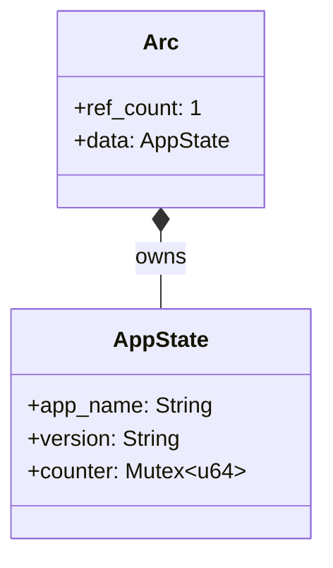
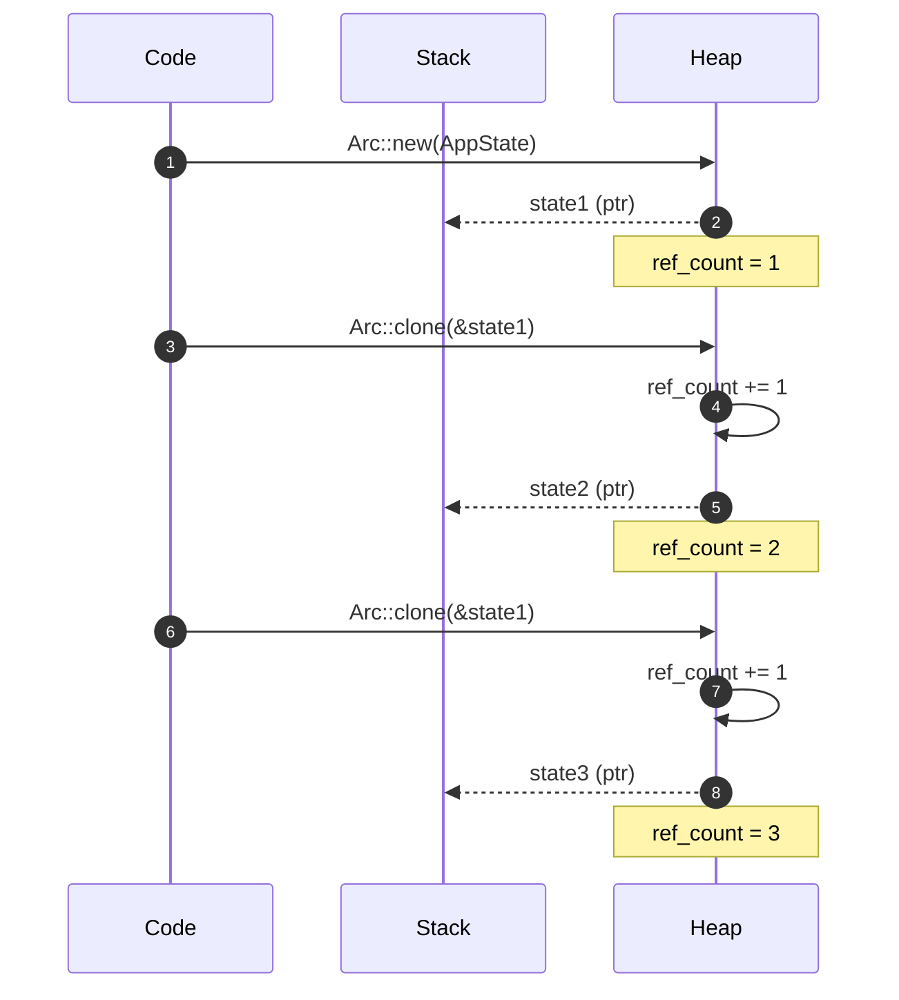
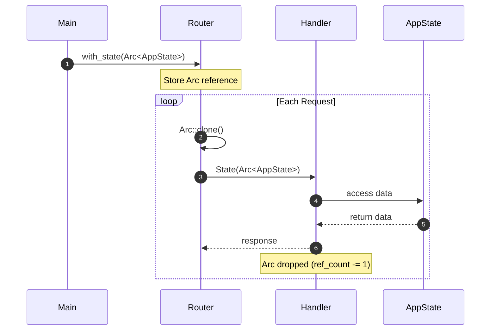

# Arc（参照カウント）の詳細解説

このドキュメントでは、Arc（Atomic Reference Counted）の仕組みを詳しく解説します。

---

## 目次

1. [Arc とは何か？](#arc-とは何か)
2. [参照カウントの仕組み](#参照カウントの仕組み)
3. [メモリレイアウト](#メモリレイアウト)
4. [Arc::clone() の動作](#arcclone-の動作)
5. [with_state() の内部動作](#with_state-の内部動作)
6. [パフォーマンスの目安](#パフォーマンスの目安)

---

## このドキュメントのコード例について

> **使用するコード例**: 最小サンプル（Counter App）
>
> Arc の概念を理解しやすくするため、`app_name`、`version`、`counter` を持つシンプルな例を使用します。

---

## Arc とは何か？

> **Arc = Atomic Reference Counted（アトミック参照カウント）**
> 「複数の所有者で同じデータを共有する」ためのスマートポインタです

### Rust の基本ルール

- 1つの値には1人の所有者しかいない（所有権）
- 所有者がスコープを抜けると、値は自動的に破棄される

### 問題

- Web サーバーでは、複数のハンドラーが同じデータにアクセスしたい
- 所有権のルールだと、1つのハンドラーしかデータを持てない

### 解決策: Arc を使う

Arc と AppState の関係を示す図です。Arc は AppState を「所有（owns）」し、参照カウントと共にHeapに格納します。



---

## 参照カウントの仕組み

### 参照カウント方式とは？

Arc は「誰がこのデータを使っているか」を **数値（参照カウント）** で追跡します。
これは C++ の `std::shared_ptr` や Swift の ARC（Automatic Reference Counting）と同じ考え方です。

### なぜ参照カウントが必要？

Rust の所有権ルールでは「1つの値に1人の所有者」ですが、Web サーバーでは複数のハンドラーが同時にデータを使います。参照カウントにより：

- **共有者が増えても安全**: カウント +1 で追跡
- **共有者が減っても安全**: カウント -1 で追跡
- **最後の1人が去ったら自動解放**: カウント 0 でメモリ解放

### 参照カウントのライフサイクル

| 操作           | 参照カウント | 説明                             |
| -------------- | ------------ | -------------------------------- |
| `Arc::new()`   | 1            | 新規作成、最初の所有者           |
| `Arc::clone()` | +1           | 共有者が増える（アトミック加算） |
| `drop()`       | -1           | 共有者が減る（アトミック減算）   |
| カウント = 0   | -            | Heapメモリを自動解放             |

### 他の言語との比較

| 言語       | Rust の Arc に相当するもの                |
| ---------- | ----------------------------------------- |
| C++        | std::shared_ptr<T>                        |
| Swift      | class（参照型、ARC で自動管理）           |
| Python     | すべてのオブジェクト（参照カウント + GC） |
| Java/JS/Go | GC が自動管理（参照カウントではない）     |

---

## メモリレイアウト

### Stack と Heap の役割分担

Rust では、メモリは **Stack** と **Heap** の2つの領域に分かれています。

| 領域  | 特徴                                 | 格納されるもの                          |
| ----- | ------------------------------------ | --------------------------------------- |
| Stack | 高速、サイズ固定、関数終了で自動解放 | ポインタ（8バイト）、プリミティブ型     |
| Heap  | 柔軟、サイズ可変、明示的な解放が必要 | String の中身、Vec の要素、Arc のデータ |

### なぜ Arc のデータは Heap に置かれるのか？

- **複数スレッドからアクセス**: Stack は各スレッド固有、Heap は共有可能
- **ライフタイムが不定**: どのハンドラーが最後まで使うか分からない
- **サイズが大きい**: AppState は DB プールなど大きなデータを含む

### メモリレイアウト図

`Arc::new(AppState {...})` 実行後のメモリ状態です。Stack にはポインタ（8バイト）だけが置かれ、実際のデータは Heap に格納されます。

#### 図の登場人物

| 名前                | 説明                                                                 | 図中の場所    |
| ------------------- | -------------------------------------------------------------------- | ------------- |
| **state (Arc ptr)** | Stack 上に置かれる Arc ポインタ。8 バイトの小さなデータ。            | 左側 (STACK)  |
| **ArcInner**        | Heap 上に確保された実データ。strong_count、weak_count、data を含む。 | 右側 (HEAP)   |
| **strong_count**    | 「何人がこのデータを使っているか」を表す数値。現在は 1。             | ArcInner 内部 |
| **data: AppState**  | 実際の AppState データ。                                             | ArcInner 内部 |

```
STACK                          HEAP
+------------------+           +---------------------------+
| state (Arc ptr)  |---------->| ArcInner                  |
| [8 bytes]        |           | +-- strong_count: 1       |
+------------------+           | +-- weak_count: 1         |
                               | +-- data: AppState        |
                               |     +-- app_name: "Hello" |
                               |     +-- version: "1.0.0"  |
                               |     +-- counter: 0        |
                               +---------------------------+
```

---

## Arc::clone() の動作

### 「クローン」という名前に騙されるな！

`Arc::clone()` は **データのコピーではありません**。これは Rust 初心者がよく誤解するポイントです。

| 操作              | 実際の動作                     | 計算量                   |
| ----------------- | ------------------------------ | ------------------------ |
| `String::clone()` | 文字列データを丸ごとコピー     | O(n)、遅い               |
| `Vec::clone()`    | 全要素をコピー                 | O(n)、遅い               |
| `Arc::clone()`    | **参照カウントを +1 するだけ** | O(1)、超高速（数ナノ秒） |

### なぜ Arc::clone() は高速？

- Heap上のデータには一切触れない
- アトミック命令で参照カウントを +1 するだけ
- 新しい Arc ポインタを Stack に作成するだけ

### アトミック操作とは？

複数スレッドから同時に参照カウントを変更しても、データ競合が起きないことを保証する CPU 命令です。`fetch_add` という命令が使われ、「読み取り → 加算 → 書き込み」が割り込み不可能な単一操作として実行されます。

### コード例

```rust
let state1 = Arc::new(AppState { ... });  // カウント: 1
let state2 = Arc::clone(&state1);          // カウント: 2（データは同じ）
let state3 = state1.clone();               // カウント: 3（同じ意味）
```

### シーケンス図

3回のクローン操作でメモリとカウントがどう変化するかを示しています。Heap上のデータは一切コピーされず、参照カウントだけが増加する点に注目してください。



### クローン後のメモリ状態

#### 図の登場人物

| 名前                 | 説明                                               | 図中の場所    |
| -------------------- | -------------------------------------------------- | ------------- |
| **state1 (Arc ptr)** | 最初に作成された Arc ポインタ。                    | Stack 上段    |
| **state2 (Arc ptr)** | Arc::clone() で作成された2つ目のポインタ。         | Stack 中段    |
| **state3 (Arc ptr)** | Arc::clone() で作成された3つ目のポインタ。         | Stack 下段    |
| **ArcInner**         | Heap 上の実データ。3つのポインタ全てがここを指す。 | 右側 (HEAP)   |
| **strong_count: 3**  | 参照者が 3 人に増加。                              | ArcInner 内部 |

#### 重要なポイント

- **3つのポインタが同じ ArcInner を指している**
- **データは1つだけ存在し、コピーされていない**
- **strong_count が 3 に増加している**

```
STACK                          HEAP
+------------------+           +---------------------------+
| state1 (Arc ptr) |---------->| ArcInner                  |
+------------------+      +--->| +-- strong_count: 3       |
| state2 (Arc ptr) |------+    | +-- data: AppState        |
+------------------+      |    |     (shared, not copied)  |
| state3 (Arc ptr) |------+    +---------------------------+
+------------------+
```

**state1, state2, state3 はすべて同じ AppState を指している！**

### Arc::clone(&arc) vs arc.clone()

どちらも同じ動作ですが、書き方の推奨があります：

```rust
let state2 = Arc::clone(&state1);  // ✅ 推奨（明示的）
let state2 = state1.clone();       // ⚠️ 動作するが非推奨
```

**なぜ Arc::clone() が推奨？**
- コードを読む人に「これは軽量な参照カウント増加だ」と伝わる
- `.clone()` だと「重いデータコピーかも？」と誤解される可能性
- Clippy（Rust のリンター）も Arc::clone() を推奨

---

## with_state() の内部動作

### axum はリクエストごとに何をしているか？

`Router::with_state(Arc<AppState>)` を呼ぶと、axum は内部で Arc への参照を保持します。
そして **リクエストが来るたびに** `Arc::clone()` を実行し、ハンドラーに渡します。

### なぜ毎回 Arc::clone() するのか？

- 各リクエストは独立したタスク（tokio タスク）で処理される
- ハンドラーが終了するまで State を「借用」し続ける必要がある
- Arc::clone() は O(1) で超高速なので、リクエストごとに呼んでも問題ない

### ハンドラー終了時の動作

ハンドラー関数が終了すると、渡された `State(Arc<AppState>)` が drop され、参照カウントが -1 されます。最後のハンドラーが終了し、main 関数も終了すると、参照カウントが 0 になり、AppState がメモリから解放されます。

### シーケンス図

main 関数で State を登録してから、各リクエストがハンドラーに渡されるまでの流れを示しています。



---

## パフォーマンスの目安

| 操作                | 所要時間          |
| ------------------- | ----------------- |
| Arc::clone()        | 約 5-10 ナノ秒    |
| HTTP リクエスト処理 | 通常 1-100 ミリ秒 |

**Arc::clone() のコストは無視できるほど小さい**

### 詳細な比較

| 操作            | 時間            |
| --------------- | --------------- |
| Arc::clone()    | 約 5 ナノ秒     |
| HTTP パース     | 約 1 マイクロ秒 |
| DB クエリ       | 約 1-100 ミリ秒 |
| HTTP レスポンス | 約 1 マイクロ秒 |

Arc::clone() のコストは全体の **0.0001% 以下**。

---

## 次のステップ

- [04-clone.md](./04-clone.md) - Clone トレイトをより詳しく理解する
- [05-mutex-and-design.md](./05-mutex-and-design.md) - Mutex と AppState の設計パターン
