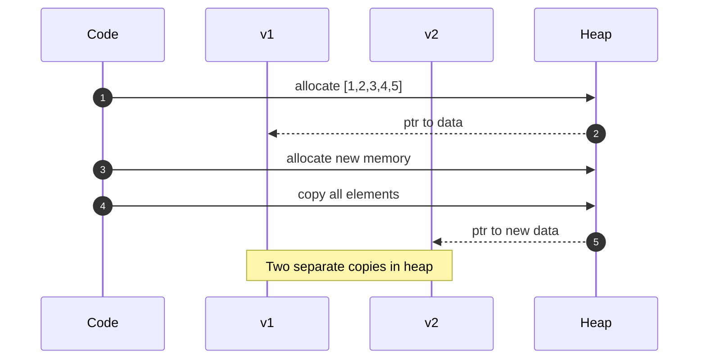
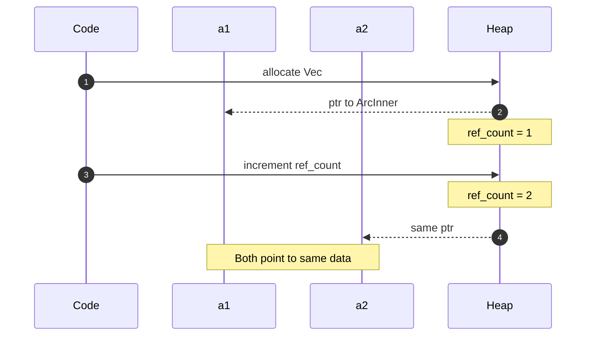

# Clone トレイトの詳細解説

このドキュメントでは、Rust の Clone トレイトと、Arc の clone の違いを詳しく解説します。

---

## 目次

1. [Clone トレイトとは？](#clone-トレイトとは)
2. [通常の clone vs Arc の clone](#通常の-clone-vs-arc-の-clone)
3. [Clone vs Copy](#clone-vs-copy)
4. [clone のコスト比較](#clone-のコスト比較)

---

## このドキュメントのコード例について

> **使用するコード例**: 汎用的な Rust の例（String, Vec, Arc）
>
> Clone トレイトは Rust の基本的な概念なので、AppState に限らず汎用的な例を使って説明します。

---

## Clone トレイトとは？

**Clone = 値を複製するための標準インターフェース**

Rust では、デフォルトでは値の複製はできません。`Clone` トレイトを実装した型だけが `.clone()` メソッドを持ちます。これにより、コピーのコストを意識したコードが書けます。

### なぜ Clone が明示的？

他の言語（Java、Python など）ではオブジェクトのコピーが暗黙的に行われることがありますが、Rust では：

- **コストの可視化**: clone() を書くことで「ここでコピーが発生する」と分かる
- **不要なコピーの防止**: 参照（`&T`）や move を使えばコピーなしでデータを渡せる
- **パフォーマンス意識**: 大きなデータの不用意なコピーを防ぐ

---

## 通常の clone vs Arc の clone

### O(n) vs O(1) の違いを実感しよう

> **なぜ Vec を例に使うのか？**
>
> `String`、`Vec`、`HashMap` などのHeapにデータを持つ型は、どれも `clone()` すると全データをコピーするため O(n) になります。どの型を例に使っても本質は同じなので、この記事では `Vec` に統一して説明します。

100万要素の Vec をクローンする場合：
- `Vec::clone()`: 新しいメモリ確保 + 全要素コピー → **数ミリ秒**
- `Arc::clone()`: 8バイトの整数をインクリメント → **数ナノ秒**

| 種類      | 動作                 | 計算量 | 100万要素の場合 |
| --------- | -------------------- | ------ | --------------- |
| Vec clone | 全要素をコピー       | O(n)   | ~1ms            |
| Arc clone | 参照カウント +1 のみ | O(1)   | ~10ns           |

### 通常の clone（全要素をコピー）

**何が起こるか**: メモリアロケータに新しい領域を要求し、全要素を1つずつコピーします。

```rust
let v1 = vec![1, 2, 3, 4, 5];
let v2 = v1.clone();  // 全要素のコピーが作られる
```

Vec のクローンで発生する2回のHeap操作（メモリ確保 + データコピー）を示しています。



#### メモリ状態

##### 図の登場人物

| 名前                     | 説明                                                | 図中の場所 |
| ------------------------ | --------------------------------------------------- | ---------- |
| **v1**                   | 最初の Vec。Heap 上の [1,2,3,4,5] (copy 1) を指す。 | Stack 上段 |
| **v2**                   | clone で作成された Vec。**別の** Heap 領域を指す。  | Stack 下段 |
| **[1,2,3,4,5] (copy 1)** | v1 が所有するデータ。                               | Heap 上段  |
| **[1,2,3,4,5] (copy 2)** | v2 が所有する**コピー**されたデータ。               | Heap 下段  |

```
STACK              HEAP
+------+           +------------------------+
| v1   |---------->| [1,2,3,4,5] (copy 1)   |
+------+           +------------------------+
| v2   |---------->| [1,2,3,4,5] (copy 2)   |
+------+           +------------------------+
```

### Arc の clone（参照カウント増加のみ）

**何が起こるか**: CPU のアトミック命令で参照カウントを +1 するだけ。メモリアロケーションは発生しません。

```rust
let a1 = Arc::new(vec![1, 2, 3, 4, 5]);
let a2 = Arc::clone(&a1);  // 参照カウント +1 のみ（超高速）
```

Vec の clone と対照的に、Heap操作が「カウント増加」の1回だけであることに注目してください。



#### クローン後のメモリ状態（a1 と a2 は同じHeap領域を指している）

##### 図の登場人物

| 名前             | 説明                                                          | 図中の場所 |
| ---------------- | ------------------------------------------------------------- | ---------- |
| **a1**           | 最初の Arc ポインタ。                                         | Stack 上段 |
| **a2**           | Arc::clone() で作成されたポインタ。**同じ** Heap 領域を指す。 | Stack 下段 |
| **ref_count: 2** | 参照者が 2 人であることを示す。                               | Heap 内部  |
| **data**         | 実際のデータ。**1つだけ存在**（コピーされていない）。         | Heap 内部  |

##### 重要なポイント

Vec の clone と比較すると:
- **Vec**: 2つの独立した Heap 領域が存在（データがコピーされた）
- **Arc**: 1つの Heap 領域を2つのポインタが共有（データはコピーされていない）

```
STACK              HEAP
+------+           +----------------------+
| a1   |---------->| ref_count: 2         |
+------+      +--->| data: [1, 2, 3, 4, 5]|
| a2   |------+    +----------------------+
+------+
```

---

## Clone vs Copy

### Copy と Clone の根本的な違い

Rust には値をコピーする2つのトレイトがあり、その違いを理解することが重要です。

| トレイト | 動作                     | 発動条件                      | 例                        |
| -------- | ------------------------ | ----------------------------- | ------------------------- |
| Copy     | ビット単位のコピー       | 代入時に**暗黙的**            | i32, f64, bool, char, &T  |
| Clone    | カスタムロジックでコピー | `.clone()` を**明示的に**呼ぶ | String, Vec, Arc, HashMap |

### Copy を実装できる型の条件

- Stack に収まる固定サイズ
- Drop トレイトを実装していない（デストラクタがない）
- 全フィールドが Copy

### なぜ String は Copy できない？

- String は内部でHeapメモリへのポインタを持つ
- ビットコピーするとポインタが2つになり、二重解放の危険
- Clone で「新しいHeap領域を確保 → データをコピー」が正しい動作

### コード例

```rust
// Copy の例（暗黙的）
let x = 42;      // i32 は Copy
let y = x;       // x の値がコピーされる（.clone() 不要）
println!("{}", x); // x はまだ使える！

// Clone の例（明示的）
let s1 = String::from("Hello");
let s2 = s1.clone();             // 明示的にクローン
println!("{}", s1);              // ✅ s1 も使える
```

---

## clone のコスト比較

### 「clone は遅い」は半分正解、半分間違い

clone のコストは型によって大きく異なります。AppState のような大きな構造体を直接 clone すると非常に遅くなりますが、`Arc<AppState>` の clone は超高速です。

### コスト一覧

| 型                     | clone のコスト | 計算量 | 1000回実行した場合 |
| ---------------------- | -------------- | ------ | ------------------ |
| i32, bool など         | 超軽量（Copy） | O(1)   | ~1μs               |
| Arc<T>, Rc<T>          | 超軽量         | O(1)   | ~10μs              |
| String (100文字)       | 中程度         | O(n)   | ~100μs             |
| Vec<i32> (1000要素)    | 重い           | O(n)   | ~1ms               |
| HashMap (1000エントリ) | 非常に重い     | O(n)   | ~10ms              |

### 結論

**大きなデータは Arc で包んで共有し、clone のコストを O(1) にする**

```rust
// ❌ 大きなデータを直接 clone
let data = BigData { /* 1MB のデータ */ };
let data2 = data.clone();  // 1MB コピー、遅い！

// ✅ Arc で包んで clone
let data = Arc::new(BigData { /* 1MB のデータ */ });
let data2 = Arc::clone(&data);  // 参照カウント +1 だけ、超高速！
```

---

---

## Arc<T> は T: Clone でなくても Clone 可能

### よくある誤解

「`Arc<T>` をクローンするには `T: Clone` が必要」と思われがちですが、これは**誤解**です。

```rust
// Arc<T> の Clone 実装（標準ライブラリ）
impl<T: ?Sized> Clone for Arc<T> {
    fn clone(&self) -> Arc<T> {
        // 参照カウントを +1 するだけ
        // T のクローンは行わない！
    }
}
```

**重要**: `Arc::clone()` は参照カウントを増やすだけで、中身の `T` をコピーしません。そのため、`T: Clone` は**不要**です。

---

## axum 推奨パターンと Clone の必須化

### axum 公式推奨パターン

このプロジェクトでは、axum 公式推奨パターンを採用しています。

axum 公式ドキュメント:
> "Your top level state needs to derive Clone"

axum メンテナー mladedav（GitHub Discussion #3223）:
> "When you extract the state, axum will clone it and pass it to your handler.
>  You can use Arc to make the clone cheap if your state is large or expensive to clone."

### axum 推奨パターンでは Clone が必須

axum 推奨パターン（`State<AppState<...>>`）を使用する場合、**AppState 自体が Clone を実装している必要があります**。
これは、axum が各リクエストで `state.clone()` を呼び出すためです。

```rust
// axum 推奨パターンの動作イメージ
loop {
    let request = accept_request().await;
    let state_clone = state.clone();  // ← Clone が必須！
    tokio::spawn(async move {
        handler(State(state_clone), request).await;
    });
}
```

### AppState の手動 Clone 実装

```rust
// state.rs での手動 Clone 実装
impl<TW, TR, C, UR, UW, S> Clone for AppState<TW, TR, C, UR, UW, S>
where
    TW: TodoWriter,
    TR: TodoReader,
    // ...
{
    fn clone(&self) -> Self {
        Self {
            auth_service: self.auth_service.clone(),
            create_todo: self.create_todo.clone(),
            // ...
        }
    }
}
```

### なぜ `#[derive(Clone)]` ではなく手動実装？

ジェネリクスを使用しているため、`#[derive(Clone)]` は `TW: Clone` などの**不要な制約**を追加してしまいます。

```rust
// ❌ derive(Clone) を使うと...
#[derive(Clone)]
pub struct AppState<TW: TodoWriter, ...> { ... }
// → コンパイラが TW: Clone を要求してしまう

// ✅ 手動実装なら正確なトレイト境界のみ
impl<TW, ...> Clone for AppState<TW, ...>
where
    TW: TodoWriter,  // Clone ではなく TodoWriter を要求
    // ...
```

### パフォーマンスへの影響

AppState の全フィールドは内部で `Arc` を使用しているため、clone は実質的に参照カウントの増加のみ（約5ナノ秒/フィールド）。実際のデータはコピーされません。

---

## 次のステップ

- [05-mutex-and-design.md](./05-mutex-and-design.md) - Mutex と AppState の設計パターン
- [03-arc.md](./03-arc.md) - Arc の仕組みをもう一度確認する
- [08-generics-design.md](./08-generics-design.md) - ジェネリクス設計の詳細
