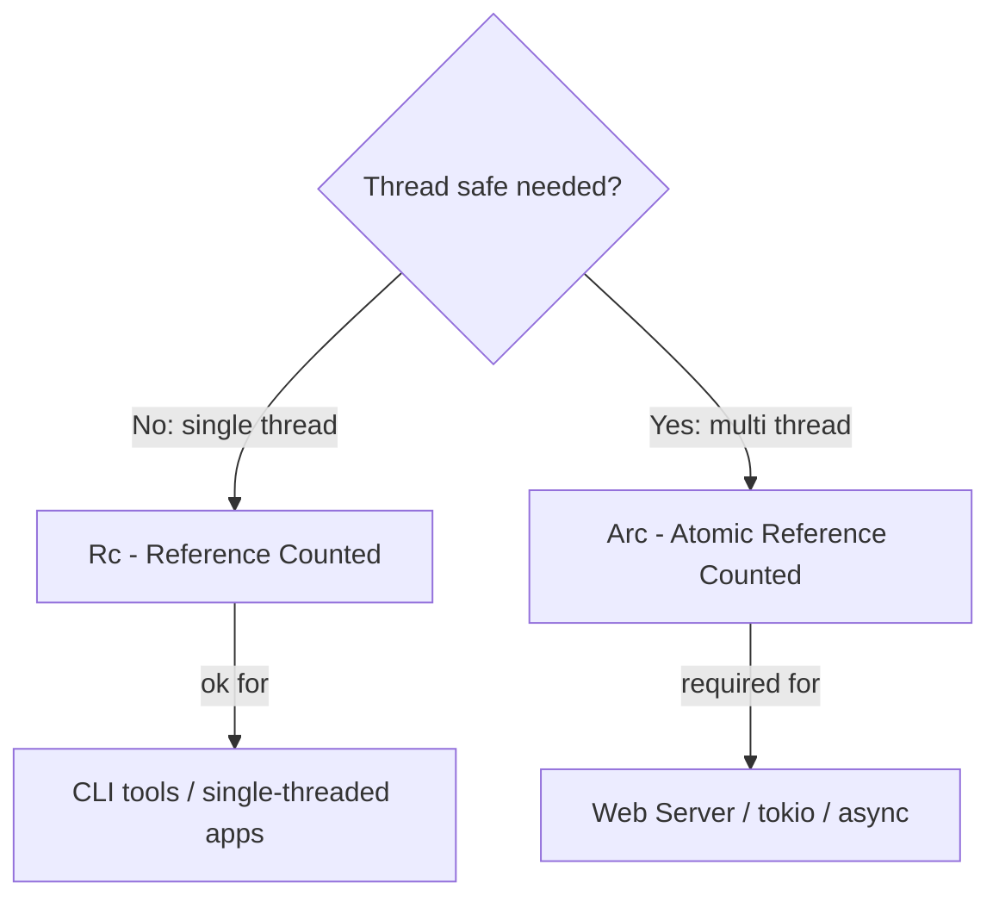
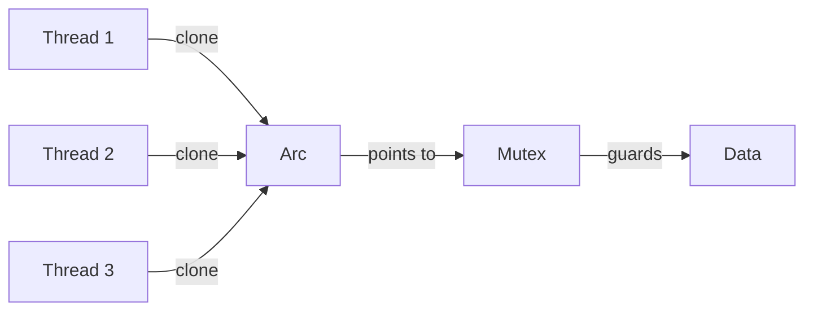
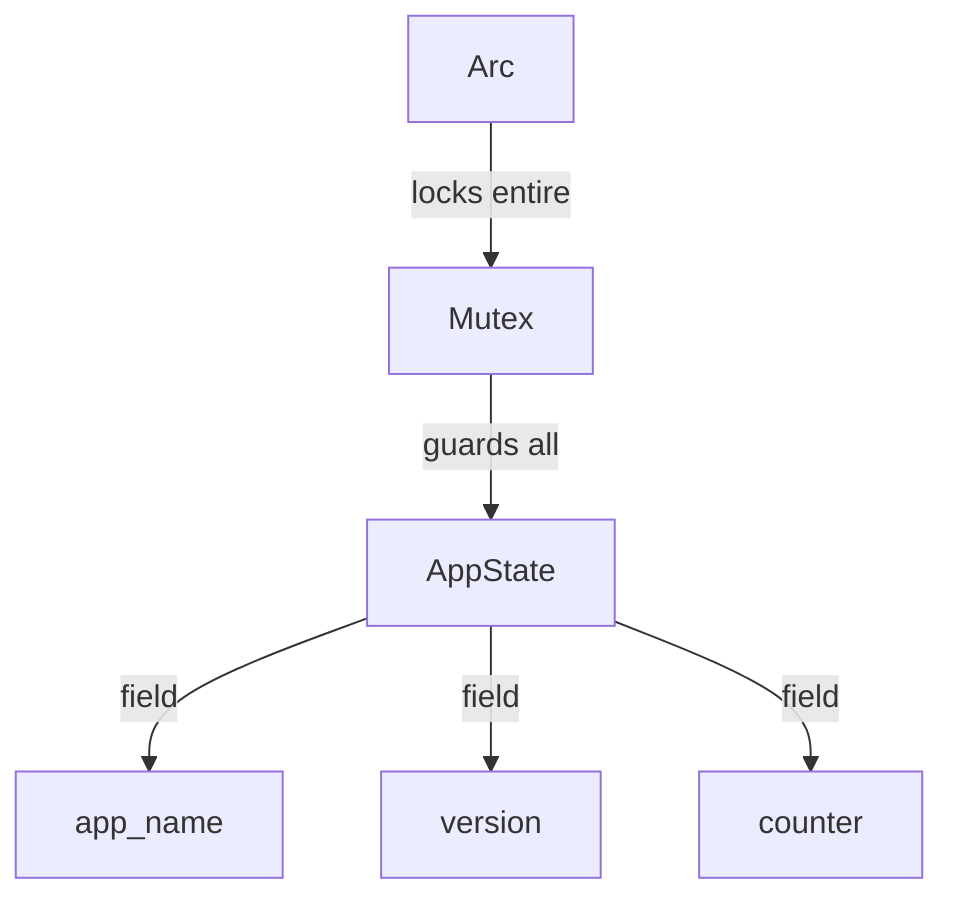
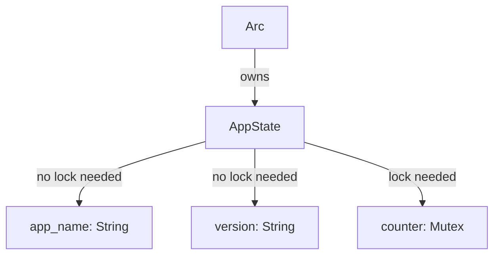
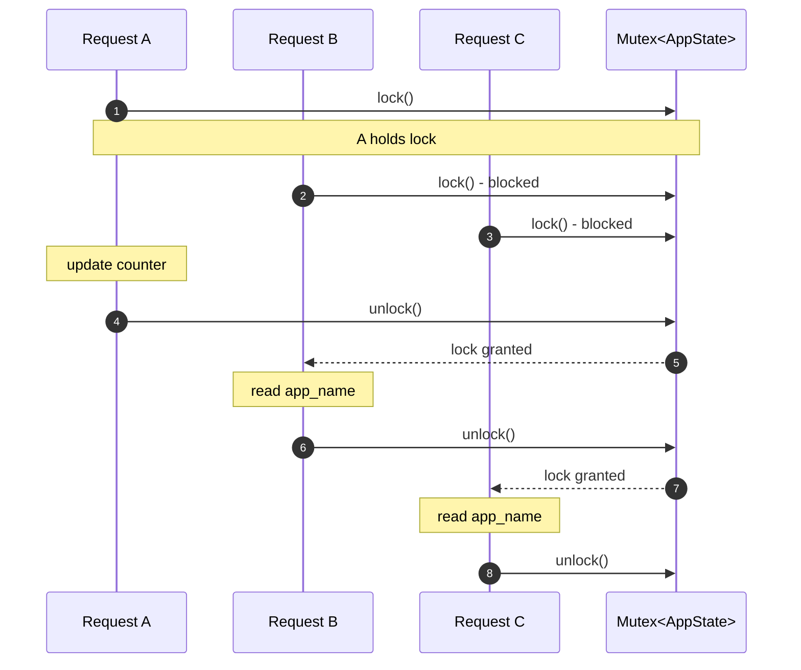
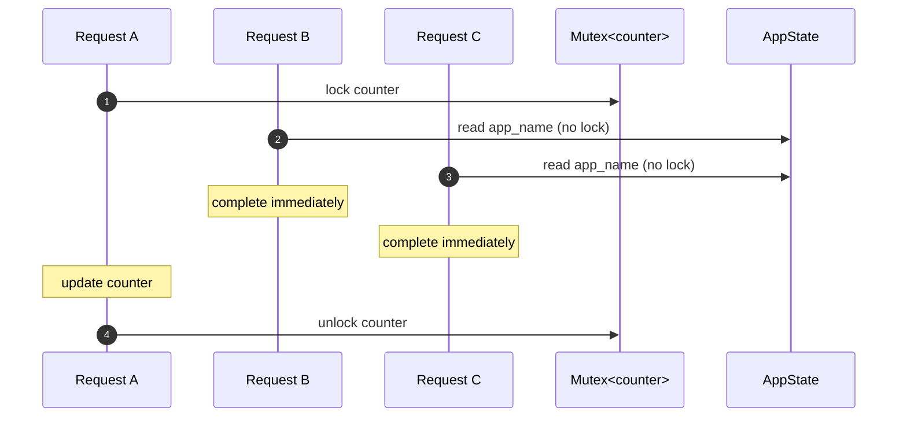
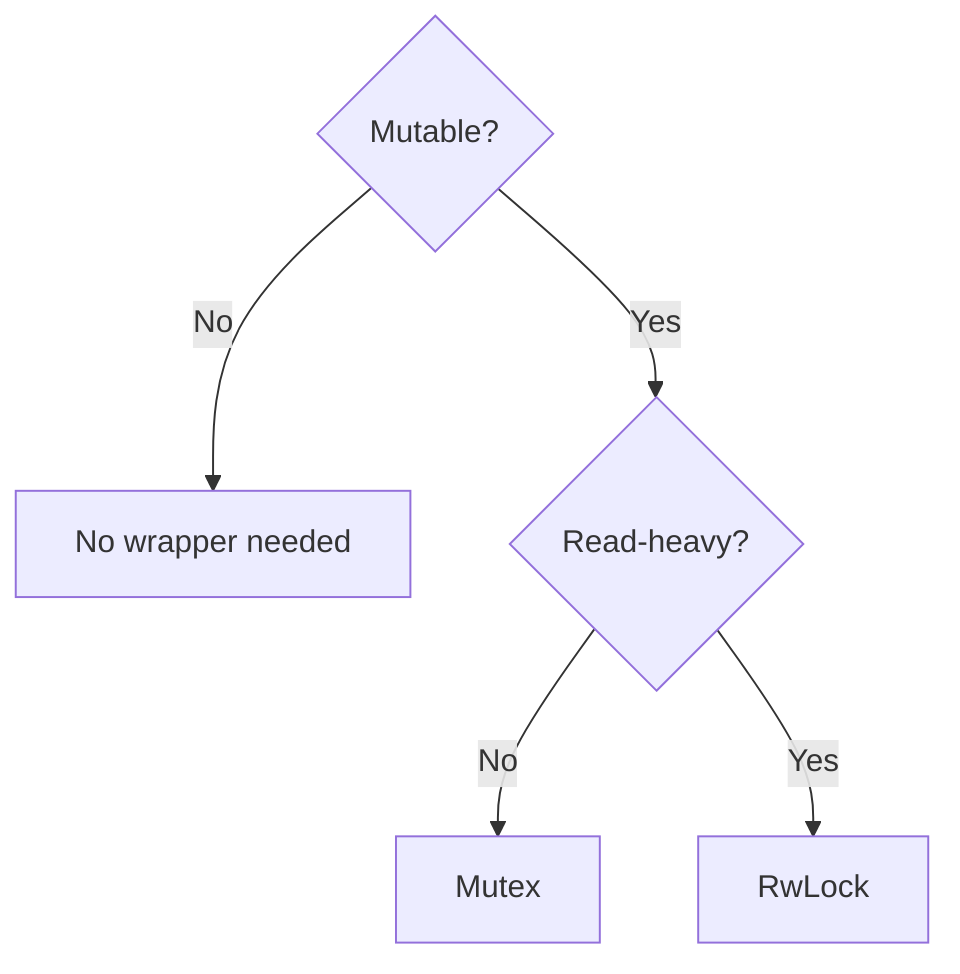

# Mutex と AppState の設計

このドキュメントでは、Arc と Mutex の使い分け、AppState の設計パターンを解説します。

---

## 目次

1. [Arc vs Rc](#arc-vs-rc)
2. [Arc だけでは「書き込み」はできない](#arc-だけでは書き込みはできない)
3. [Mutex が必要なフィールド・不要なフィールド](#mutex-が必要なフィールド不要なフィールド)
4. [Arc\<AppState\> vs Arc\<Mutex\<AppState\>\>](#arcappstate-vs-arcmutexappstate)
5. [3つのリクエストが同時に来た場合](#3つのリクエストが同時に来た場合)
6. [ベストプラクティスまとめ](#ベストプラクティスまとめ)

---

## このドキュメントのコード例について

> **使用するコード例**: 最小サンプル（Counter App）
>
> Mutex の概念と設計パターンを理解しやすくするため、`app_name`、`version`、`counter` を持つシンプルな例を使用します。
> 実際のプロジェクトでは `PgPool`（内部でスレッドセーフ）などを AppState に追加しますが、概念は同じです。

---

## Arc vs Rc

### Rc と Arc の本質的な違い

どちらも「参照カウント方式のスマートポインタ」ですが、スレッドセーフティが異なります。

| 型 | スレッドセーフ | 参照カウント操作 | 用途 |
|----|---------------|-----------------|------|
| Rc<T> | No | 通常の加算/減算 | シングルスレッドでの共有 |
| Arc<T> | **Yes** | **アトミック**命令 | マルチスレッドでの共有 |

### なぜ Rc はスレッドセーフでないのか？

Rc の参照カウント操作は「読み取り → 加算 → 書き込み」の3ステップです。2つのスレッドが同時にこれを実行すると：

```
Thread A: read count (= 1)
Thread B: read count (= 1)    <- A hasn't written yet!
Thread A: write count (= 2)
Thread B: write count (= 2)   <- Should be 3, but becomes 2!
```

結果として、参照カウントが狂い、早期解放やメモリリークが発生します。

### Arc はアトミック命令で解決

CPU のアトミック命令（`lock xadd` など）は「読み取り → 加算 → 書き込み」を**単一の割り込み不可能な操作**として実行します。これにより、複数スレッドが同時に操作しても正しいカウントが保証されます。

### 選択フローチャート

スレッドセーフが必要かどうかで Rc/Arc を選択するフローを示しています。Web サーバーは必ずマルチスレッドなので、**必ず Arc を使います**。



### Arc のオーバーヘッドはどの程度？

- Rc の clone: 約 1-2 ナノ秒
- Arc の clone: 約 5-10 ナノ秒（アトミック命令のため少し遅い）
- **差は数ナノ秒**: 実用上は無視できる

**結論: Web サーバーでは常に Arc を使う。パフォーマンス差は気にしなくてよい。**

---

## Arc だけでは「書き込み」はできない

### 「共有」と「変更」は別の問題

Arc は「複数の所有者でデータを共有する」問題を解決しますが、「データを変更する」問題は解決しません。

| 機能 | Arc | Mutex | Arc + Mutex |
|------|-----|-------|-------------|
| 複数所有者での共有 | ✅ | ❌ | ✅ |
| データの変更 | ❌ | ✅ | ✅ |
| スレッドセーフな変更 | ❌ | ✅ | ✅ |

### なぜ Arc だけでは変更できない？

- Rust の借用ルール: `&T`（不変参照）は複数可、`&mut T`（可変参照）は1つだけ
- Arc は内部データへの `&T` しか提供しない
- 複数スレッドが同時に `&mut T` を持つとデータ競合が発生

### Mutex の役割（排他制御）

Mutex（Mutual Exclusion）は「一度に1つのスレッドだけがデータにアクセスできる」ことを保証します。`lock()` を呼ぶと：

1. ロックを取得できるまで待機
2. ロック中は他のスレッドはブロックされる
3. `MutexGuard` が drop されると自動でアンロック

### デッドロックの注意点

- 複数の Mutex を同じ順序でロックする
- ロックを長時間保持しない（DB クエリ中にロックを持たない）
- 可能なら `tokio::sync::Mutex` を使う（async 対応）

### 構造図

複数スレッドが Arc を通じて Mutex で保護されたデータにアクセスする様子を示しています。



---

## Mutex が必要なフィールド・不要なフィールド

### 判断基準: そのフィールドは変更されるか？

| フィールドの種類 | Mutex | 理由 | 例 |
|-----------------|-------|------|-----|
| 読み取り専用（不変） | 不要 | 変更しないので競合しない | app_name, config |
| 読み書きする（可変） | **必要** | 同時書き込みで競合する | counter, cache |
| 内部でスレッドセーフな型 | 不要 | 型自体が排他制御を持つ | PgPool, redis::Client |

### 内部でスレッドセーフな型とは？

DB 接続プール（`sqlx::PgPool`）や Redis クライアントなどは、内部で既に排他制御を実装しています。これらを Mutex で包むと二重ロックになり、無駄なオーバーヘッドが発生します。

---

## Arc\<AppState\> vs Arc\<Mutex\<AppState\>\>

### ロック粒度がパフォーマンスを決める

「ロック粒度」とは、一度のロックで保護される範囲のことです。粒度が大きいほど実装は簡単ですが、パフォーマンスは悪化します。

| アプローチ | ロック粒度 | 実装の簡単さ | パフォーマンス |
|-----------|-----------|-------------|---------------|
| Arc<Mutex<AppState>> | 構造体全体 | ✅ 簡単 | ❌ 悪い（ボトルネック） |
| Arc<AppState> + 個別 Mutex | フィールド単位 | △ やや複雑 | ✅ 良い |

### ❌ Arc<Mutex<AppState>>（構造体全体をロック）

**問題点**: counter を更新するだけなのに、app_name も version もロックされます。他のスレッドは、関係ないフィールドを読むだけでも待たされます。

AppState 全体が1つの Mutex で保護されている様子を示しています。どのフィールドにアクセスする場合も、同じロックを取得する必要があります。



### ✅ Arc<AppState>（フィールドごとに Mutex）

**利点**: 必要なフィールドだけをロックするので、他のスレッドは別のフィールドに同時アクセスできます。

counter だけが Mutex で保護されています。app_name と version へのアクセスはロック不要です。



---

## 3つのリクエストが同時に来た場合

### このシナリオは現実で頻繁に起こる

Web サーバーでは、毎秒数百〜数千のリクエストが同時に処理されます。そのうち多くは「読み取りだけ」のリクエストです。

**シナリオ:**
- リクエスト A: GET /count (counter を更新) - **書き込み**
- リクエスト B: GET /info (app_name を読むだけ) - **読み取り**
- リクエスト C: GET /info (app_name を読むだけ) - **読み取り**

### ❌ Arc<Mutex<AppState>> の場合

**ブロッキングによるレイテンシ増加:**

B と C は app_name を読むだけなのに、A の counter 更新（例: 5ms）を待つ必要があります。

- A の処理時間: 5ms
- B の待ち時間: 5ms（A のロック解放待ち）
- C の待ち時間: 10ms（A + B のロック解放待ち）
- **合計レイテンシ: 20ms**（本来は 5ms + 1ms + 1ms = 7ms で済むはず）



### ✅ Arc<AppState> の場合

**パラレル処理による高速化:**

B と C は counter にアクセスしないので、A のロックを待つ必要がありません。

- A の処理時間: 5ms
- B の処理時間: 1ms（**待ち時間なし**）
- C の処理時間: 1ms（**待ち時間なし**）
- **合計レイテンシ: 7ms**（全リクエストが並列処理）

B と C が A のロック解放を待たずに直接 AppState にアクセスしている点に注目してください。



### タイムライン比較

同じ3リクエストの処理時間を比較しています。

#### 図の登場人物

| 名前 | 説明 | 図中の場所 |
|------|------|-----------|
| **A** | GET /count（counter を更新する**書き込み**リクエスト） | 上段 |
| **B** | GET /info（app_name を読むだけの**読み取り**リクエスト） | 中段 |
| **C** | GET /info（app_name を読むだけの**読み取り**リクエスト） | 下段 |
| **Time** | 横軸。0〜9 の任意時間単位。 | 最上部 |

#### 凡例

| 記号 | 意味 |
|------|------|
| `[===LOCK===]` | 処理中（ロック保持または実行中） |
| `[==WAIT==]` | ロック待ち（ブロッキング） |
| `[==DONE==]` | 処理完了 |

#### パフォーマンスへの影響

構造体全体ロックでは、読み取りリクエスト（B, C）が書き込みリクエスト（A）に**直列化**されます。1秒間に1000リクエストが来る場合：
- 構造体全体ロック: 最大スループット = 1000 / 20ms = **50 req/sec**
- フィールド単位ロック: 最大スループット = 1000 / 7ms = **142 req/sec**

**約3倍の性能差が生じます。**

```
Arc<Mutex<AppState>> - Entire struct locked:

Time:  0----1----2----3----4----5----6----7----8----9
A:     [=======LOCK=======]
B:                         [==WAIT==][==LOCK==]
C:                                             [WAIT][==]


Arc<AppState> - Field-level lock:

Time:  0----1----2----3----4----5----6----7----8----9
A:     [===counter LOCK===]
B:     [==DONE==]                    <- No wait!
C:     [==DONE==]                    <- No wait!
```

---

## ベストプラクティスまとめ

### 設計判断フローチャート

新しいフィールドを AppState に追加するとき、以下のフローチャートに従って保護方法を決定してください。

**判断基準:**
1. **Mutable?（変更される？）**: 初期化後に値が変わるかどうか
2. **Read-heavy?（読み取りが多い？）**: 書き込みより読み取りが圧倒的に多いか

**各選択肢の意味:**
- **No wrapper**: そのままの型でOK（例: `app_name: String`）
- **Mutex**: 排他ロック（例: `counter: Mutex<u64>`）
- **RwLock**: 読み取りは複数可、書き込みは排他（例: `cache: RwLock<HashMap<...>>`）



### 重要な4つのルール

1. **構造体全体を Mutex で包まない**（`Arc<Mutex<AppState>>` は避ける）
2. **変更が必要なフィールドだけを Mutex で包む**
3. **読み取り専用フィールドは Mutex 不要**
4. **読み取りが多いフィールドは RwLock を検討**

### フィールドの種類と保護方法

| 種類 | 保護方法 | 例 |
|------|----------|-----|
| 読み取り専用 | そのまま | String, Config |
| 読み書き | Mutex<T> | counter, cache |
| 読み取り多め | RwLock<T> | settings |
| DB接続プール | そのまま | PgPool（内部でスレッドセーフ） |

### 迷ったときの推奨選択

- 分からなければまず **Mutex** を使う（シンプルで安全）
- パフォーマンス問題が発生したら **RwLock** に変更
- 過剰な最適化は避け、計測してから判断

---

## 次のステップ

- [06-quickref.md](./06-quickref.md) - 5W1H クイックリファレンス
- [07-faq.md](./07-faq.md) - よくある疑問と回答
