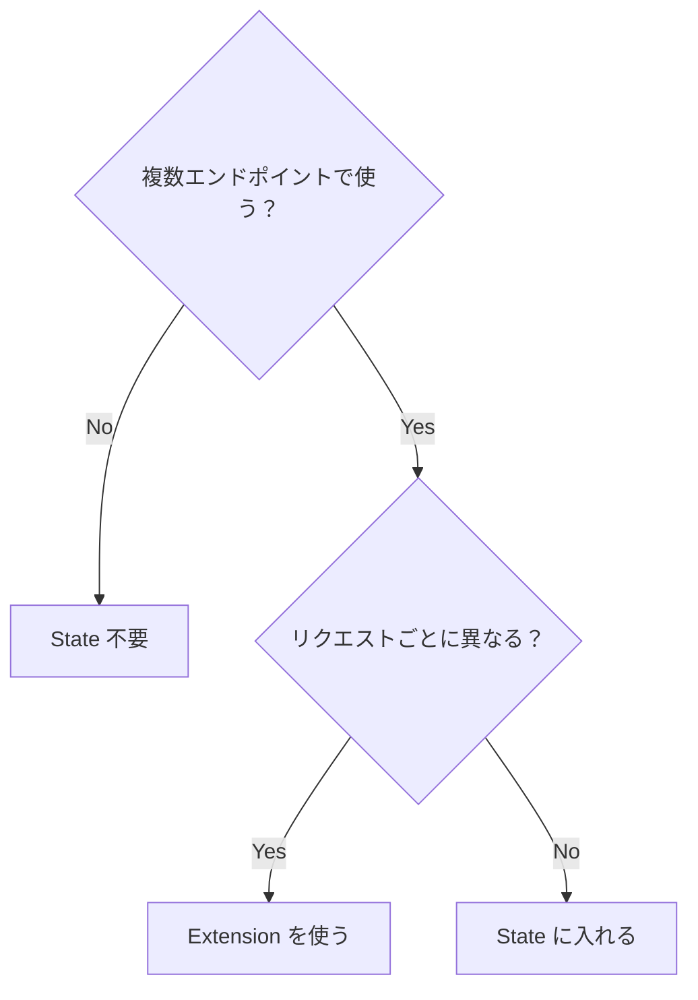
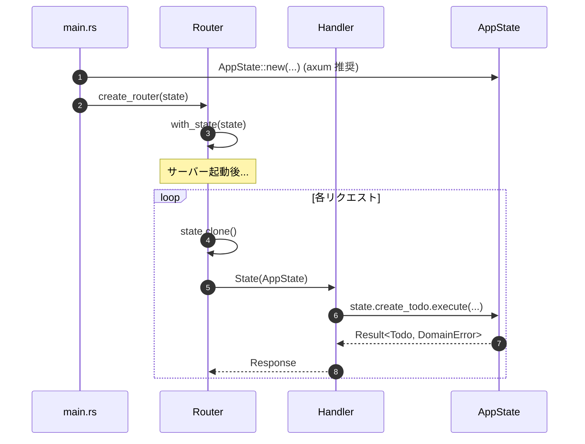

# 5W1H クイックリファレンス

実装中にサッと参照できる、State に関する 5W1H 形式のクイックリファレンスです。

---

## 目次

1. [5W1H まとめ](#5w1h-まとめ)
2. [When: いつ State を使うか？](#when-いつ-state-を使うか)
3. [Where: どこで State を定義・使用するか？](#where-どこで-state-を定義使用するか)
4. [Who: 誰が State にアクセスするか？](#who-誰が-state-にアクセスするか)
5. [How: 実装ステップ](#how-実装ステップ)

---

## このドキュメントのコード例について

> **使用するコード例**: TODO アプリ（実践パターン）
>
> このドキュメントは実装ガイドなので、`TodoReader`、`TodoWriter`、`PgPool` など実践的なコード例を使用します。

> **重要: 実際の実装はジェネリクスを使用**
>
> このドキュメントのコード例は理解しやすいようにトレイトオブジェクト版を示していますが、
> **このプロジェクトの実際の実装は axum 推奨のジェネリクスパターンを使用しています**。
> 詳細は [08-generics-design.md](./08-generics-design.md) を参照してください。

---

## 5W1H まとめ

| 5W1H      | 回答                                                             |
| --------- | ---------------------------------------------------------------- |
| **What**  | 全 API エンドポイントで共有するリソースの入れ物                  |
| **Why**   | DB 接続を効率的に共有し、テストを容易にするため                  |
| **When**  | 複数エンドポイントで使う & リクエストごとに変わらないリソース    |
| **Where** | 定義は presentation 層、組み立ては main.rs、使用はハンドラー     |
| **Who**   | ハンドラーだけが直接アクセス、下位レイヤーはトレイト経由         |
| **How**   | Clone 可能な AppState を with_state() で登録、State<...> で受け取る（axum 推奨） |

---

## When: いつ State を使うか？

### State に入れるべきもの

| リソース           | State に入れる？ | 理由                                         |
| ------------------ | ---------------- | -------------------------------------------- |
| DB 接続プール      | ✅ Yes            | 全エンドポイントで共有、毎回作るのは高コスト |
| Redis クライアント | ✅ Yes            | 同上                                         |
| JWT シークレット   | ✅ Yes            | 認証で全エンドポイントが参照                 |
| S3 クライアント    | ✅ Yes            | ファイル操作で共有                           |
| アプリ設定         | ✅ Yes            | 全体で参照する読み取り専用データ             |
| リクエストボディ   | ❌ No             | リクエストごとに異なる                       |
| ユーザー ID        | ❌ No             | リクエストごとに異なる（Extension で渡す）   |

### 判断フローチャート



---

## Where: どこで State を定義・使用するか？

### ファイル構成

```
api/
├── src/
│   └── main.rs           ← State を組み立てる場所（Composition Root）
│
crates/
├── presentation/
│   └── src/
│       ├── state.rs      ← AppState 構造体の定義
│       ├── handlers/     ← State を受け取って使う
│       └── router.rs     ← with_state() で登録
```

### 各場所の役割

| 場所            | 役割              | 担当するコード                       |
| --------------- | ----------------- | ------------------------------------ |
| `state.rs`      | AppState の型定義 | `pub struct AppState { ... }`        |
| `main.rs`       | State の組み立て  | `AppState::new(...)`（axum 推奨）    |
| `router.rs`     | Router への登録   | `.with_state(state)`                 |
| `handlers/*.rs` | State の使用      | `State(state): State<AppState<...>>` |

### データフロー図



---

## Who: 誰が State にアクセスするか？

### アクセス権限の設計

#### 図の登場人物

| 名前           | 説明                                                   | 図中の場所 |
| -------------- | ------------------------------------------------------ | ---------- |
| **Handler**    | axum の State を直接受け取る。Presentation Layer。     | 上段       |
| **Use Case**   | ビジネスロジック。axum を知らない。Application Layer。 | 中段       |
| **Repository** | 実際の DB/Redis/S3 操作。Infrastructure Layer。        | 下段       |

#### 重要なポイント

- **Handler だけが axum/State を知っている**
- **Use Case 以下は State の存在を知らない（トレイト経由）**
- **依存の方向は上から下へ（逆方向はない）**

```
+-------------------------------------------------------------+
|  Presentation Layer (knows axum)                            |
|  +-------------------------------------------------------+  |
|  |  Handler                                              |  |
|  |  - Receives State<Arc<AppState>> directly             |  |
|  |  - Extracts dependencies from State                   |  |
|  +-------------------------------------------------------+  |
+-------------------------------------------------------------+
                              |
                              | passes trait references
                              v
+-------------------------------------------------------------+
|  Application Layer (does NOT know axum)                     |
|  +-------------------------------------------------------+  |
|  |  Use Case                                             |  |
|  |  - Receives &dyn TodoWriter etc. (trait references)   |  |
|  |  - Does NOT know about State                          |  |
|  +-------------------------------------------------------+  |
+-------------------------------------------------------------+
                              |
                              | calls via trait
                              v
+-------------------------------------------------------------+
|  Infrastructure Layer (does NOT know axum)                  |
|  +-------------------------------------------------------+  |
|  |  Repository Implementation                            |  |
|  |  - Actual DB/Redis/S3 operations                      |  |
|  |  - Does NOT know about State                          |  |
|  +-------------------------------------------------------+  |
+-------------------------------------------------------------+
```

### 誰が何を知っているか

| レイヤー   | axum を知る？ | State を知る？ | 具象型を知る？        |
| ---------- | ------------- | -------------- | --------------------- |
| Handler    | ✅ Yes         | ✅ Yes          | ❌ No（トレイト経由）  |
| Use Case   | ❌ No          | ❌ No           | ❌ No（トレイト経由）  |
| Repository | ❌ No          | ❌ No           | ✅ Yes（自分が実装）   |
| main.rs    | ✅ Yes         | ✅ Yes          | ✅ Yes（組み立て担当） |

---

## How: 実装ステップ

### Step 1: AppState 構造体を定義

```rust
// presentation/src/state.rs

use std::sync::Arc;
use domain::{TodoWriter, TodoReader};

pub struct AppState {
    // 必要なフィールドだけを Arc<dyn Trait> で持つ
    todo_writer: Arc<dyn TodoWriter>,
    todo_reader: Arc<dyn TodoReader>,
    jwt_secret: String,  // 読み取り専用は Arc 不要
}

impl AppState {
    pub fn new(
        todo_writer: Arc<dyn TodoWriter>,
        todo_reader: Arc<dyn TodoReader>,
        jwt_secret: String,
    ) -> Self {
        Self {
            todo_writer,
            todo_reader,
            jwt_secret,
        }
    }

    // アクセサ（参照を返す）
    pub fn todo_writer(&self) -> &dyn TodoWriter {
        &*self.todo_writer
    }

    pub fn todo_reader(&self) -> &dyn TodoReader {
        &*self.todo_reader
    }

    pub fn jwt_secret(&self) -> &str {
        &self.jwt_secret
    }
}
```

### Step 2: main.rs で組み立て（axum 推奨パターン）

```rust
// api/src/main.rs

#[tokio::main]
async fn main() -> anyhow::Result<()> {
    // インフラ層を初期化
    let db_pool = PgPool::connect(&config.database_url).await?;

    // リポジトリを作成（Arc で包む）
    let todo_writer = Arc::new(PostgresTodoWriter::new(db_pool.clone()));
    let todo_reader = Arc::new(PostgresTodoReader::new(db_pool.clone()));

    // State を組み立て（axum 推奨: Arc なしで直接作成）
    // axum 公式: "Your top level state needs to derive Clone"
    let state = AppState::new(
        todo_writer,
        todo_reader,
        config.jwt_secret,
    );

    // ルーターに登録
    let app = Router::new()
        .route("/todos", get(list_todos).post(create_todo))
        .with_state(state);

    axum::serve(listener, app).await?;
    Ok(())
}
```

### Step 3: ハンドラーで使用（axum 推奨パターン）

```rust
// presentation/src/handlers/todo.rs

pub async fn list_todos(
    // axum 推奨: State<AppState<...>> で直接受け取る
    // axum が各リクエストで state.clone() を呼び出す
    State(state): State<AppState>,
) -> Result<Json<Vec<Todo>>, AppError> {
    // State から依存を取り出して Use Case に渡す
    let todos = list_todos_use_case(state.todo_reader()).await?;
    Ok(Json(todos))
}

pub async fn create_todo(
    State(state): State<AppState>,
    Json(input): Json<CreateTodoInput>,
) -> Result<Json<Todo>, AppError> {
    let todo = create_todo_use_case(
        state.todo_writer(),
        input,
    ).await?;
    Ok(Json(todo))
}
```

### よくあるミス

| ミス                                | 問題                       | 正しい方法                 |
| ----------------------------------- | -------------------------- | -------------------------- |
| `Arc<Mutex<AppState>>`              | 全フィールドがロックされる | フィールド単位で Mutex     |
| Use Case で `State<...>` を受け取る | axum 依存が漏れる          | トレイト参照を受け取る     |
| AppState に Clone を実装しない      | axum 推奨パターンで使用できない | Clone を手動実装する  |

---

## 実際の実装（ジェネリクス版 + axum 推奨パターン）

このプロジェクトでは axum 推奨のジェネリクスパターンを採用しています。

### AppState の実際の定義

```rust
// presentation/src/state.rs（実際の実装）
pub struct AppState<
    TW: TodoWriter,
    TR: TodoReader,
    C: TodoCacheOps,
    UR: UserReader,
    UW: UserWriter,
    S: StorageOps,
> {
    pub auth_service: AuthService<UR, UW>,
    pub create_todo: CreateTodoCommand<TW, C>,
    pub get_todo: GetTodoQuery<TR>,
    // ...
}

// Clone の手動実装（axum 推奨パターンで必須）
impl<TW, TR, C, UR, UW, S> Clone for AppState<TW, TR, C, UR, UW, S>
where
    TW: TodoWriter,
    TR: TodoReader,
    // ...
{
    fn clone(&self) -> Self { ... }
}
```

### ハンドラの実際のシグネチャ（axum 推奨パターン）

```rust
// handlers/todo.rs（実際の実装）
pub async fn list_todos<TW, TR, C, UR, UW, S>(
    user: UserContext,
    // axum 推奨: State<AppState<...>> で直接受け取る
    State(state): State<AppState<TW, TR, C, UR, UW, S>>,
    Query(query): Query<ListQuery>,
) -> Result<impl IntoResponse, ApiError>
where
    TW: TodoWriter,
    TR: TodoReader,
    C: TodoCacheOps,
    UR: UserReader,
    UW: UserWriter,
    S: StorageOps,
{
    // ...
}
```

### routes.rs でのターボフィッシュ

```rust
// routes.rs（実際の実装）
.route("/", get(list_todos::<TW, TR, C, UR, UW, S>))
```

ジェネリクスの詳細は [08-generics-design.md](./08-generics-design.md) を参照してください。

---

## 関連ファイル

このプロジェクトでの実装例：

- [api/src/main.rs](../../api/src/main.rs) - 実際の Composition Root
- [crates/presentation/src/state.rs](../../crates/presentation/src/state.rs) - AppState の定義（ジェネリクス版）
- [crates/presentation/src/routes.rs](../../crates/presentation/src/routes.rs) - ターボフィッシュ構文の使用例
