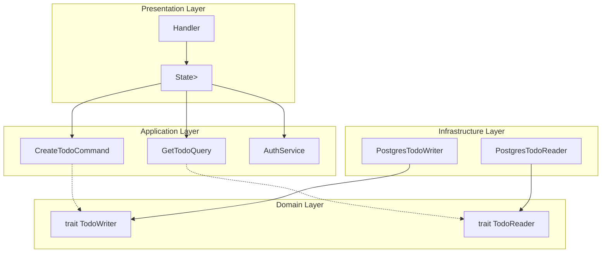

# ジェネリクス設計の解説

このドキュメントでは、AppState でジェネリクスを採用した理由と、トレイトオブジェクトとの比較を解説します。

---

## 目次

1. [なぜジェネリクスを選択したか](#なぜジェネリクスを選択したか)
2. [axum 公式の推奨パターン](#axum-公式の推奨パターン)
3. [ジェネリクス vs トレイトオブジェクト比較](#ジェネリクス-vs-トレイトオブジェクト比較)
4. [ターボフィッシュ構文の解説](#ターボフィッシュ構文の解説)
5. [このプロジェクトでの実装パターン](#このプロジェクトでの実装パターン)
6. [トレードオフと将来の選択肢](#トレードオフと将来の選択肢)

---

## このドキュメントのコード例について

> **使用するコード例**: TODO アプリ（実践パターン）
>
> このドキュメントでは、実際の `state.rs`、`handlers/*.rs`、`routes.rs` のコードを参照しながら解説します。

---

## なぜジェネリクスを選択したか

### 設計判断の理由

このプロジェクトでは、AppState に**ジェネリクス**を使用しています。これは axum 公式ドキュメントの推奨に従った設計判断です。

```rust
// ジェネリクスを使用した AppState（実際の実装）
pub struct AppState<
    TW: TodoWriter,
    TR: TodoReader,
    C: TodoCacheOps,
    UR: UserReader,
    UW: UserWriter,
    S: StorageOps,
> {
    pub auth_service: AuthService<UR, UW>,
    pub create_todo: CreateTodoCommand<TW, C>,
    pub get_todo: GetTodoQuery<TR>,
    // ...
}
```

### 3つの主要なメリット

| メリット | 説明 |
|----------|------|
| **コンパイル時型安全性** | 型エラーをコンパイル時に検出できる |
| **ゼロコスト抽象化** | 動的ディスパッチのオーバーヘッドがない |
| **テスト容易性** | モック実装への差し替えが容易 |

---

## axum 公式の推奨パターン

### 公式ドキュメントの記載

axum の公式ドキュメントでは、以下のように記載されています：

> The documentation emphasizes **generics over trait objects**. State uses generic type parameters (`State<S>`) throughout, enabling **compile-time type checking** and **zero-cost abstractions** rather than runtime dispatch.

### なぜ axum はジェネリクスを推奨するのか

1. **Rust の強みを活かす**: Rust はコンパイル時に多くのエラーを検出できる言語。ジェネリクスはこの強みを最大限に活かす。

2. **パフォーマンス**: ジェネリクスはコンパイル時に具体的な型に展開（モノモーフィゼーション）されるため、実行時のオーバーヘッドがない。

3. **型推論との相性**: Rust の型推論システムとジェネリクスは相性が良く、多くの場合、型注釈を省略できる。

---

## ジェネリクス vs トレイトオブジェクト比較

### 基本的な違い

| 観点 | ジェネリクス | トレイトオブジェクト |
|------|--------------|----------------------|
| 型情報 | コンパイル時に決定 | 実行時に決定 |
| ディスパッチ | 静的（インライン化可能） | 動的（vtable 経由） |
| コード生成 | 型ごとに別のコードを生成 | 1つのコードを共有 |
| バイナリサイズ | 大きくなる可能性 | 小さく抑えられる |
| 実行速度 | 高速 | わずかに遅い（1-2ns/call） |

### コード比較

#### ジェネリクス版（このプロジェクトの実装）

```rust
// AppState の定義
pub struct AppState<TW: TodoWriter, TR: TodoReader, ...> {
    pub create_todo: CreateTodoCommand<TW, C>,
    // ...
}

// ハンドラの定義（axum 推奨: Clone 可能な AppState）
pub async fn list_todos<TW, TR, C, UR, UW, S>(
    State(state): State<AppState<TW, TR, C, UR, UW, S>>,
) -> Result<impl IntoResponse, ApiError>
where
    TW: TodoWriter,
    TR: TodoReader,
    // ...
```

#### トレイトオブジェクト版（代替パターン）

```rust
// AppState の定義
pub struct AppState {
    pub todo_writer: Arc<dyn TodoWriter>,
    pub todo_reader: Arc<dyn TodoReader>,
    // ...
}

// ハンドラの定義
pub async fn list_todos(
    State(state): State<Arc<AppState>>,
) -> Result<impl IntoResponse, ApiError>
```

### パフォーマンス比較

| 操作 | ジェネリクス | トレイトオブジェクト | 差 |
|------|--------------|----------------------|-----|
| メソッド呼び出し | 0 ns | 1-2 ns | +1-2 ns |
| DB クエリ | ~1,000,000 ns | ~1,000,000 ns | 0.0001% |
| HTTP 処理全体 | ~10,000,000 ns | ~10,000,002 ns | 0.00002% |

**結論**: Web アプリケーションでは、パフォーマンス差は無視できるレベル。

---

## ターボフィッシュ構文の解説

### ターボフィッシュとは？

`::<Type>` という構文を「**ターボフィッシュ（turbofish）**」と呼びます。魚のように見えることからこの名前が付きました。

```rust
// ターボフィッシュ構文の例
.route("/", get(list_todos::<TW, TR, C, UR, UW, S>))
//                        ^^^^^^^^^^^^^^^^^^^^^^^^^^ これがターボフィッシュ
```

### なぜターボフィッシュが必要か？

ジェネリック関数をルートに登録する際、Rust コンパイラは具体的な型を推論できない場合があります。その場合、明示的に型を指定する必要があります。

### routes.rs での使用例

```rust
pub fn create_router<TW, TR, C, UR, UW, S>(
    state: AppState<TW, TR, C, UR, UW, S>,  // axum 推奨: Clone 可能な AppState
    edge_secret: Option<String>,
) -> Router
where
    TW: TodoWriter + 'static,
    TR: TodoReader + 'static,
    // ...
{
    let todo_routes = Router::new()
        // ターボフィッシュで型を明示的に指定
        .route(
            "/",
            get(list_todos::<TW, TR, C, UR, UW, S>)
                .post(create_todo::<TW, TR, C, UR, UW, S>),
        )
        .route(
            "/{id}",
            get(get_todo::<TW, TR, C, UR, UW, S>)
                .patch(update_todo::<TW, TR, C, UR, UW, S>)
                .delete(delete_todo::<TW, TR, C, UR, UW, S>),
        );
    // ...
}
```

### ターボフィッシュの利点と欠点

| 観点 | 説明 |
|------|------|
| **利点** | コンパイル時に型が確定し、型安全性が保証される |
| **欠点** | コードが冗長に見える（可読性の低下） |

---

## このプロジェクトでの実装パターン

### 構造図



### 型パラメータの役割

| パラメータ | トレイト | 役割 |
|------------|----------|------|
| `TW` | `TodoWriter` | TODO の作成・更新・削除（Commands） |
| `TR` | `TodoReader` | TODO の取得・一覧（Queries） |
| `C` | `TodoCacheOps` | キャッシュ操作（Write-Through/無効化） |
| `UR` | `UserReader` | ユーザー情報の取得 |
| `UW` | `UserWriter` | ユーザーの作成・更新 |
| `S` | `StorageOps` | ファイルストレージ操作 |

### CQRS パターンとの関係

このプロジェクトでは **CQRS（Command Query Responsibility Segregation）** パターンを採用しています。

- **Commands（状態変更）**: `TW: TodoWriter`, `UW: UserWriter`
- **Queries（参照操作）**: `TR: TodoReader`, `UR: UserReader`

ジェネリクスにより、Commands と Queries を別々の型として扱い、型システムで役割を明確化しています。

---

## トレードオフと将来の選択肢

### 現状の評価

| 観点 | 評価 |
|------|------|
| **axum 推奨パターン準拠** | ✅ 準拠している |
| **コンパイル時型安全性** | ✅ 最大限に活用 |
| **コードの可読性** | △ ターボフィッシュが冗長 |
| **保守性** | △ 型パラメータ追加時の影響範囲が広い |

### 将来の選択肢

#### 現状維持（推奨）

- axum 公式推奨に沿っている
- 動作している本番前コードを大きく変更するリスクを避ける
- 将来 axum が推奨パターンを変更した場合に追従

#### トレイトオブジェクト化

以下の場合に検討：
- 型パラメータがさらに増加し、管理が困難になった場合
- コードの可読性が重大な問題になった場合
- チームメンバーがジェネリクスに不慣れな場合

**参考**: すべての domain トレイトは object-safe であることを確認済み。将来的にトレイトオブジェクトへの移行は技術的に可能。

---

## 参考資料

### 公式ドキュメント

- [axum State Documentation](https://docs.rs/axum/0.8.4/axum/extract/struct.State.html)
- [axum todos example](https://github.com/tokio-rs/axum/blob/main/examples/todos/src/main.rs)

### 関連ファイル

- [state.rs](../../crates/presentation/src/state.rs) - AppState の定義
- [routes.rs](../../crates/presentation/src/routes.rs) - ルーティングとターボフィッシュ
- [handlers/todo.rs](../../crates/presentation/src/handlers/todo.rs) - ジェネリックハンドラ

---

## 次のステップ

- [04-clone.md](./04-clone.md) - Clone トレイトと手動実装の理由
- [07-faq.md](./07-faq.md) - ジェネリクス関連の FAQ
