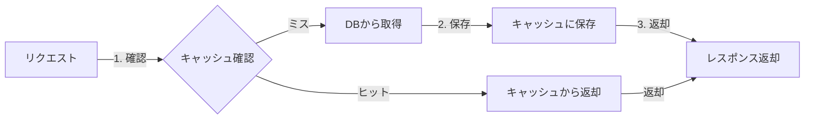
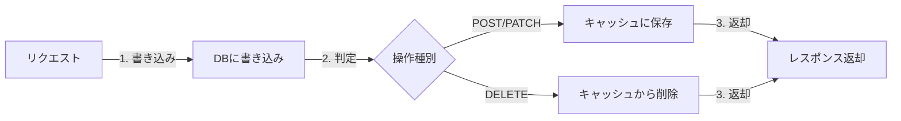
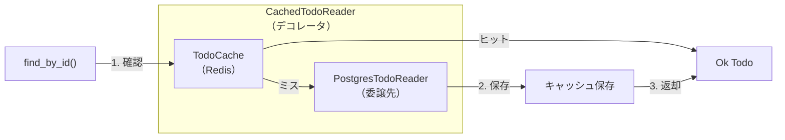
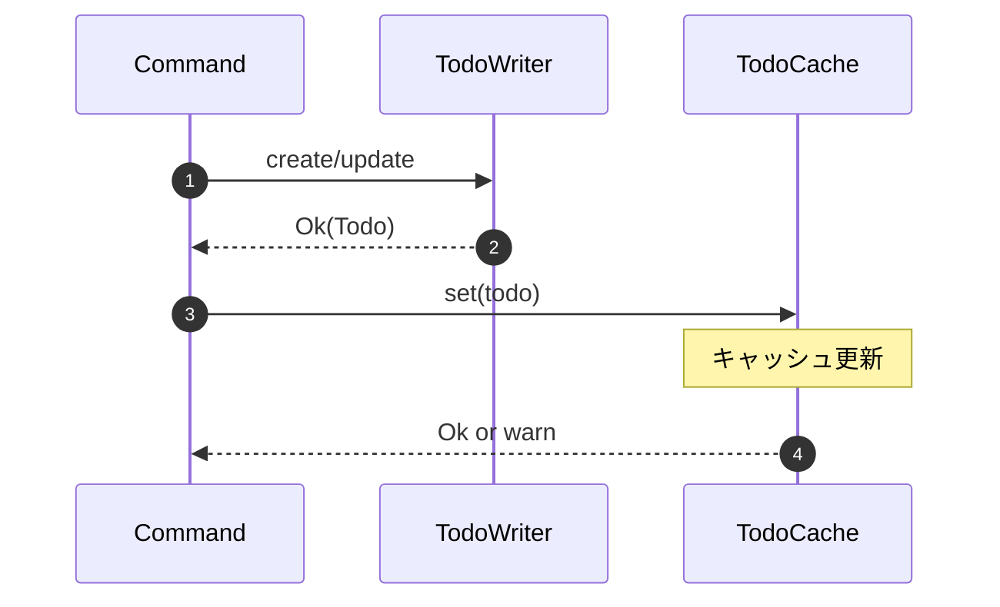

# キャッシュ戦略

本プロジェクトでは **Cache-Aside パターン**（Lazy Loading）を採用しています。

## 読み取りフロー（GET）

キャッシュを先にチェックし、ヒットすればそのまま返却します。
キャッシュミスの場合は DB から取得し、次回アクセス高速化のためキャッシュに保存します。

## 書き込みフロー（POST / PATCH / DELETE）

DB を先に更新し、成功後にキャッシュを同期します。
これにより DB とキャッシュの整合性を保ちます。

## 操作別キャッシュ動作

| 操作                 | キャッシュ動作                  | TTL |
| -------------------- | ------------------------------- | --- |
| `GET /todos/{id}`    | ミス時: DB取得 → キャッシュ保存 | 5分 |
| `POST /todos`        | DB保存 → キャッシュ保存         | 5分 |
| `PATCH /todos/{id}`  | DB更新 → キャッシュ上書き       | 5分 |
| `DELETE /todos/{id}` | DB削除 → キャッシュ削除         | -   |

> **Note**: `find_all()` はキャッシュをバイパスします。
> 一覧取得のキャッシュ無効化は複雑になるため、個別エンティティのみキャッシュしています。

## キャッシュ実装

### 関連ファイル

| ファイル                                                | 役割                                |
| ------------------------------------------------------- | ----------------------------------- |
| `domain/src/repositories/todo_cache.rs`                 | `TodoCacheOps` トレイト定義         |
| `infrastructure/src/persistence/redis/todo_cache.rs`    | Redis を使った実装                  |
| `infrastructure/src/repositories/cached_todo_reader.rs` | キャッシュ付き Reader（デコレータ） |

### CachedTodoReader の仕組み

## Write-Through パターン

TODO 作成・更新時は **Write-Through** パターンを採用しています。

- DB 書き込み成功後、即座にキャッシュを更新
- キャッシュ更新失敗は警告ログのみ（DB が信頼の源泉）
- 次回読み取り時にキャッシュヒットを保証

## バッチ操作とキャッシュ

バッチ操作（`/batch`, `/with-files`）ではキャッシュ更新を**行いません**。

| 操作                     | キャッシュ動作 | 理由                            |
| ------------------------ | -------------- | ------------------------------- |
| `POST /todos`            | Write-Through  | 単一 TODO は即座にキャッシュ    |
| `POST /todos/batch`      | なし           | 個別取得時に Cache-Aside で対応 |
| `POST /todos/with-files` | なし           | 複雑性回避、整合性優先          |

## キャッシュ無効化戦略

| イベント     | 無効化方法                                 |
| ------------ | ------------------------------------------ |
| TODO 更新    | キャッシュ上書き（Write-Through）          |
| TODO 削除    | 明示的削除（`delete` メソッド）            |
| ユーザー削除 | DB CASCADE で TODO 削除 → 個別取得時にミス |

> **注意**: ユーザー削除時のキャッシュ無効化は明示的に行っていません。
> TTL（5分）で自然に期限切れになるか、取得時に DB 側で NotFound になります。
