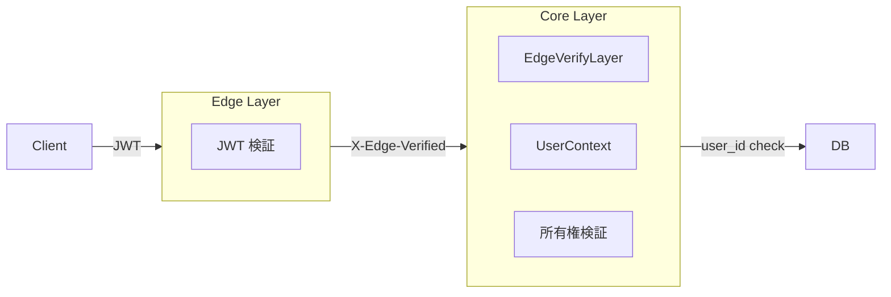
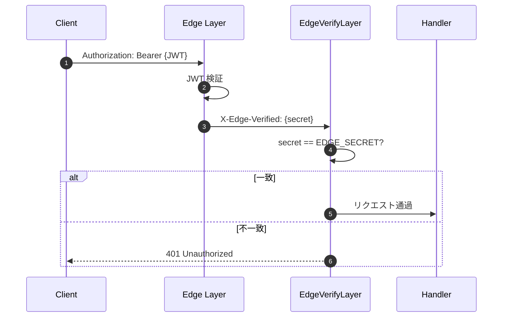
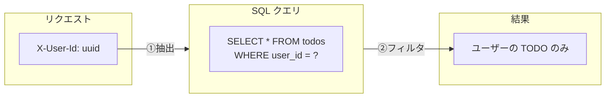

# セキュリティ

本プロジェクトは多層防御（Defense in Depth）アプローチを採用しています。

## アーキテクチャ



## 認証フロー

### 1. Edge 層（JWT 検証）

| 検証項目         | 説明                                       |
| ---------------- | ------------------------------------------ |
| 署名検証         | `JWT_SECRET` で HMAC-SHA256 署名を検証     |
| 有効期限         | `exp` クレームが現在時刻より未来であること |
| ユーザー ID 抽出 | `sub` クレームから UUID を抽出             |

### 2. Core 層（リクエスト検証）

Edge 層を経由したリクエストのみを受け付けます。

| ミドルウェア      | 対象ヘッダー      | 検証内容               |
| ----------------- | ----------------- | ---------------------- |
| `EdgeVerifyLayer` | `X-Edge-Verified` | `EDGE_SECRET` との一致 |
| `UserContext`     | `X-User-Id`       | UUID 形式の検証        |

### 3. ハンドラ層（所有権検証）

各 TODO 操作でユーザー所有権を検証します。

| 操作                     | 検証方法                       |
| ------------------------ | ------------------------------ |
| `GET /api/todos`         | `WHERE user_id = ?` でフィルタ |
| `GET /api/todos/{id}`    | 取得後に `user_id` を照合      |
| `PATCH /api/todos/{id}`  | 取得後に `user_id` を照合      |
| `DELETE /api/todos/{id}` | 取得後に `user_id` を照合      |

> **キャッシュヒット時も検証**: Redis からの取得時も必ず `user_id` を検証し、
> 他ユーザーの TODO を返さないようにしています。

## ミドルウェア詳細

### EdgeVerifyLayer

Edge 層からのリクエストであることを検証するミドルウェア。

| 項目         | 説明                                     |
| ------------ | ---------------------------------------- |
| 対象ヘッダー | `X-Edge-Verified`                        |
| 検証方法     | 環境変数 `EDGE_SECRET` との一致確認      |
| 失敗時       | 401 Unauthorized                         |
| 適用パス     | `/api/todos/*`（認証必須エンドポイント） |



### UserContext

Edge 層が JWT から抽出したユーザー ID をハンドラに渡すエクストラクタ。

| 項目         | 説明                                |
| ------------ | ----------------------------------- |
| 対象ヘッダー | `X-User-Id`                         |
| 抽出先       | `UserContext.user_id: Uuid`         |
| 用途         | TODO の所有権検証、ユーザー別クエリ |

## パスワードセキュリティ

### ハッシュ化

| 項目         | 値                    |
| ------------ | --------------------- |
| アルゴリズム | bcrypt                |
| コスト係数   | `DEFAULT_COST`（12）  |
| 保存先       | `users.password_hash` |

### バリデーション

| 項目       | 要件                   |
| ---------- | ---------------------- |
| 最小文字数 | 8文字以上              |
| その他     | 現時点では追加要件なし |

> **改善提案**: パスワード複雑性チェック（大文字・小文字・数字・記号の組み合わせ）の追加を検討。

### 機密データの保護

`password_hash` は `#[serde(skip_serializing)]` により API レスポンスに含まれません。

```rust
#[derive(Serialize)]
pub struct User {
    pub id: Uuid,
    pub email: String,
    #[serde(skip_serializing)]  // レスポンスに含まれない
    pub password_hash: String,
    pub display_name: Option<String>,
    // ...
}
```

## マルチテナント対応

全ての TODO 操作はユーザー ID でスコープされます。



## 入力バリデーション

### メールアドレス

| 項目         | 現在の実装      | 改善提案                |
| ------------ | --------------- | ----------------------- |
| 形式チェック | `contains('@')` | RFC 5322 準拠の正規表現 |
| 長さ制限     | なし            | 最大 254 文字           |
| 正規化       | なし            | 小文字化                |

### TODO タイトル

| 項目       | 要件                  |
| ---------- | --------------------- |
| 最小文字数 | 1文字（空白トリム後） |
| 最大文字数 | 200文字               |
| 前後空白   | 自動トリム            |

### ファイルメタデータ

| 項目           | 要件                                             |
| -------------- | ------------------------------------------------ |
| ファイル名     | 空でないこと、パストラバーサル文字を含まないこと |
| MIME タイプ    | `type/subtype` 形式であること                    |
| ファイルサイズ | 正の整数であること                               |

## セキュリティヘッダー

> **Note**: セキュリティヘッダー（CSP, X-Frame-Options 等）は Edge 層で設定されます。
> Core 層は API サーバーとして動作し、ブラウザ向けのセキュリティヘッダーは設定しません。

## 関連ファイル

| ファイル                                      | 役割                                 |
| --------------------------------------------- | ------------------------------------ |
| `presentation/src/middleware/edge_verify.rs`  | Edge 検証ミドルウェア                |
| `presentation/src/middleware/user_context.rs` | ユーザーコンテキスト抽出             |
| `application/src/services/auth_service.rs`    | 認証サービス（登録・ログイン）       |
| `domain/src/entities/user.rs`                 | ユーザーエンティティ、バリデーション |
