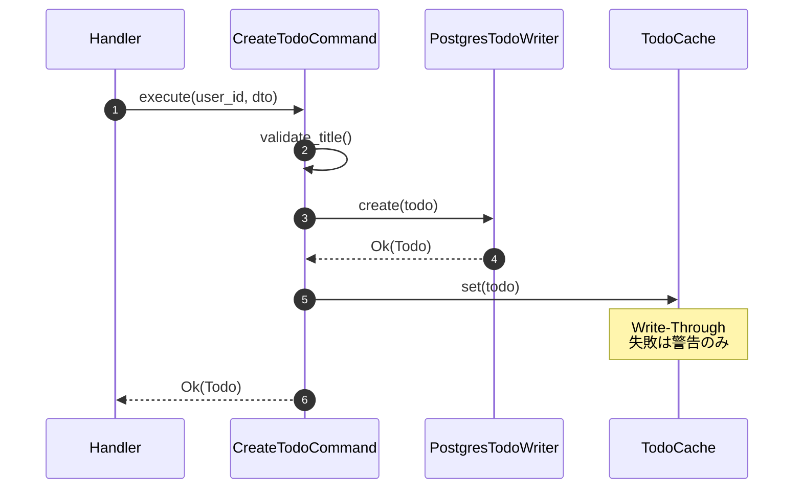
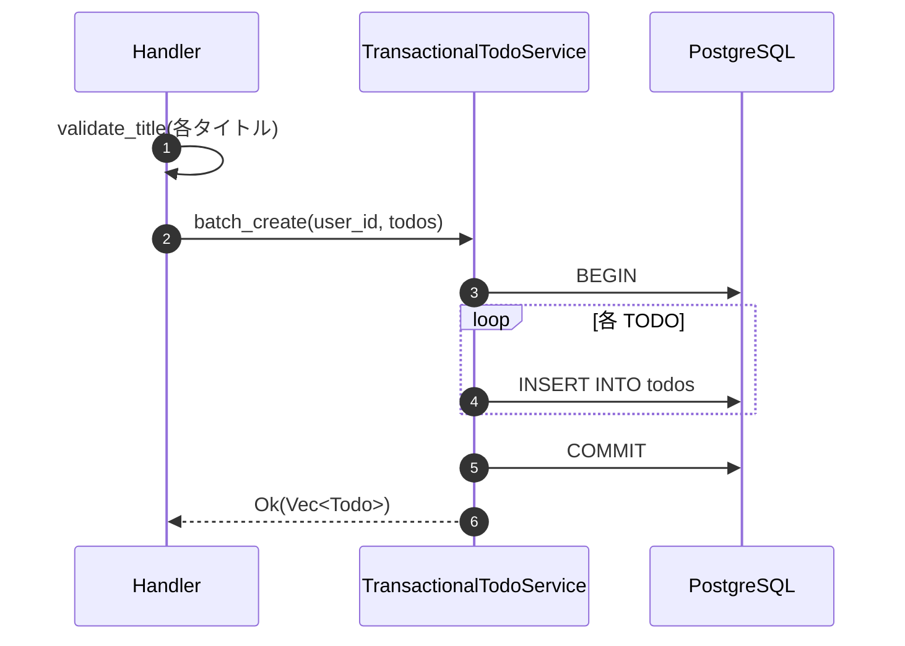
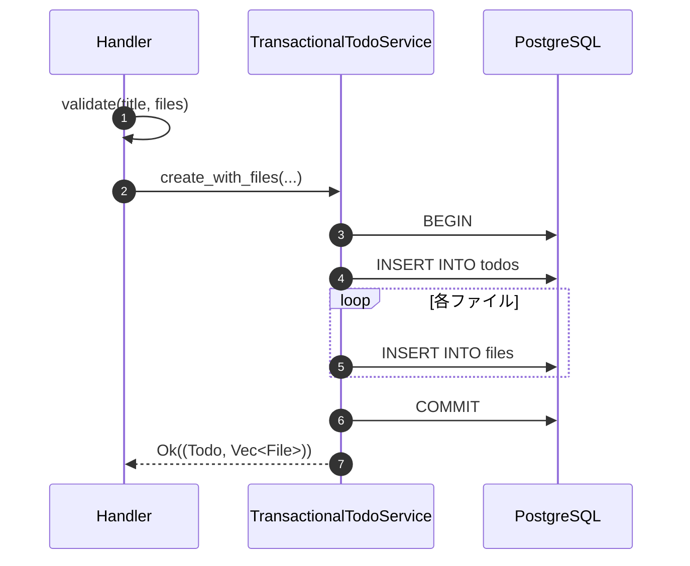

# トランザクション管理

## 設計方針

| 操作 | 方式 | 理由 |
|------|------|------|
| 単一 TODO CRUD | 暗黙トランザクション | 単一クエリで完結、sqlx が自動管理 |
| バッチ作成 | 明示的トランザクション | 全件成功または全件ロールバック |
| TODO + ファイル | 明示的トランザクション | 複数テーブルの整合性保証 |
| ユーザー削除 | DB CASCADE | アプリコードでの管理不要 |
| DB + キャッシュ | ベストエフォート | キャッシュ失敗は警告のみ |

## レイヤー別責務

| レイヤー | 責務 | 実装 |
|----------|------|------|
| Presentation | トランザクションに関知しない | Handler → Command/Service 呼び出し |
| Application | トランザクション境界を決定 | 何回リポジトリを呼ぶか判断 |
| Domain | トランザクションに関知しない | Entity, Repository トレイト定義 |
| Infrastructure | トランザクションを実行 | `TransactionalTodoService` |

## 単一 TODO 作成フロー



## バッチ TODO 作成フロー



## TODO + ファイル同時作成フロー



> **補償トランザクション**: ファイル本体は事前にストレージにアップロード済みの前提。
> DB トランザクション失敗時、ストレージのファイルは手動削除が必要。

## RAII による自動ロールバック

sqlx の `Transaction` は **RAII パターン**を採用しています。

- `pool.begin()` でトランザクション開始
- `tx.commit()` で明示的にコミット
- `commit()` を呼ばずにスコープを抜けると**自動ロールバック**

> **Rust らしい設計**: `?` 演算子でエラー伝播すると `tx` が Drop され、
> 明示的なロールバック処理なしで安全にロールバックされる。

## 外部キー制約による整合性

```sql
-- todos.user_id → users.id (ON DELETE CASCADE)
-- files.todo_id → todos.id (ON DELETE CASCADE)
```

ユーザー削除時は関連 TODO が、TODO 削除時は関連ファイルが DB レベルで自動削除されます。

## パターン比較

| パターン | Rust 適性 | 採用 |
|----------|-----------|------|
| **Executor トレイト + RAII** | ✅ 最適 | **採用** |
| TransactionProvider | ○ 中規模向け | - |
| Unit of Work | △ Java/C# 向け | - |

> **なぜ Unit of Work ではないか**: Rust は所有権で明示的にトランザクションを管理するため、
> Java の EntityManager のような暗黙的管理は馴染まない。

## 参考資料

- [Robust Transaction Management with SQLx](https://leapcell.io/blog/robust-transaction-management-with-sqlx-and-diesel-in-rust)
- [rust-clean-architecture-with-db-transactions](https://github.com/frederikhors/rust-clean-architecture-with-db-transactions)
- [Sqlx transaction abstraction (Rust Forum)](https://users.rust-lang.org/t/sqlx-transaction-abstraction/130079)
