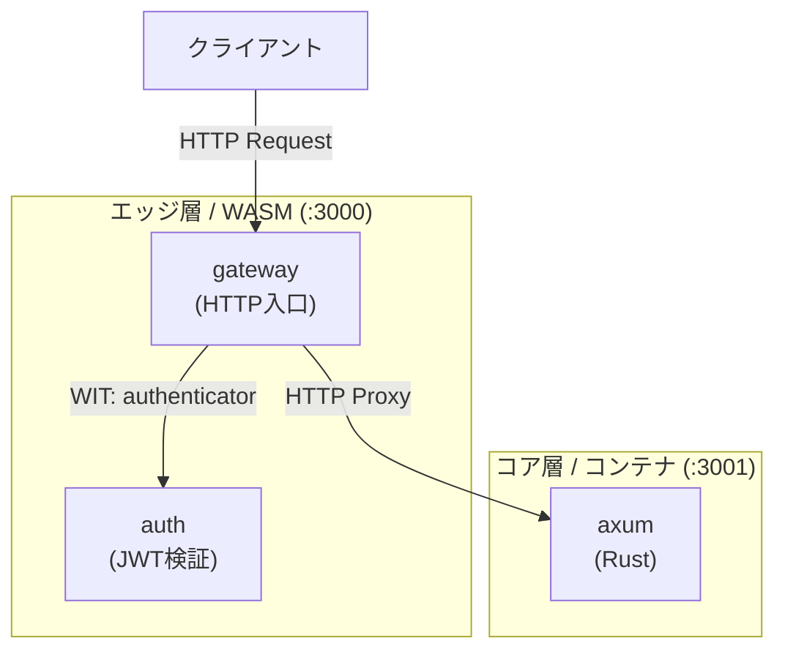

# エッジ層 (Edge Layer)

ハイブリッドアーキテクチャのエッジ層を担当する Spin アプリケーションです。

## 概要

このエッジ層は **Spin** 上で動作する WASM アプリケーションです。
クライアントからの HTTP リクエストを受け取り、JWT 認証を行った後、
コア層（Docker コンテナ）にリクエストをプロキシします。



このエッジ層は 2 つの Wasm コンポーネントで構成されています：

| コンポーネント | 役割 |
|---------------|------|
| **gateway** | HTTP リクエストの受信、認証呼び出し、コア層へのプロキシ |
| **auth** | JWT トークンの検証、ユーザーID の抽出 |

## ディレクトリ構成

```
edge/
├── README.md       # このファイル
├── spin.toml       # Spin 設定（コンポーネント合成）
├── Cargo.toml      # Rust ワークスペース設定
├── Cargo.lock      # 依存関係のロックファイル
├── auth/           # 認証コンポーネント
│   ├── Cargo.toml
│   └── src/
│       └── lib.rs  # JWT 検証ロジック
└── gateway/        # ゲートウェイコンポーネント
    ├── Cargo.toml
    └── src/
        └── lib.rs  # HTTP ハンドラー + プロキシ
```

## 必要なツール

```bash
# Rust + Wasm ターゲット
rustup target add wasm32-wasip1

# Spin CLI（Homebrew）
brew tap spinframework/tap
brew install spinframework/tap/spin
# または公式インストーラ
curl -fsSL https://spinframework.dev/downloads/install.sh | bash
```

## ビルド方法

```bash
# このディレクトリで実行
spin build
```

ビルド成功時の出力：
```
Building component auth with `cargo build --release --target wasm32-wasip1 -p auth`
Building component gateway with `cargo build --release --target wasm32-wasip1 -p gateway`
Finished building all Spin components
```

## 起動方法

```bash
# エッジ層を起動（ポート 3000）
spin up

# バックグラウンドで起動
spin up &
```

## WIT コンポーネント合成

このプロジェクトは **WIT (WebAssembly Interface Types)** を使用して
2 つのコンポーネントを合成しています。

### 合成の仕組み

1. `wit/auth.wit` で `authenticator` インターフェースを定義
2. `auth` コンポーネントが `authenticator` をエクスポート
3. `gateway` コンポーネントが `authenticator` をインポート
4. `spin.toml` で依存関係を設定

```toml
# spin.toml より
[component.gateway]
dependencies = { "demo:auth/authenticator" = { component = "auth" } }
```

### 利点

- **関心の分離**: 認証ロジックと HTTP 処理を別コンポーネントに分離
- **再利用性**: auth コンポーネントは他のゲートウェイでも使用可能
- **型安全性**: WIT でインターフェースを明示的に定義

## コンポーネント詳細

### gateway コンポーネント

| 項目 | 内容 |
|------|------|
| パブリックパス | `/health`, `/api/auth/register`, `/api/auth/login` → 認証なしでプロキシ |
| 認証必須パス | `/api/*`（上記以外）→ JWT 認証 → コア層へプロキシ |
| その他 | 401 Unauthorized |
| プロキシ先 | `http://localhost:3001` |

### auth コンポーネント

| 項目 | 内容 |
|------|------|
| アルゴリズム | HS256 (HMAC-SHA256) |
| 秘密鍵 | `super-secret-key`（Core 層と同じ値を使用） |
| 検証項目 | 署名、有効期限、sub クレーム |
| sub クレーム | `X-User-Id` ヘッダーとしてコア層に転送 |

> **重要**: JWT シークレットは Core 層の `JWT_SECRET` 環境変数と同じ値を使用する必要があります。

## 認証フロー

エッジ層は以下のパスを **認証不要（パブリック）** として扱います：

| パス | 説明 |
|------|------|
| `/health` | ヘルスチェック |
| `/api/auth/register` | ユーザー登録 |
| `/api/auth/login` | ログイン（JWT 取得） |

その他の `/api/*` パスは JWT 認証が必要です。

## 動作確認

```bash
# 1. ユーザー登録（認証不要）
curl -X POST http://localhost:3000/api/auth/register \
  -H "Content-Type: application/json" \
  -d '{"email": "test@example.com", "password": "password123"}'

# 2. ログイン（JWT 取得）
TOKEN=$(curl -s -X POST http://localhost:3000/api/auth/login \
  -H "Content-Type: application/json" \
  -d '{"email": "test@example.com", "password": "password123"}' | jq -r '.token')

# 3. 認証なしで TODO アクセス → 401
curl http://localhost:3000/api/todos
# → {"error":"Missing token"}

# 4. 無効なトークン → 401
curl -H "Authorization: Bearer invalid" http://localhost:3000/api/todos
# → {"error":"Invalid token format"}

# 5. 有効な JWT → 200
curl -H "Authorization: Bearer $TOKEN" http://localhost:3000/api/todos
# → []

# 6. TODO 作成
curl -X POST http://localhost:3000/api/todos \
  -H "Authorization: Bearer $TOKEN" \
  -H "Content-Type: application/json" \
  -d '{"title": "テスト", "description": "エッジ層経由で作成"}'

# 7. クエリパラメータ付きリクエスト
curl -H "Authorization: Bearer $TOKEN" "http://localhost:3000/api/todos?completed=false"
# → 未完了の TODO のみ返却

# または、プロジェクトルートで make demo を実行
make demo
```

## 依存クレート

| クレート | バージョン | 用途 |
|---------|-----------|------|
| `wit-bindgen` | 0.51 | WIT バインディング生成 |
| `spin-sdk` | 5.1 | Spin SDK |
| `base64` | 0.22 | Base64 エンコード/デコード |
| `hmac` | 0.12 | HMAC 署名検証 |
| `sha2` | 0.10 | SHA-256 ハッシュ |
| `serde` | 1.0 | シリアライズ/デシリアライズ |
| `serde_json` | 1.0 | JSON 処理 |

## トラブルシューティング

### ビルドエラー

```bash
# Rust ターゲットを確認
rustup target list --installed | grep wasm32

# 必要に応じて追加
rustup target add wasm32-wasip1
```

### 起動エラー

```bash
# Spin のバージョン確認
spin --version

# ログを確認
cat .spin/logs/*
```

## 参考リンク

- [Spin ドキュメント](https://spinframework.dev/v3/index)
- [WIT 仕様](https://github.com/WebAssembly/component-model/blob/main/design/mvp/WIT.md)
- [コンポーネントモデル](https://component-model.bytecodealliance.org/)
