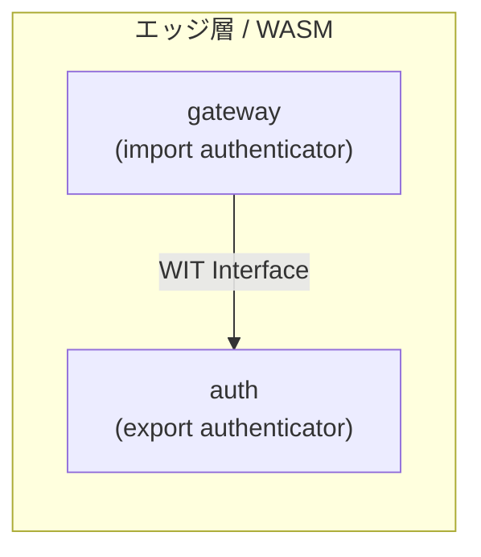

# WIT インターフェース定義

このディレクトリには、Wasm コンポーネント間のインターフェースを定義する
WIT (WebAssembly Interface Types) ファイルが含まれています。

## 概要

WIT (WebAssembly Interface Types) は、Wasm コンポーネント間の
インターフェースを定義するための言語です。
このプロジェクトでは、`gateway` コンポーネントが `auth` コンポーネントの
認証機能を呼び出すためのインターフェースを定義しています。



WIT を使用することで、Wasm コンポーネント間の型安全な通信を実現します。

## ディレクトリ構成

```
wit/
├── README.md   # このファイル
└── auth.wit    # 認証インターフェース定義
```

## ファイル説明

### auth.wit

認証機能のインターフェースを定義しています。

```wit
package demo:auth;

interface authenticator {
    record auth-result {
        authenticated: bool,
        user-id: option<string>,
        error: option<string>,
    }

    verify-token: func(token: string) -> auth-result;
}

world auth-world {
    export authenticator;
}

world gateway-world {
    import authenticator;
}
```

## WIT の基本概念

### パッケージ (package)

```wit
package demo:auth;
```

パッケージは `namespace:name` の形式で定義します。

| 部分 | 説明 | 例 |
|------|------|-----|
| namespace | 組織やプロジェクトを識別 | `demo`, `wasi`, `fermyon` |
| name | パッケージ名 | `auth`, `http`, `config` |

### インターフェース (interface)

```wit
interface authenticator {
    // 型定義と関数
}
```

インターフェースは、エクスポート/インポート可能な機能の集合を定義します。

### レコード型 (record)

```wit
record auth-result {
    authenticated: bool,
    user-id: option<string>,
    error: option<string>,
}
```

Rust の `struct` に相当します。

| WIT 型 | Rust 型 | 説明 |
|--------|---------|------|
| `bool` | `bool` | 真偽値 |
| `string` | `String` | 文字列 |
| `option<T>` | `Option<T>` | オプショナル値 |
| `list<T>` | `Vec<T>` | リスト |
| `result<T, E>` | `Result<T, E>` | 結果型 |

### 関数 (func)

```wit
verify-token: func(token: string) -> auth-result;
```

関数のシグネチャを定義します。

- 引数: `(token: string)`
- 戻り値: `auth-result`

### ワールド (world)

```wit
world auth-world {
    export authenticator;
}

world gateway-world {
    import authenticator;
}
```

ワールドは、コンポーネントが提供/使用するインターフェースを宣言します。

| キーワード | 説明 |
|-----------|------|
| `export` | このコンポーネントが提供するインターフェース |
| `import` | このコンポーネントが使用するインターフェース |

## 命名規則

WIT ではケバブケース (kebab-case) を使用します：

| WIT | Rust (生成コード) |
|-----|-------------------|
| `auth-result` | `AuthResult` |
| `user-id` | `user_id` |
| `verify-token` | `verify_token` |

## コンポーネント合成

### 1. auth コンポーネント (エクスポート側)

```rust
// edge/auth/src/lib.rs
wit_bindgen::generate!({
    world: "auth-world",  // authenticator をエクスポート
    path: "../../wit",
});

use exports::demo::auth::authenticator::{Guest, AuthResult};

impl Guest for AuthComponent {
    fn verify_token(token: String) -> AuthResult {
        // 実装
    }
}

export!(AuthComponent);
```

### 2. gateway コンポーネント (インポート側)

```rust
// edge/gateway/src/lib.rs
wit_bindgen::generate!({
    world: "gateway-world",  // authenticator をインポート
    path: "../../wit",
});

use demo::auth::authenticator::{verify_token, AuthResult};

// verify_token() を直接呼び出し可能
let result: AuthResult = verify_token(&token);
```

### 3. Spin 設定 (コンポーネント合成)

```toml
# edge/spin.toml
[component.gateway]
dependencies = { "demo:auth/authenticator" = { component = "auth" } }
```

## 拡張例

### 新しいインターフェースを追加する場合

```wit
// wit/auth.wit に追加
interface token-generator {
    generate-token: func(user-id: string, expires-in: u64) -> string;
}

world token-world {
    export token-generator;
}
```

### 複数のインターフェースをインポートする場合

```wit
world gateway-world {
    import authenticator;
    import token-generator;
    import wasi:http/outgoing-handler@0.2.0;
}
```

## 参考リンク

- [WIT 仕様](https://github.com/WebAssembly/component-model/blob/main/design/mvp/WIT.md)
- [コンポーネントモデル](https://component-model.bytecodealliance.org/)
- [wit-bindgen](https://github.com/bytecodealliance/wit-bindgen)
- [WASI 標準インターフェース](https://github.com/WebAssembly/WASI)
